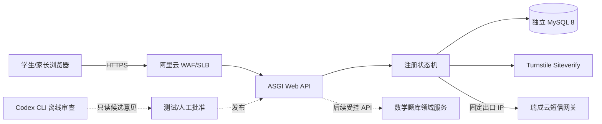
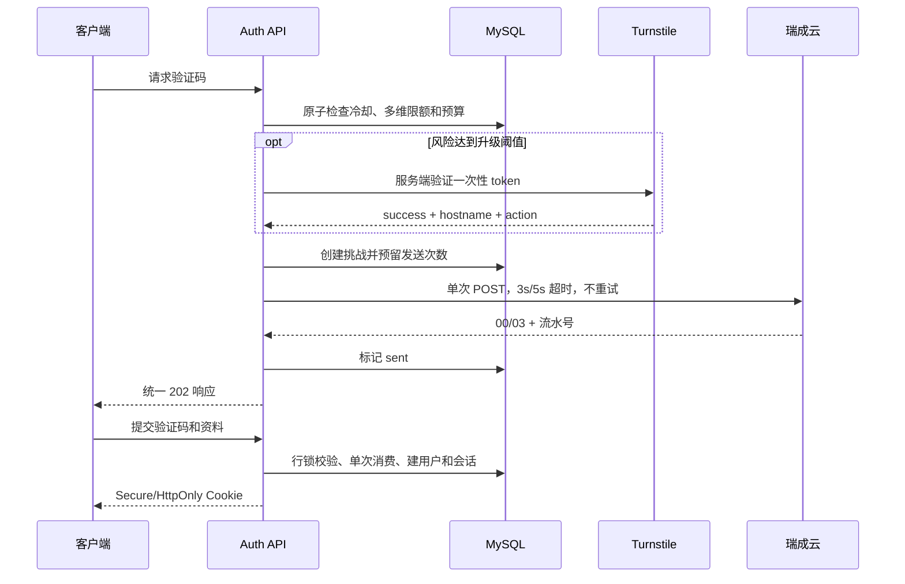

# 李兆霖数学错题本 Web：项目架构

## 边界

这是独立 Web 后端，不直接读取桌面版 `data/math_notebook.db`。在线身份认证完全由确定性代码和 MySQL 完成；Codex CLI 仅承担需求、实现和安全的离线只读审查。

## 目录

| 路径 | 权威职责 |
|---|---|
| `services/web_auth/registration.py` | OTP、限流、注册和会话状态机 |
| `services/web_auth/mysql_store.py` | MySQL 事务与行锁 |
| `services/web_auth/asgi.py` | HTTP 边界和 Cookie |
| `services/web_auth/bootstrap.py` | 生产环境变量装配和失败关闭 |
| `services/web_auth/ruicheng_sms.py` | 瑞成云提交适配 |
| `services/web_auth/turnstile.py` | CAPTCHA 服务端验证 |
| `services/web_auth/migrations/` | MySQL 迁移 |
| `scripts/project_workflow.py` | 任务领取、租约、证据和断点 |
| `scripts/codex_task_router.py` | Luna/Terra/Sol 分层只读审查 |
| `config/model-routing.json` | 模型路由策略 |
| `schemas/engineering-review-result.schema.json` | 结构化审查输出 |
| `docs/` | 产品、架构、实施、验收和运维基线 |

## 注册链路

## 完成门

单元测试和启动烟雾测试只证明代码可运行。生产完成还要求：真实 MySQL/RDS TLS 集成、并发限流、真实短信测试号、小流量费用验证、WAF 可信代理配置、监护人同意服务、Sol 安全复核和人工部署批准。

