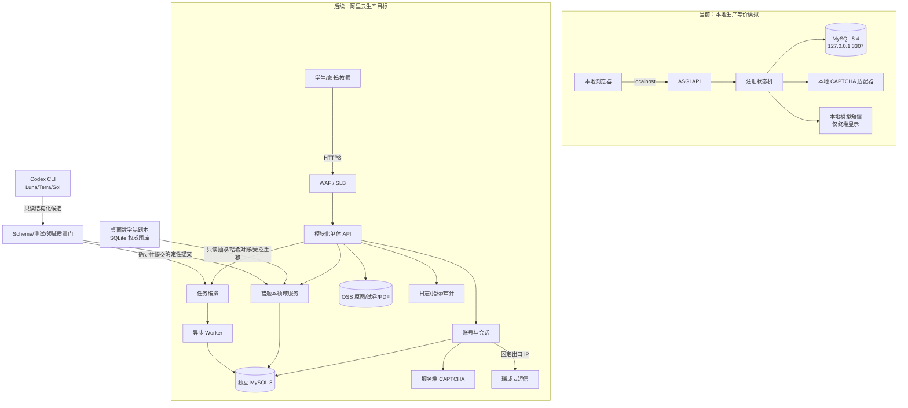
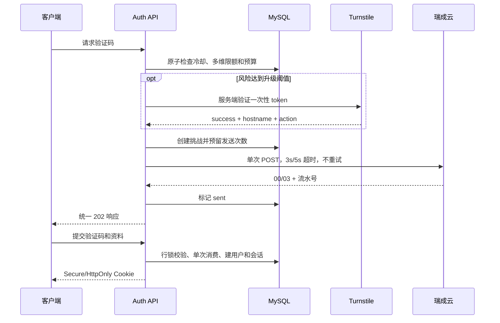
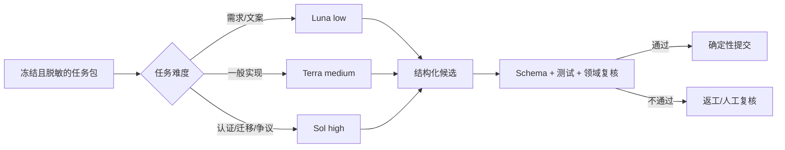

# 李兆霖数学错题本 Web：项目架构

## 1. 当前决策与边界

这是独立 Web 项目。当前只建设并验收本地模拟环境；阿里云部署保留为最后的人工批准步骤，在本地端到端流程完全跑通前不得执行。

当前产品基线为 v0.3.2：所有用户完成手机号验证码后直接使用个人错题本。MVP 不建设姓名/昵称/年级资料、身份角色、家庭、学生档案、监护同意或实名认证。个人业务数据以服务端会话解析的 `user_id` 隔离。

现有代码和在建 Schema 中的 `tenant_id`、家庭、成员、学生档案及监护同意属于早期设计，不能继续作为产品入口或注册后阻断条件。架构步骤必须形成迁移与回滚方案后再调整，不得直接覆盖用户尚未提交的在建代码。

桌面版的 `data/math_notebook.db` 仍是现有数学题库的权威库，Web 项目不直接读取、复制或共享该 SQLite 文件。后续只能通过只读抽取、哈希对账和受控迁移把已验证内容导入独立 MySQL。

在线身份认证、限流、验证码和权限判断完全由确定性代码与 MySQL 完成。Codex CLI 仅承担离线只读审查；模型输出是候选意见，不能直接写数据库、发送短信或批准部署。

## 2. 整体架构

## 3. 功能分解与状态

| 功能域 | 权威入口/计划落点 | 当前状态 |
|---|---|---|
| 手机验证码注册、会话、限流 | `services/web_auth/` | 已实现；单元、MySQL、并发和真实 HTTP 本地验收通过 |
| 本地 MySQL 模拟环境 | `scripts/local_env.py` | 已实现；仅绑定 localhost，不是生产启动器 |
| Codex 模型路由 | `scripts/codex_task_router.py`、`config/model-routing.json` | 已实现；外发必须显式授权，候选只读 |
| 任务领取、租约、证据、恢复 | `scripts/project_workflow.py` | 已实现注册模板和全项目模板 |
| 个人账号与 user_id 数据隔离 | 后续领域模块 | 规划中；替代家庭/学生档案产品模型 |
| Web 题库、错题、作答和复习数据 | 后续 MySQL 迁移 | 规划中；不得直接共享桌面 SQLite |
| 文件上传、解析、审核、判题 | API + Worker + OSS | 规划中 |
| 推荐、复习计划和 PDF | 领域服务 + Worker | 规划中 |
| 前端/PWA、运营后台和运维恢复 | Web/运维模块 | 规划中 |
| 阿里云部署 | WAF/SLB、RDS、OSS、运行环境 | 已后置；本地全链路通过后人工批准 |

## 4. 目录

| 路径 | 权威职责 |
|---|---|
| `services/web_auth/registration.py` | OTP、限流、注册和会话状态机 |
| `services/web_auth/mysql_store.py` | MySQL 事务与行锁 |
| `services/web_auth/asgi.py` | HTTP 边界和 Cookie |
| `services/web_auth/bootstrap.py` | 生产环境变量装配和失败关闭 |
| `services/web_auth/ruicheng_sms.py` | 瑞成云提交适配 |
| `services/web_auth/turnstile.py` | CAPTCHA 服务端验证 |
| `services/web_auth/migrations/` | MySQL 迁移 |
| `scripts/project_workflow.py` | 注册/全项目任务模板、依赖、领取、租约和证据 |
| `scripts/codex_task_router.py` | Luna/Terra/Sol 分层只读审查 |
| `scripts/local_env.py` | localhost MySQL、模拟短信/CAPTCHA 与端到端验收 |
| `config/model-routing.json` | 模型路由策略 |
| `schemas/engineering-review-result.schema.json` | 结构化审查输出 |
| `docs/` | 产品、架构、实施、验收和运维基线 |

## 5. 注册链路

## 6. Codex CLI 与质量门

模型任务统一走 `scripts/codex_task_router.py`，外发前必须显式授权。手机号、验证码、密钥、用户数据和数据库内容不得进入模型输入。低置信度最多自动升级一次。

## 7. 完成门

“本地注册环境已跑通”不等于“整个 Web 项目完成”。当前只能认定验证码与本地 MySQL 模拟基线可运行；现有监护同意阻断仍不符合 v0.3.2 的“注册后直接使用”。整个项目仍要求 user_id 领域数据、桌面库迁移对账、上传/审核/判题、推荐/复习/PDF、前端、运维恢复和端到端验收全部具备证据。

阿里云部署只有在上述本地流程完全跑通、系统安全复核通过且用户人工批准后才能领取 `cloud_deploy_approval`。

## 本地模拟边界

本地模拟复用同一注册状态机、MySQL 适配器、迁移和 ASGI 边界，仅替换短信与 CAPTCHA 外部适配器。MySQL 固定绑定 `127.0.0.1:3307`；模拟服务固定绑定 localhost，不能作为生产启动入口。
