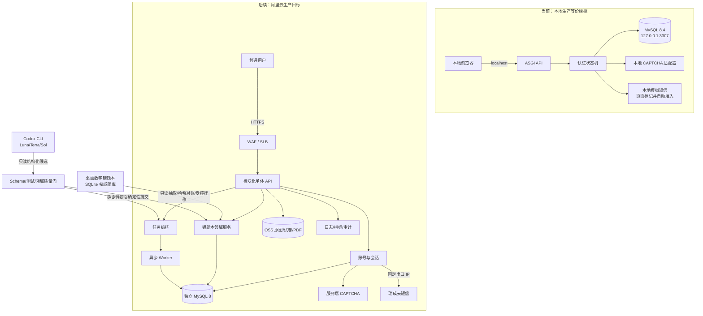
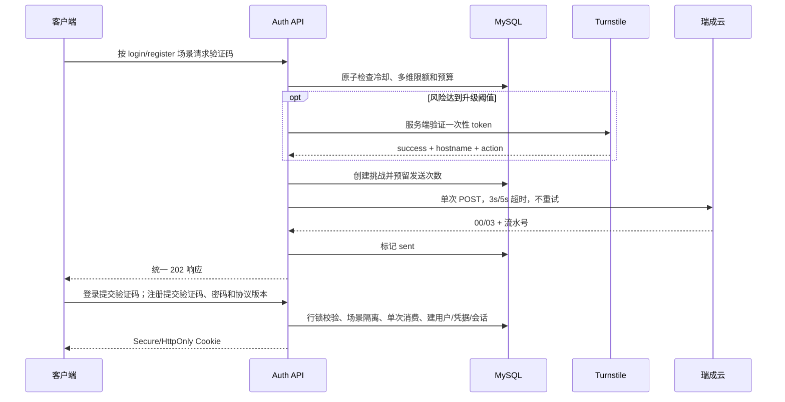
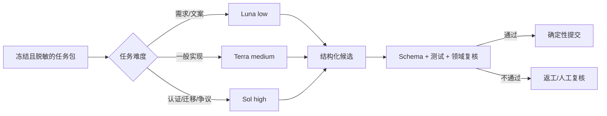

# 李兆霖数学错题本 Web：项目架构

## 1. 当前决策与边界

这是独立 Web 项目。当前只建设并验收本地模拟环境；阿里云部署保留为最后的人工批准步骤，在本地端到端流程完全跑通前不得执行。

当前目标产品基线为 v0.4.0：验证码登录与新用户注册拆成两个页面和两个服务端场景；登录使用手机号验证码，注册使用手机号、验证码、密码和协议确认，注册成功自动登录并进入个人错题本。MVP 仍不建设姓名/昵称/年级资料、身份角色、家庭、学生档案、监护同意或实名认证。个人业务数据以服务端会话解析的 `user_id` 隔离。

v0.4.0 本地测试版的认证契约已落地为四个接口：`POST /v1/auth/login/otp/request`、`POST /v1/auth/login/otp/verify`、`POST /v1/auth/register/otp/request`、`POST /v1/auth/register/complete`。注册原子保存密码凭据、协议版本并创建会话；登录不得建号，注册不得覆盖已有账号。当前 44 paths OpenAPI、真实 MySQL smoke、230 项测试、独立安全复核和浏览器注册/移动视口检查已对齐；旧 v0.3.3 单入口仅作迁移起点。生产门禁仍未完成。详细标准见 `docs/13-LOGIN-REGISTER-PRD.md`。

现有代码和在建 Schema 中的 `tenant_id`、家庭、成员、学生档案及监护同意属于早期设计，不能继续作为产品入口或注册后阻断条件。架构步骤必须形成迁移与回滚方案后再调整，不得直接覆盖用户尚未提交的在建代码。

桌面版的 `data/math_notebook.db` 仍是现有数学题库的权威库，Web 项目不直接读取、复制或共享该 SQLite 文件。后续只能通过只读抽取、哈希对账和受控迁移把已验证内容导入独立 MySQL。

在线身份认证、限流、验证码和权限判断完全由确定性代码与 MySQL 完成。Codex CLI 承担只读工程审查和首次数学图片/判题候选；连续错题会话直接复用官方 Codex app-server Harness 的线程、回合、压缩和事件协议。题干修正、作答 OCR、判题及入本内容均由大模型进行语义确认；确定性代码负责校验资源归属、冻结版本、结构化结果和最终写库。模型不能自行跨过确认口令、直接写入正式错题、发送短信、改变权限或批准部署。

Codex app-server 是当前已经实现的本地模型运行时，不是阿里云生产必须永久绑定的供应商。若目标环境无法稳定使用 Codex/OpenAI 服务，模型推理将通过供应商无关的 `ModelProvider` 适配；产品会话历史、分页、压缩、流式事件、停止、恢复、重试和任务循环收归应用自有 `NotebookAgent`。阿里云首个候选优先评测百炼通义千问多模态模型，现有 Codex 适配器保留作本地对照和迁移回退。该方案当前仅已记录，待离线评测和实施批准，详见 `docs/18-MODEL-PROVIDER-MIGRATION.md`。

## 2. 整体架构

## 3. 功能分解与状态

| 功能域 | 权威入口/计划落点 | 当前状态 |
|---|---|---|
| 手机验证码注册、会话、限流 | `services/web_auth/` | v0.4.0 四接口、密码、协议、场景隔离已在本地验收；短信/CAPTCHA 仍为模拟，生产门禁未完成 |
| 本地 MySQL 模拟环境 | `scripts/local_env.py` | 已实现；仅绑定 localhost，不是生产启动器 |
| Codex 模型路由与团队 | `scripts/codex_task_router.py`、`scripts/codex_app_server.py`、`services/web_app/codex_model.py`、`config/model-routing.json`、`config/team-roles.json` | 已实现；本地启动须使用 `--enable-codex-model` 显式授权，首次 OCR/判题候选走 Terra→Sol 质量门，连续错题会话走官方 app-server 持久 Sol 线程、真实事件流和结构化候选 |
| 模型供应商迁移与应用自有 Harness | `docs/18-MODEL-PROVIDER-MIGRATION.md`、后续 `NotebookAgent` / `ModelProvider` | 方案已记录，待标注集评测和实施批准；当前未接通百炼，不得标记为生产完成 |
| 任务领取、租约、证据、恢复 | `scripts/project_workflow.py` | 已实现注册模板和全项目模板 |
| 个人账号与 user_id 数据隔离 | `services/web_domain/` | 已实现；API、Store、任务和下载均从服务端会话注入 `user_id` |
| Web 题库、错题、作答和复习数据 | MySQL 个人 `user_id` 模型 | 权威桌面题库已同步到本地 MySQL：10,569 题，其中 10,278 题保持已验证、291 题按授权/质量门降级为候选；生产回滚未完成 |
| 文件上传、解析、审核、判题 | API + Harness 附件业务桥 + 现有错题领域服务 | PNG/JPEG 可从一张图片按阅读顺序拆出至多 20 道题及其对应作答。官方 Harness 模型一次提交当前回合全部图片的结构化结果；Host 读取真实附件，Python 服务按附件逐次复用文件隔离、题目冻结、判题候选和自动入本。正确题自动跳过，错误或部分正确自动入本，只有无法识别或证据冲突才等待补充。若保守匹配到已验证、当前且授权的题库版本，则先对冻结的独立答案执行确定性比对；按小题、无序备选答案和等价区间/连写不等式规范化后仍无法确认等价时，才把题库当前版本答案与解析作为受保护证据交给同一会话做第二阶段语义复核。语义复核一致时绑定 `question_id` 并继续入本，确有冲突或无法确认时禁止入本。附件哈希和冻结版本保证重试不重复写入，权威回执作为工具事件写回原 Harness 会话；每批图片判题及必要复核后，工具结果和最终回复都依据真实回执给出一个可立即执行的下一步。模型不可用时安全停止，PDF/DOCX 自动解析与生产异步 Worker 仍延期 |
| 推荐、复习计划和 PDF | `services/web_domain/` | 仅已验证且授权题可推荐；推荐、复习和 PDF 本地链路已验收，题库为空时展示缺口。按中国标准时间为每个账号记录唯一学习用量：每日判题建议 12 道、硬上限 20 道，每日推荐建议 12 道、硬上限 24 道，可覆盖一次选取的 12 道错题并为每题最多匹配 2 道练习；重复提交、失败和无法识别不计数，已经开始处理的同一批图片完整完成后才停止下一批。桌面 Skill `output/pdf` 中的历史 PDF 可通过既有错题迁移脚本幂等同步到个人练习 PDF 历史，重名内容只存一份但保留每个生成记录的文件名 |
| 前端/PWA、运营后台和运维恢复 | `@deepseek-ai/dsh-web-frontend`、`extensions/dsh-math-notebook-ui/`、`web/`、`services/web_ops/` | 工作台已直接复用固定版 DeepSeek Harness 官方 Web 前端和 Host，会话树、历史分页、附件、输入、上下文计量及压缩不再由项目仿写；Harness 内部固定使用隔离的“错题会话”工作区，学生界面不显示工作区选择和添加入口。错题本、练习 PDF 和学习进度通过 Harness 的 `conversation` 扩展面载入内容视图；学生设置仅显示账号与隐私。独立 `/admin` 入口已实现按角色过滤的脱敏、只读运营视图，覆盖概览、失败任务、内容质量、短信风控、隐私工单和后台访问审计，不出现在学生导航中，也不提供业务写操作。本地登录外壳在 8000 端口校验会话后嵌入隔离运行于 3080 的官方界面。PWA、人工复核提交、敏感访问审批、危险批量操作、生产观测和生产恢复仍延期 |
| 阿里云部署 | WAF/SLB、RDS、OSS、运行环境 | 已后置；本地全链路通过后人工批准 |

## 4. 目录

| 路径 | 权威职责 |
|---|---|
| `services/web_auth/registration.py` | OTP、限流、登录、注册和会话的唯一权威状态机 |
| `services/web_auth/mysql_store.py` | MySQL 事务与行锁 |
| `services/web_auth/asgi.py` | HTTP 边界和 Cookie |
| `services/web_auth/bootstrap.py` | 生产环境变量装配和失败关闭 |
| `services/web_auth/ruicheng_sms.py` | 瑞成云提交适配 |
| `services/web_auth/turnstile.py` | CAPTCHA 服务端验证 |
| `services/web_auth/migrations/` | MySQL 迁移 |
| `services/web_domain/` | 错题、推荐、复习调度、进度和 A4 PDF |
| `services/web_ops/` | 后台角色授权、脱敏运营聚合和访问审计 |
| `scripts/project_workflow.py` | 注册/全项目任务模板、依赖、领取、租约和证据 |
| `scripts/codex_task_router.py` | Luna/Terra/Sol 分层只读审查 |
| `scripts/local_env.py` | localhost MySQL、模拟短信/CAPTCHA 与端到端验收 |
| `extensions/dsh-math-notebook-ui/` | 官方 Harness Web 的产品品牌、完整产品导航和固定工作区扩展，不复制官方会话组件 |
| `config/deepseek-harness/web-product.patch.yml` | 学生工作台的 Harness Web 组合与编程能力禁用边界 |
| `config/model-routing.json` | 模型路由策略 |
| `docs/18-MODEL-PROVIDER-MIGRATION.md` | 阿里云模型供应商迁移、Provider 边界、自有 Harness、评测和灰度基线 |
| `schemas/engineering-review-result.schema.json` | 结构化审查输出 |
| `docs/` | 产品、架构、实施、验收和运维基线 |

## 5. 注册链路

## 6. Codex CLI 与质量门

模型任务统一走 `scripts/codex_task_router.py`，外发前必须显式授权。团队岗位和波次由 `config/team-roles.json` 声明；每个岗位对应一个独立、临时、只读的 Codex CLI 子进程，最多并行 4 个，完整职责见 `docs/14-CODEX-MULTI-AGENT-TEAM.md`。批量 `team-run` 只接受位于固定输入根目录、按岗位拆分的公开/合成资料包，并把结果限制到固定候选根目录；真实项目材料不得用该命令批量外发。手机号、验证码、密码、密钥和数据库凭据永不进入模型输入。本地数学流程只发送当前用户已授权处理的题目图片或当前题干/作答候选，且移除 `user_id` 等身份字段；图片外发前必须复验隔离对象哈希、解码并重编码为去 EXIF 的有界 PNG 预览。判题先以不含学生作答的临时只读任务独立求解，再把原图、参考解、受限 AST 验算报告与学生作答交给同图父 Harness 线程复核；验算器不提供 Shell、文件、网络或任意函数调用。同一任务资源与输入版本只允许一个进行中的调用，全局最多两个；图片识别结果必须按 `item_no` 连续编号，服务端在一个事务中把同一文件的每道题保存为独立 `intake_item`，输出匹配 JSON Schema、资源 ID 和冻结版本后才能进入自动处理队列。单项低置信度最多自动升级一次，批量波次不自动升级。

本地 Web 的图片识别、独立解题和判题复核统一使用官方 Codex app-server 通道，以复用桌面客户端已经工作的登录与网络策略；不再让独立解题回退到普通 `codex exec` 子进程。题库参考答案与解析只能在独立解题结果冻结后加入复核证据；服务端仅接受 `verified` 状态、当前版本、开放或用户授权来源且存在验证记录的题目，匹配阈值不足时按“未匹配”处理。瞬时连接、超时和限流错误在 app-server 调用层最多尝试两次，自动工作流仍失败时再延迟续跑一次；证书、认证和非网络错误不做盲目重试。每次尝试写入 `data/audits/codex-routing/codex-cli-events.jsonl`，仅记录调用标识、任务、模型、阶段、耗时、尝试次数、结果和错误分类，不记录题目、图片路径、提示词、stdout、stderr、账号或密钥。

错题会话使用 `math-notebook-loop` 路由和官方 `codex app-server`：首轮通过 `thread/start` 建立持久线程，后续轮次只按 MySQL 中当前用户与 intake 绑定的不透明 thread id 调用 `thread/resume`；刷新与翻页时服务端通过 `thread/items/list` 和官方游标读取线程，只将结构化封包中的真实 `user_message` 与 `assistant_message` 转为产品消息。浏览器不能读取或提交 thread id，也不能看到内部提示；浏览器收到的产品游标同时绑定用户拥有的 intake。运行时固定只读 sandbox、拒绝审批、关闭 shell 与 MCP，最终消息必须通过 `math-loop-turn.schema.json`。真实 turn/item/delta/压缩/完成事件经 NDJSON 推送；工作台停止按钮调用 `turn/interrupt`，整理上下文调用 `thread/compact/start`。详细能力边界见 `docs/16-CODEX-APP-SERVER-HARNESS.md`。

## 7. 完成门

“本地完整测试版”当前指：登录/注册→个人空工作台→上传 PNG/JPEG→Codex 批量识别候选→系统按顺序自动冻结版本并判题→正确题自动跳过、错误或部分正确自动入本→仅已验证推荐→复习→PDF；无法识别、证据冲突、模型失败或用户停止时安全结束并等待补充，不猜测、不误写。用户仍可在同一会话中修正和追问。对话历史支持官方游标继续加载，长会话可主动压缩。导出/注销的敏感 OTP 二次验证、会话撤销、下载和任务/文件失效也必须通过本地 smoke 与独立安全复核。该闭环和权威题库本地同步不等于生产完成；真实短信/CAPTCHA/KMS/OSS、生产异步 Worker、PDF/DOCX 自动解析、运行中追加/重新生成/分叉、压测/灾备/观测和生产恢复仍是门禁。

阿里云部署只有在上述本地流程完全跑通、系统安全复核通过且用户人工批准后才能领取 `cloud_deploy_approval`。

## 本地模拟边界

本地模拟复用同一注册状态机、MySQL 适配器、迁移和 ASGI 边界，仅替换短信与 CAPTCHA 外部适配器。localhost 启动器会在验证码申请成功的响应中附加本地测试码，页面明确标记并自动填入；生产装配不会返回该字段。使用 `python -X utf8 -B scripts/local_env.py serve --enable-harness-model --enable-harness-ui` 时，启用固定版 DeepSeek Harness 数学运行时及其原生 Web 界面；不带模型参数时既有产品模型接口稳定返回 `model_unavailable`。官方 Web Host 使用隔离的 `data/runtime/deepseek-harness-web-home`，固定绑定 `127.0.0.1:3080`，由本地启动器随主服务启停；8000 端口的登录外壳不把未登录用户带入工作台。该双端口方案只用于本地测试，不能作为生产反向代理或认证边界。同步 MySQL、文件、PDF 和模型调用通过标准库线程执行，避免阻塞 ASGI 事件循环；上传仍使用有大小上限的本地缓冲，生产必须改为流式 OSS。MySQL 固定绑定 `127.0.0.1:3307`；模拟服务固定绑定 localhost，不能作为生产启动入口。
