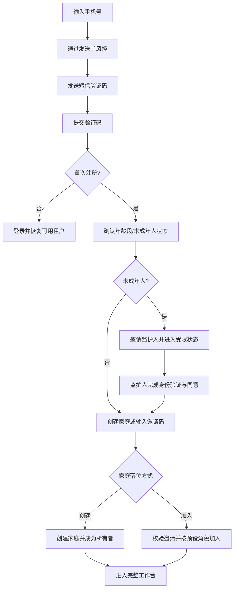

# Web 版产品需求文档（PRD）

> 产品：李兆霖数学错题本 Web 版
> 文档版本：`v0.2.0`
> 基线日期：`2026-08-22`
> 状态：`已确认，待技术设计与开发`

## 1. 产品目标

为学生与家庭提供可注册、可隔离、可持续使用的多用户错题学习服务。MVP 必须允许普通用户通过手机号验证码开放注册，同时以家庭租户承载学生、监护人及后续受控角色，满足未成年人保护、访问控制与个人信息权利的基本要求。

## 2. 用户与角色

| 角色 | 说明 | 核心权限 |
|---|---|---|
| 学生 | 错题与复习任务的主体，可能是未成年人 | 在所属家庭内使用被授权的学习功能 |
| 监护人 | 对未成年人账号给予或撤回同意，管理家庭 | 管理家庭成员、查看被授权的学习进度、处理同意 |
| 家庭所有者 | 创建家庭的初始成年人或后续受让人 | 管理成员、邀请码、角色与所有权转移 |
| 教师/辅导者 | 通过受控邀请加入，权限限于被授权学生 | 查看或指导指定范围学习数据 |
| 平台运营/管理员 | 平台内部高权限角色 | 经审批和审计执行必要运营管理，不属于家庭普通成员 |

同一用户可以在不同家庭中拥有不同角色；所有授权均以服务端保存的成员关系和作用域为准。

## 3. 核心用户流程



## 4. 功能需求与验收标准

### AUTH-001 手机号短信验证码注册与登录

- 优先级：P0
- MVP：是
- 状态：已确认

需求：

1. 支持中国大陆手机号发送短信验证码。
2. 同一入口兼容首次注册与已有账号登录。
3. 验证码必须短时有效、一次性使用；成功后立即失效。
4. 接口不得向未认证调用方暴露该手机号是否已注册。
5. 登录成功后签发可撤销的会话，并支持退出登录和全端失效。

验收标准：

- AC-AUTH-001-01：合法手机号通过发送前风控后，可收到包含正确签名和用途说明的验证码。
- AC-AUTH-001-02：正确验证码在有效期内仅能成功使用一次；错误、过期或已使用验证码均失败。
- AC-AUTH-001-03：首次验证成功创建一个身份记录，重复验证同一规范化手机号不会创建重复身份。
- AC-AUTH-001-04：对“已注册”和“未注册”手机号，发送接口的公开状态码与文案一致，不可据此枚举账号。
- AC-AUTH-001-05：退出登录后当前会话失效；执行安全事件处置时可令该账号全部会话失效。

### AUTH-002 验证码防轰炸与风控

- 优先级：P0
- MVP：是
- 状态：已确认

需求：

1. 对手机号、IP、设备标识、会话和平台总量实施组合限流。
2. 对连续请求、异常地域、代理池特征或大量失败校验升级图形/行为挑战，必要时阻断。
3. 设置验证码发送最短间隔、小时/日上限、错误尝试上限和短期锁定。
4. 供应商调用必须支持幂等键，避免重试导致重复发送和重复计费。
5. 记录不含明文验证码、不含完整手机号的风控审计事件；支持告警、预算阈值和紧急熔断。

MVP 默认安全基线（可配置，不得硬编码在客户端）：

- 同一手机号：60 秒内最多 1 次、1 小时最多 5 次、滚动 24 小时最多 5 次。
- 同一 IP：1 分钟最多 10 次、1 小时最多 20 次；超过阈值进入挑战或阻断。
- 同一设备：1 小时最多 10 次、24 小时最多 20 次。
- 同一验证码：最多校验 5 次，超过后立即作废并短期锁定。
- 平台级：按小时费用/条数预算告警，达到紧急阈值时暂停非白名单发送。

验收标准：

- AC-AUTH-002-01：自动化测试覆盖手机号、IP、设备和全局四类阈值，超限请求不触发短信供应商调用。
- AC-AUTH-002-02：并发提交相同幂等键时，供应商最多接收一次有效发送请求。
- AC-AUTH-002-03：连续错误校验达到上限后，旧验证码失效且后续请求进入挑战或锁定。
- AC-AUTH-002-04：风控日志可关联请求、规则和结果，但不出现完整手机号或验证码明文。
- AC-AUTH-002-05：模拟供应商异常和预算熔断时，系统返回统一可恢复提示并生成告警，不发生无限重试。

### AUTH-003 未成年人监护人同意

- 优先级：P0
- MVP：是
- 状态：已确认

需求：

1. 首次注册需确认年龄段或未成年人状态，仅采集完成判断所必需的信息。
2. 未成年人身份创建后进入 `guardian_consent_pending` 受限状态。
3. 监护人通过独立手机号验证后查看隐私说明并作出明确同意；系统保存同意版本、时间、主体、关系声明和证据摘要。
4. 监护人可以撤回同意；撤回后停止非必要处理并限制账号，后续按注销/导出规则处理。
5. 未完成监护同意前，不允许上传错题照片、生成学习画像或向模型发送学生内容。

验收标准：

- AC-AUTH-003-01：标记为未成年人的新账号在监护同意前无法调用受限学习接口，服务端返回明确状态而非仅前端隐藏。
- AC-AUTH-003-02：同意记录可以追溯到监护人、被监护账号、政策版本和时间，且不可由学生会话自行伪造。
- AC-AUTH-003-03：监护人撤回后，所有受限接口在规定传播时间内停止，已有会话权限同步刷新。
- AC-AUTH-003-04：受限状态仍可访问隐私说明、监护邀请、注销申请、退出登录和必要客服入口。

### TENANT-001 注册后创建家庭租户

- 优先级：P0
- MVP：是
- 状态：已确认

需求：

1. 符合条件的成年人可在首次落位流程创建家庭租户，并成为家庭所有者。
2. 创建操作必须幂等；网络重试不得产生多个家庭。
3. 所有学习数据必须归属明确的 `tenant_id`；授权判断由服务端成员关系决定。
4. 家庭所有者可以邀请成员、调整允许的家庭角色并转移所有权。

验收标准：

- AC-TENANT-001-01：新用户创建家庭后同时生成唯一租户和所有者成员关系，整个操作在同一事务中完成。
- AC-TENANT-001-02：重复提交同一幂等请求只返回同一家庭，不产生孤立成员或重复租户。
- AC-TENANT-001-03：用户无法通过篡改请求中的 `tenant_id` 访问非成员家庭数据。
- AC-TENANT-001-04：最后一名所有者退出或注销前，系统强制完成所有权转移或家庭解散流程。

### TENANT-002 受控加入家庭租户

- 优先级：P0
- MVP：是
- 状态：已确认

需求：

1. 用户可以在注册后输入有效邀请码加入已有家庭。
2. 加入行为必须尊重邀请码预设租户、角色、有效期、次数和目标手机号约束。
3. 已加入用户重复使用同一邀请应幂等成功，不创建重复成员关系。
4. 未成年人加入家庭仍必须满足 `AUTH-003`，邀请码不能替代监护同意。

验收标准：

- AC-TENANT-002-01：有效邀请使用户加入指定家庭并获得且仅获得预设角色。
- AC-TENANT-002-02：过期、撤销、超次数、租户不匹配或目标手机号不匹配的邀请码均被拒绝。
- AC-TENANT-002-03：邀请码校验与成员写入具备并发一致性，最后一个名额不能被超额使用。
- AC-TENANT-002-04：任何邀请均不能绕过未成年人同意状态和服务端权限校验。

### AUTHZ-001 邀请码与高权限授予

- 优先级：P0
- MVP：是
- 状态：已确认

需求：

1. 邀请码用于受控加入和角色授予，不作为普通用户创建身份的强制条件。
2. 邀请记录必须绑定签发者、租户、预设角色、有效期、最大使用次数和状态。
3. 邀请码原文仅在创建时显示，持久化使用不可逆摘要；支持撤销。
4. 教师、家庭管理员、平台运营等高权限必须使用专用邀请或审批流程，不能由普通成员邀请码提升。
5. 签发、查看、使用、失败和撤销均进入安全审计。

验收标准：

- AC-AUTHZ-001-01：普通手机号注册全流程在没有邀请码时可完成，并可选择创建家庭。
- AC-AUTHZ-001-02：数据库和日志中不可检索到可直接使用的邀请码原文。
- AC-AUTHZ-001-03：普通角色邀请无法被修改请求提升为更高角色；服务端以签发记录为准。
- AC-AUTHZ-001-04：撤销邀请码后所有未完成兑换立即失败，已完成的成员关系按单独权限流程处理。

### PRIV-001 手机号脱敏与敏感数据保护

- 优先级：P0
- MVP：是
- 状态：已确认

需求：

1. 前端、管理端、日志、审计导出和错误信息默认显示脱敏手机号，例如 `138****1234`。
2. 明文手机号仅允许在短信发送等必要边界内短时使用，存储与访问遵循最小权限和可审计原则。
3. 验证码不得以明文持久化或写入日志；只保存安全摘要和必要元数据。
4. 对用户输入、异常堆栈和第三方回调执行日志清洗。

验收标准：

- AC-PRIV-001-01：自动化扫描注册、运营查询、审计和错误日志，不出现完整手机号或验证码明文。
- AC-PRIV-001-02：无敏感字段权限的后台角色只能看到脱敏号码；越权读取被拒绝并记录。
- AC-PRIV-001-03：数据库泄露演练中，验证码不可直接恢复，手机号保护方案与密钥权限相互隔离。

### PRIV-002 个人数据导出

- 优先级：P0
- MVP：是
- 状态：已确认

需求：

1. 用户完成二次身份验证后可以申请导出本人有权访问的个人数据。
2. 导出任务异步生成，包含数据范围、生成时间和格式说明，不包含其他家庭成员无权共享的数据。
3. 下载地址短时有效、单次或限次使用，并记录访问审计。
4. 监护人代未成年人申请导出时，必须验证有效监护关系和当前同意状态/法定依据。

验收标准：

- AC-PRIV-002-01：通过身份验证的用户可创建导出任务，并查询 `pending/running/ready/failed/expired` 状态。
- AC-PRIV-002-02：导出包通过租户与数据所有权测试，不包含无权访问的其他成员数据、验证码或内部安全字段。
- AC-PRIV-002-03：过期或超次数的下载链接不可使用；每次下载均有审计记录。
- AC-PRIV-002-04：任务失败可安全重试，不会产生权限扩大或重复通知风暴。

### PRIV-003 账号注销

- 优先级：P0
- MVP：是
- 状态：已确认

需求：

1. 用户完成二次身份验证后可以申请注销，并看到影响范围、不可立即删除项及预计完成时间。
2. 注销前检查家庭所有权；唯一所有者必须先转移所有权或解散家庭。
3. 注销执行后撤销所有会话和授权，停止非必要数据处理，并按规则删除、匿名化或依法隔离留存数据。
4. 注销不应无提示删除其他家庭成员的共享数据；保留数据必须记录依据、范围和到期处置。
5. 监护人可按有效关系为未成年人发起注销。

验收标准：

- AC-PRIV-003-01：未通过二次验证或仍是家庭唯一所有者的注销申请被安全阻止，并给出明确下一步。
- AC-PRIV-003-02：注销完成后所有访问令牌失效，手机号不能继续登录原账号，非必要处理停止。
- AC-PRIV-003-03：执行报告可证明各数据类别被删除、匿名化或依法留存，且留存数据不可用于原目的之外的处理。
- AC-PRIV-003-04：家庭共享数据按所有权规则保留或删除，不造成其他成员数据越权暴露。

## 5. 状态机

### 5.1 用户开通状态

```text
phone_unverified
  -> phone_verified
  -> guardian_consent_pending（未成年人）
  -> tenant_placement_pending
  -> active
  -> restricted（同意撤回/安全风控）
  -> deletion_pending
  -> deleted
```

状态迁移必须由服务端根据已验证事件执行，不接受客户端直接指定目标状态。

### 5.2 邀请码状态

```text
active -> exhausted
active -> expired
active -> revoked
```

已过期、已撤销或已用尽的邀请码不可恢复使用；需要时重新签发。

## 6. 非功能要求

### NFR-SEC-001 安全

- 验证码、会话、邀请和高权限操作遵循最小权限、短时有效、可撤销和完整审计原则。
- 所有身份、租户、监护和隐私权利校验必须在服务端执行。
- 关键写操作使用事务、幂等键或唯一约束处理并发与重试。

### NFR-PRIV-001 隐私

- 默认最少收集；未成年人不默认采集完整身份证件。
- 敏感字段分级、脱敏、加密和审计；测试数据不得使用真实手机号。
- 模型调用前执行租户授权和必要性判断，未取得监护同意的学生内容不得发送。

### NFR-OBS-001 可观测性

- 记录验证码请求量、发送成功率、供应商延迟/错误、风控拦截率、预算消耗、邀请兑换和注销/导出任务状态。
- 指标与日志使用内部主体 ID 或不可逆关联标识，不使用完整手机号作为标签。

### NFR-AVAIL-001 可用性

- 短信供应商超时不得阻塞工作线程无限等待；支持受控重试、熔断与人工告警。
- 注册关键路径的目标可用性、响应时间和恢复目标由技术方案进一步量化并纳入上线门禁。

## 7. MVP 上线门禁

以下条件全部满足后，相关功能才能标记为“已完成”：

1. `AUTH-001` 至 `PRIV-003` 的全部 P0 验收用例通过，并有自动化或可复现证据。
2. 完成验证码轰炸、账号枚举、邀请码并发、租户越权、未成年人绕过、导出越权和注销残留专项测试。
3. 数据库迁移具备回滚方案，关键唯一约束和外键/引用完整性检查通过。
4. 日志与错误响应通过手机号、验证码、邀请码泄露扫描。
5. 短信模板、隐私政策、未成年人说明、监护同意文本及注销/导出说明完成业务和合规确认。
6. 运营具备短信预算熔断、异常告警和人工处置流程。

## 8. 需求状态总表

| 需求编号 | 名称 | 优先级 | MVP | 状态 | 目标版本 |
|---|---|---:|---|---|---|
| AUTH-001 | 手机号短信验证码注册与登录 | P0 | 是 | 已确认 | v0.2.0 |
| AUTH-002 | 验证码防轰炸与风控 | P0 | 是 | 已确认 | v0.2.0 |
| AUTH-003 | 未成年人监护人同意 | P0 | 是 | 已确认 | v0.2.0 |
| TENANT-001 | 注册后创建家庭租户 | P0 | 是 | 已确认 | v0.2.0 |
| TENANT-002 | 受控加入家庭租户 | P0 | 是 | 已确认 | v0.2.0 |
| AUTHZ-001 | 邀请码与高权限授予 | P0 | 是 | 已确认 | v0.2.0 |
| PRIV-001 | 手机号脱敏与敏感数据保护 | P0 | 是 | 已确认 | v0.2.0 |
| PRIV-002 | 个人数据导出 | P0 | 是 | 已确认 | v0.2.0 |
| PRIV-003 | 账号注销 | P0 | 是 | 已确认 | v0.2.0 |

## 9. 版本记录

| 版本 | 日期 | 状态 | 变更摘要 |
|---|---|---|---|
| v0.2.0 | 2026-08-22 | 已确认 | 将开放手机号验证码注册、防轰炸、未成年人监护同意、家庭租户创建/加入、受控邀请码、手机号脱敏、个人数据导出及账号注销正式纳入 MVP |
