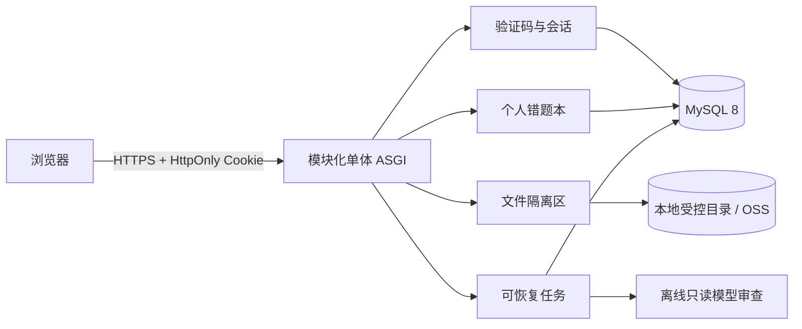
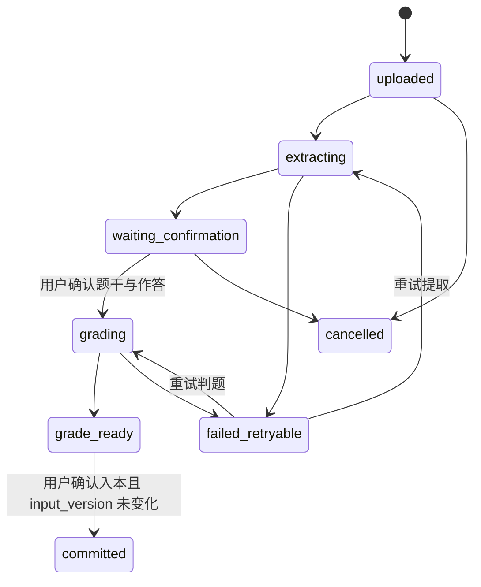

# Web 版技术架构（v0.4.0 本地候选）

## 1. 冻结边界

李兆霖数学错题本 Web 只有一种普通用户，但认证有两个明确场景：已有账号使用手机号验证码登录，新用户使用手机号、验证码和密码注册并确认协议。注册成功自动登录。服务端从安全 Cookie 解析当前 `user_id`；客户端不得提交可改变数据归属的 `user_id`。

首版不建设姓名、昵称、年级、身份角色、家庭、学生档案、监护同意或实名认证。旧设计中的 tenant/student/guardian 只作为迁移历史，不是产品、权限或注册状态。

## 2. 最小架构

首版不引入 Redis、消息中间件或微服务。任务用 MySQL 行锁、状态和检查点恢复。模型只产生带输入版本的候选结果，不能登录、授权、发短信或直接写正式记录。

## 3. 权威边界

| 边界 | 权威实现 | 不变量 |
|---|---|---|
| OTP/登录/注册 | `services/web_auth/registration.py` | `purpose=login|register` 隔离；登录不建号，注册不覆盖已有账号；挑战只能成功消费一次 |
| 密码凭据 | Auth Store + 新前向迁移 | 只保存经安全复核的自适应哈希、独立盐和参数；原文永不落库或进入日志 |
| 协议确认 | Auth Store + 新前向迁移 | 保存用户、协议版本与确认时间；不保存无关身份信息 |
| 会话 | Auth Store/API | 仅保存 token 哈希；Cookie 为 Secure、HttpOnly、SameSite=Lax |
| 个人数据 | Domain Store | 所有查询和写入都由会话注入 `user_id` |
| 公共题库 | `question_*` 表 | 只有来源允许且已验证版本可进入推荐池 |
| 文件 | File service/Store | 对象键不可猜；同用户幂等，跨用户不复用对象 |
| 候选提交 | Domain service | 候选携带 `input_version`；正式提交时必须再次比对 |
| 迁移 | `scripts/local_env.py` | 文件哈希、成功后记账、失败不记账、重复执行幂等 |

## 4. 账号与授权

v0.4.0 目标 API 拆为 `POST /v1/auth/login/otp/request`、`POST /v1/auth/login/otp/verify`、`POST /v1/auth/register/otp/request` 和 `POST /v1/auth/register/complete`。登录挑战只能访问已有 `active` 账号；注册挑战只能创建不存在的手机号账号。注册完成在一个事务内消费验证码、创建账号、保存密码凭据和协议版本并建立会话；成功后返回 `next_action=workbench`。

产品要求对登录未注册号码和注册已存在号码给出明确跳转反馈，因此不再承诺公开响应完全不可枚举。该风险必须通过多维限流、CAPTCHA、最小响应、审计告警、批量枚举测试和独立安全批准控制；普通日志和运营检索仍不得提供手机号状态查询。

当前 `openapi/web-v1.json` 与代码已升级为 v0.4.0 四接口：登录/注册验证码申请与验证分场景，注册原子保存密码、协议并创建会话；旧 v0.3.3 单入口仅作为迁移起点。真实 MySQL smoke、153 项测试、Codex CLI 数学候选实测和浏览器验收已通过；生产门禁仍未完成。

每个受保护请求先解析会话，再把 `user_id` 传给 Store。资源查询必须同时匹配 `id` 与 `user_id`；未匹配统一返回 `not_found`，不暴露其他用户资源是否存在。退出当前设备撤销当前会话，全端退出撤销该用户所有会话。

保留 `tenant_scope_hash` 仅作为旧 0001 中公开注册入口的内部反滥用维度；它不能成为产品租户或数据权限键。

## 5. 数据与状态

公共内容：`question_sources → questions → question_versions → question_verifications`。个人内容：`web_files`、`intake_items`、`web_jobs`、`attempts`、`grade_candidates`、`error_notebook_entries`、`recommendations`、`review_tasks`，全部直接外键到 `web_users.id`。

首题闭环：

`unclear` 判题不能入本。相同幂等键只产生一个上传、作答、正式错题或复习阶段。候选结果永不覆盖输入；用户修订会增加 `input_version`，使旧候选失效。

## 6. 迁移顺序

1. 已应用的 `0001_phone_registration.sql` 永不改写。
2. 尚未共享应用的 `0002_web_domain.sql` 直接重构为 `user_id` 模型。
3. `0003_account_simplification.sql` 前向移除资料和监护字段/表，并收敛账号状态。
4. 已应用的领域迁移继续保持只读；新增认证迁移必须使用下一个未占用编号，建立密码凭据和协议确认表，并为验证码挑战用途建立可验证约束。
5. 密码凭据迁移必须支持灰度：旧账号没有密码仍可验证码登录；不得为旧账号生成伪密码或阻断登录。
6. 迁移账本以名称和 SHA-256 记录；同名异哈希立即失败。

空库执行 0001→0002→0003。已有本地库先登记已存在且哈希一致的 0001，再执行剩余迁移。DDL 失败不得记成功账；修复后从未记账迁移恢复。回滚通过恢复执行前备份或补充新的前向迁移完成，不逆向修改已经发布的迁移。

## 7. API 与错误

当前机器可校验契约见 `openapi/web-v1.json`（35 paths）；认证细则见 `docs/13-LOGIN-REGISTER-PRD.md`。错误统一为 `{error:{code,message,retryable,request_id}}`；页面只依赖稳定 `code`，不解析文案。生产切换前仍需完成真实供应商、观测、压测、灾备和安全复核。

## 8. 安全和部署门

手机号、验证码、密码、Cookie、CAPTCHA token 和密钥不得进入日志或仓库。密码哈希方案、参数、pepper托管、协议证据和账号存在性反馈必须经过独立安全复核。供应商只支持明文 HTTP 时，生产必须固定出口 IP、供应商白名单、出站安全组、短超时且禁止自动重发和请求体日志。当前只验收本地生产等价环境；阿里云部署仍需单独人工批准。
