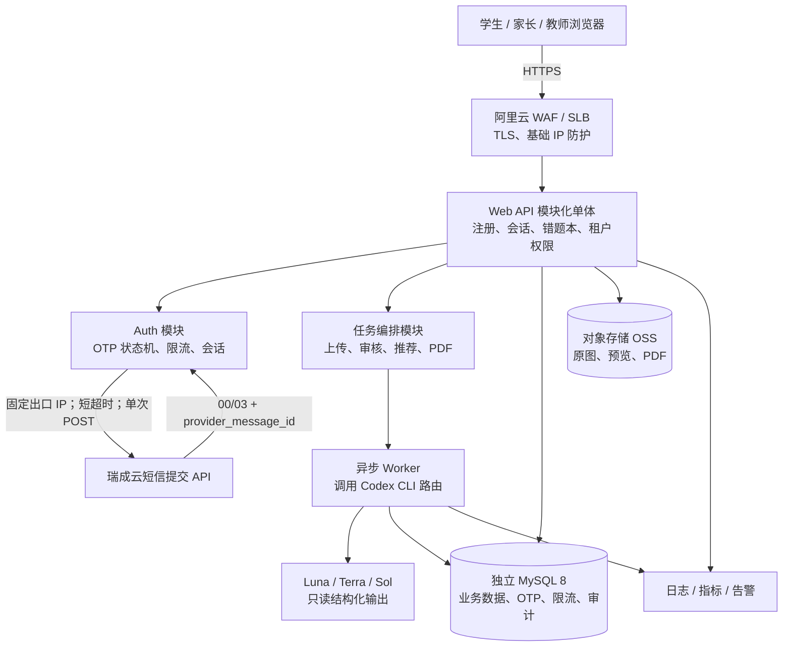
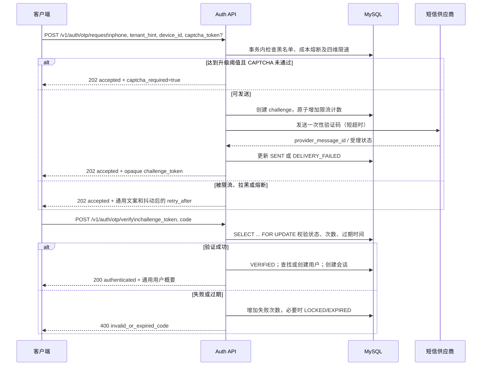
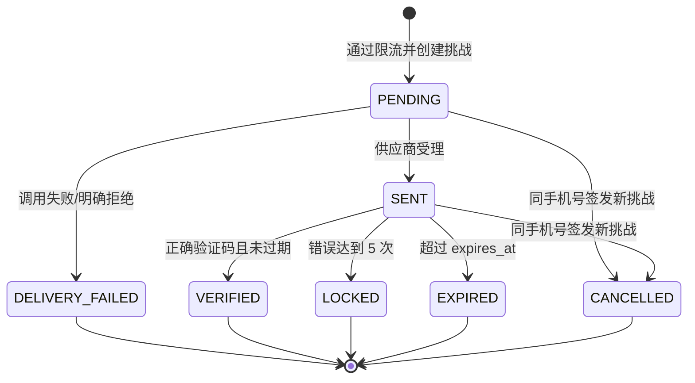
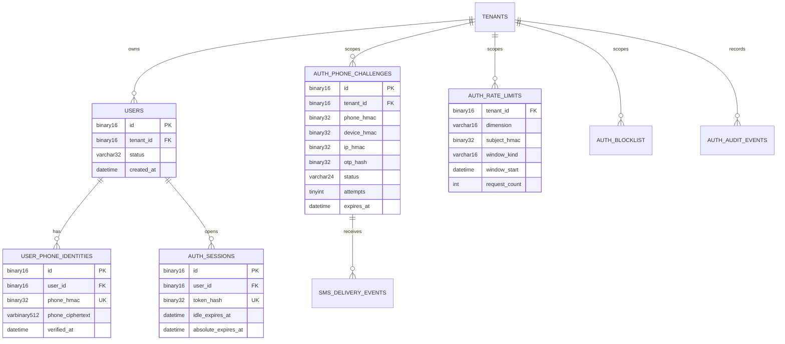

# Web 版技术架构与手机号注册安全设计

## 1. 目标与首版边界

Web 版面向多用户、应用与数据库分离部署，使用 MySQL 作为业务与安全状态的唯一持久化数据库。首版采用“模块化单体 API + 异步任务进程 + MySQL”。现有桌面错题本只作为受控迁移的规则与数据来源；Web 项目不直接读取或共享桌面 SQLite，也不建立平行验证器或推荐器。首期不引入 Redis、微服务注册中心或独立消息队列。

手机号入口采用“验证码登录/注册合一”：验证码校验成功后，手机号不存在则创建账号，已存在则登录。请求、短信文案和成功响应均不暴露手机号是否已经注册，从协议层消除账号枚举旁路。

## 2. 系统架构

安全边界：浏览器、短信供应商和模型均是不可信边界；模型不能直接写 MySQL。后续迁移到 Web 的领域质量门必须保持桌面版 `grade-preview → grade-commit`、`prepare-review-batch → verify-review-batch`、`assign-recommendations` 等不变量；在这些 Web 质量门真正实现并验收前，不得把规划写成已具备能力。

## 3. 手机验证码注册流程

当前瑞成云通道只返回同步提交状态，不提供送达状态回调。因此 `SENT` 表示网关已受理，不能解释为手机已送达；系统保存流水号用于对账，但不伪造送达事件。

接口只返回不可推断账号状态的信息：

- `POST /v1/auth/otp/request` 无论手机号已存在、被策略静默拦截或供应商已受理，均返回 HTTP 202、固定结构和近似耗时；仅 `captcha_required`、抖动后的 `retry_after_seconds` 可以变化。
- `POST /v1/auth/otp/verify` 只区分“验证成功”和“验证码无效或已过期”，不返回“手机号未注册”。成功后统一进入会话；新账号再进入资料完善流程。
- `challenge_token` 是至少 128 bit 的随机不透明值；验证码为 6 位随机数，有效期 5 分钟，只能成功使用一次。
- 服务端不明文保存验证码；使用 `HMAC-SHA-256(server_pepper, challenge_id || code || salt)`，pepper 存放在密钥管理服务，不进入数据库或日志。

## 4. 验证码状态机

状态转换必须在事务中完成。`VERIFIED`、`LOCKED`、`EXPIRED`、`CANCELLED`、`DELIVERY_FAILED` 均为终态；终态挑战不可再次验证或重发。对同一租户和手机号，新挑战创建时取消仍有效的旧挑战，避免多个有效验证码并存。

## 5. 防验证码轰炸

### 5.1 多维持久限流

每次请求同时检查以下维度，任一维度超限即不发送短信。数值是首版起始值，必须配置化，并依据真实误拦率和费用调整。

| 维度 | 冷却时间 | 1 小时上限 | 24 小时上限 | 说明 |
|---|---:|---:|---:|---|
| 手机号（HMAC 后） | 60 秒 | 5 | 5 | 防止单个号码被轰炸，并符合当前通道日上限 |
| 精确 IP | 无 | 20；另有 10/分钟 | 未设置 | HMAC 后持久计数，防止单地址突发 |
| IP 前缀 | 无 | 30 | 未设置 | IPv4 /24、IPv6 /56 聚合；同时保留精确 IP HMAC 审计 |
| 设备标识 | 无 | 10 | 20 | 随机持久设备 ID，仅作为一个信号，不作为可信身份 |
| 租户 | 无 | 300 | 未设置 | 防单租户配置或业务被滥用 |
| 全局成本 | 无 | 未设置 | 10,000 | 达阈值触发成本熔断 |

响应中的冷却时间增加 0—15% 非负随机抖动，既不缩短真实冷却时间，也避免攻击者精确探测计数窗口。被静默拦截的请求仍写安全审计，但不创建可验证挑战、不调用短信供应商。

### 5.2 CAPTCHA 渐进升级

正常低风险请求不展示 CAPTCHA。满足任一条件时要求 CAPTCHA：手机号在 1 小时内第 3 次请求、IP 或设备达到小时上限的 50%、近期连续验证码失败达到 3 次、设备/IP 与大量手机号关联、命中供应商风险信号。CAPTCHA 通过只解除本次升级要求，不绕过硬上限、黑名单或成本熔断；token 必须服务端校验且一次性使用。

### 5.3 黑名单、提交回执与成本熔断

- 黑名单支持 `phone_hmac`、IP 前缀、设备、租户四类主体，具有原因、创建者、有效期和解除记录；永久封禁必须由管理员明确操作。
- 当前通道只保存同步受理状态和流水号，不把 `00`/`03` 当作送达证明。未来供应商若提供已验签回调，再按 `provider + provider_message_id + event_type` 唯一约束扩展幂等事件。
- 维护全局、租户和供应商三级小时/日预算。达到 80% 告警并强制 CAPTCHA，达到 100% 熔断新短信；已发挑战仍可验证。管理员恢复必须记录审计，自动恢复只能发生在新预算窗口。
- 供应商调用设 3 秒连接、5 秒读取超时且不自动重试，避免一次用户请求产生多条短信。超时属于结果未知，必须等待用户在冷却期后重新请求。

## 6. MySQL 数据模型

手机号和 IP 按最小化原则保存：匹配和唯一约束使用不可逆 HMAC；确需展示或供应商重试时，手机号使用 KMS 信封加密密文。业务日志禁止写手机号、验证码、会话 token 和 CAPTCHA token。

建议表和关键字段如下；所有时间均用 UTC，`created_at`/`updated_at` 使用 `DATETIME(6)`：

| 表 | 关键字段与约束 |
|---|---|
| `tenants` | `id BINARY(16) PK`, `name`, `status`, `sms_hour_budget`, `sms_day_budget` |
| `users` | `id`, `tenant_id`, `status(active/locked/deleted)`, `created_at`; 索引 `(tenant_id,status)` |
| `user_phone_identities` | `user_id`, `phone_hmac BINARY(32)`, `phone_ciphertext VARBINARY(512)`, `verified_at`; 唯一 `(tenant_id,phone_hmac)` |
| `auth_phone_challenges` | `id`, `public_token_hash`, `tenant_id`, `phone_hmac`, `device_hmac`, `ip_hmac`, `purpose`, `otp_hash`, `otp_salt`, `status`, `attempts`, `max_attempts`, `expires_at`, `sent_at`, `verified_at`, `provider`, `provider_message_id`; 唯一 `public_token_hash`，索引 `(tenant_id,phone_hmac,status,expires_at)` |
| `auth_rate_limits` | `tenant_id`, `dimension`, `subject_hmac`, `window_kind`, `window_start`, `request_count`, `updated_at`; 唯一 `(tenant_id,dimension,subject_hmac,window_kind,window_start)` |
| `sms_delivery_events` | `provider`, `provider_message_id`, `event_type`, `provider_status`, `occurred_at`, `payload_sha256`, `created_at`; 唯一 `(provider,provider_message_id,event_type)` |
| `auth_sessions` | `id`, `user_id`, `token_hash`, `csrf_secret_hash`, `device_hmac`, `created_at`, `last_seen_at`, `idle_expires_at`, `absolute_expires_at`, `revoked_at`, `revoke_reason`; 唯一 `token_hash` |
| `auth_blocklist` | `id`, `tenant_id NULL`, `subject_type`, `subject_hmac`, `reason_code`, `starts_at`, `expires_at NULL`, `created_by`, `revoked_at`; 活跃查询索引 `(subject_type,subject_hmac,expires_at,revoked_at)` |
| `auth_cost_budgets` | `scope_type`, `scope_id`, `window_kind`, `window_start`, `accepted_count`, `estimated_cost_minor`, `limit_minor`, `tripped_at`; 唯一 `(scope_type,scope_id,window_kind,window_start)` |
| `auth_audit_events` | `id`, `tenant_id`, `actor_user_id NULL`, `event_type`, `outcome`, `subject_hmac NULL`, `ip_hmac`, `device_hmac`, `request_id`, `metadata_json`, `created_at`; 索引 `(tenant_id,event_type,created_at)` |

限流计数采用单条原子语句 `INSERT ... ON DUPLICATE KEY UPDATE request_count = request_count + 1`，随后在同一事务读取所有维度并决定是否签发挑战。计数增加和挑战创建必须同事务提交；短信网络调用在事务提交后执行，避免长事务占锁。若发送失败，回写挑战状态，不回退限流计数，以免失败重试成为绕过手段。

## 7. 会话与账号枚举防护

- 浏览器会话使用 256 bit 随机不透明 token，只把 `SHA-256(token)` 存入 MySQL；cookie 设置 `Secure`、`HttpOnly`、`SameSite=Lax`、`Path=/`，禁止进入 URL 或本地存储。
- 会话闲置有效期 30 天、绝对有效期 90 天；登录成功、敏感资料变更和权限提升时轮换 token。退出、锁定账号、修改手机号时撤销相关会话。
- 所有写请求使用同源校验与 CSRF token；高风险操作要求最近 10 分钟内完成过验证码验证。
- OTP 请求、验证失败、用户查询、找回流程均使用统一文案和近似响应时间。管理后台只有具备审计权限的角色可查看脱敏账号状态。
- 密码学比较使用常量时间函数；错误日志只记录 `request_id`、HMAC 后主体、策略原因码和供应商消息 ID。

## 8. 不使用 Redis 的首版实现与升级门槛

首版 MySQL 已能通过唯一键、原子自增和行锁提供跨实例一致限流，运维组件更少，也避免 Redis 与 MySQL 双写不一致。清理任务每天删除超过审计保留期的限流窗口；当前窗口和近期审计保留在线索引。

满足以下任一条件并经压测复现后，才引入 Redis 作为限流热路径；MySQL 仍保留最终审计和成本账本：

1. OTP 请求持续超过 50 RPS，或峰值超过 150 RPS；
2. `auth_rate_limits` 行锁等待 P95 连续 15 分钟超过 20 ms；
3. Auth API P95 因限流事务超过 200 ms，且索引与事务缩短后仍不达标；
4. 限流表活跃窗口超过 500 万行，清理和索引维护开始影响业务库；
5. 多地域部署需要地域内快速拒绝，而单主 MySQL 往返延迟无法满足目标。

升级时使用 Redis Lua 脚本原子检查多维计数，MySQL 异步落审计；禁止在没有幂等键和故障降级策略时双写。Redis 不可用时默认回退 MySQL 硬限流，不得“失败开放”。

## 9. 首版代码落点

为保持安全规则只有一份实现，首版使用以下权威落点，不另建平行验证码服务：

| 路径 | 职责 |
|---|---|
| `services/web_auth/registration.py` | 标准化手机号、生成/校验 OTP、四维限流决策、状态转换、统一响应、会话签发所需的纯业务内核 |
| `services/web_auth/__init__.py` | 仅导出稳定公共接口，不包含第二份业务逻辑 |
| `services/web_auth/migrations/0001_phone_registration.sql` | 本章 MySQL 表、索引、唯一约束与外键的权威迁移 |
| `tests/test_web_auth_registration.py` | 状态机、防轰炸、枚举防护、会话与并发边界的自动化回归 |

HTTP 框架适配层负责解析请求、可信代理 IP、CAPTCHA 和短信供应商调用；它只调用 `registration.py`，不得复制限流或状态机规则。MySQL 仓储实现必须遵守该内核的事务边界，模型路由器不参与身份认证决策。
