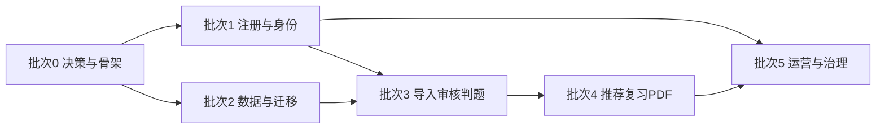

# Web 版实施计划

> 文档版本：`v0.3.0`
> 基线日期：`2026-08-22`
> 状态：产品映射已确认；工程批次待验收

## 1. 目标与交付边界

本计划把“李兆霖数学错题本”从单机项目改造成应用与数据库分离、支持多用户的 Web 服务。首个可上线版本必须同时满足：

- 手机验证码注册、登录和账号恢复；
- 服务端防验证码轰炸、撞库、批量注册和接口重放；
- 用户、学生档案、题库、错题、练习、复习计划和 PDF 数据隔离；
- MySQL 作为权威关系型数据库，对象存储承载图片、原卷和 PDF；
- 题目导入、审核、判题、推荐和复习任务通过可恢复的异步工作流执行；
- Codex CLI 按任务难度路由 Luna、Terra、Sol，模型只产出候选结果，业务质量门负责最终写入；
- 关键操作可追踪、可审计、可回滚，灰度发布失败可恢复到上一稳定版本。

产品范围以 `02-PRODUCT-REQUIREMENTS.md` v0.3.0 为准。公开 MVP 有两道不可替代的门：GATE-A 账号与租户基础、GATE-B 错题学习闭环。批次可以独立交付工程证据，但注册模块完成不能替代完整学习闭环。

首期不建设独立向量数据库。题目召回先使用 MySQL 结构化标签、全文索引和项目现有语义重排；只有离线评测证明召回质量或延迟不能达标时，才通过 ADR 引入向量检索。

## 2. 实施原则

1. **先边界、后功能**：先确定租户隔离、身份认证、写入质量门和审计边界，再开放业务入口。
2. **应用与数据分离**：Web/API/Worker 无状态部署；MySQL 和对象存储为独立托管资源。首版限流和任务状态持久化在 MySQL，达到架构文档量化门槛后再通过 ADR 引入 Redis。
3. **同步轻、异步重**：注册、登录和查询同步完成；OCR、导入、审核、判题、推荐、PDF 在队列中执行。
4. **候选与事实分离**：模型结果、OCR 结果和自动审核都是只读候选；只有确定性校验和人工/业务质量门可更新权威数据。
5. **幂等优先**：所有可重试写操作必须有幂等键；任务以检查点续跑，不因进程重启重复扣费或重复写库。
6. **隐私最小化**：手机号、验证码、未成年人资料和作业图片按最小权限处理，不进入模型提示词或普通日志。
7. **证据化验收**：每一批次都以测试报告、迁移记录、审计记录、监控截图或演练记录作为完成证据。

## 3. 技术基线

| 层 | 首期选择 | 约束 |
|---|---|---|
| Web 前端 | 响应式 Web/PWA | 不持有服务端密钥；上传走短时签名 URL |
| API | 无状态 REST API | OpenAPI 契约；统一鉴权、限流、幂等和错误码 |
| 身份认证 | 手机验证码 + 服务端会话/令牌 | 验证码只存哈希；短有效期；一次性消费 |
| 关系数据库 | MySQL | 权威业务数据；迁移脚本版本化；禁止模型直连 |
| 缓存与协调 | 首版 MySQL | 验证码、持久限流、幂等键和 Worker 短租约；不以进程内缓存作为安全事实源 |
| 文件 | 阿里云 OSS | 原图、试卷、审核包、PDF；数据库只存元数据和对象键 |
| 异步任务 | 队列 + Worker | 至少一次投递；业务幂等；重试上限和死信队列 |
| AI 执行 | Codex CLI 任务路由器 | 只读沙箱、结构化输出、最多升级一次 |
| 可观测性 | 日志、指标、追踪、审计事件 | trace_id 贯穿 API、任务、模型调用和质量门 |

## 4. 实施批次

### 批次 0：决策冻结与可执行骨架

产品映射：全部需求的公共边界、权限矩阵和追溯规则。

交付：

- 冻结租户模型、用户/学生关系、数据所有权、保留期和删除策略；
- 建立开发、测试、预发布、生产四套隔离配置；
- 建立 API、Worker、数据库迁移、测试和部署流水线骨架；
- 建立任务清单、角色领取、复核和证据归档机制，见 `06-WORKBREAKDOWN-CODEX-WORKFLOW.md`；
- 为短信供应商、OSS、MySQL 形成 ADR 和故障降级策略，并记录 Redis 的量化升级触发条件。

完成证据：ADR 已批准；空服务可在测试环境部署；健康检查、迁移 dry-run、回滚演练通过；密钥扫描无高危结果。

### 批次 1：多用户基础与手机验证码注册

产品映射：`AUTH-001`、`AUTH-002`、`AUTH-003`、`TENANT-001`、`TENANT-002`、`AUTHZ-001` 和 `PRIV-001`。

交付：

- 用户、租户/家庭、学生档案、角色、会话和审计表；
- `发送验证码 → 校验验证码 → 创建账号/会话` 完整状态机；
- 手机号、IP、设备指纹、账号、场景五层限流；
- 图形验证码/行为挑战、冷却时间、日配额、供应商熔断和异常告警；
- 验证码哈希存储、短时有效、尝试次数限制、原子消费、防重放；
- 注册接口无论号码是否存在均返回等价响应，避免账号枚举；
- 风控命中时不向模型发送任何验证码、手机号或设备标识。

当前已实现基线（配置化并须持续压测校准）：同手机号冷却 60 秒、1 小时和滚动 24 小时均最多 5 次；同精确 IP 每分钟 10 次、每小时 20 次；同 IP 前缀每小时 30 次；同设备每小时 10 次、滚动 24 小时 20 次；同租户每小时 300 次；全局每日 10,000 次。连续失败触发挑战。供应商成功不等于注册成功，二者分别计数和审计。

完成证据：注册端到端测试；验证码并发原子消费测试；按手机号/IP/设备/网段的轰炸模拟；重放、枚举、时钟漂移和供应商超时测试；限流指标和告警可见。

### 批次 2：领域数据与单机库迁移

产品映射：`STUDENT-001`、`CONTENT-001`，并为 `ERROR-001`、`REVIEW-001`、`PRIV-002` 提供权威数据基础。

交付：

- MySQL 中的题库、题目版本、来源、验证记录、错题、作答、推荐、复习任务和文件元数据；
- 所有用户数据表具有明确的 `tenant_id/user_id/student_id` 归属并由服务层强制过滤；
- SQLite 到 MySQL 的只读抽取、校验、导入、对账和回滚工具；
- 内容哈希去重、外键、唯一约束和审计事件；
- 现有 `notebook.py` 领域规则封装为服务层能力，避免出现平行验证器或推荐器。

完成证据：匿名化快照迁移两次结果一致；总数、哈希、关联完整性和抽样内容对账通过；跨租户访问测试全部拒绝；回滚不丢原始数据。

### 批次 3：上传、导入、审核与判题工作流

产品映射：`INTAKE-001`、`INTAKE-002`、`GRADE-001`、`ERROR-001`、`JOB-001` 和 `WORKBENCH-001` 的任务入口。

交付：

- 文件直传 OSS、格式/大小/病毒检查和图片规范化；
- 试卷导入、题目切分、审核包、照片判题和错因分析工作流；
- 每一步记录输入快照、输出摘要、检查点、重试次数、模型路线和质量门结果；
- 低置信度、图像不清、答案冲突、复杂证明或重复题自动进入人工/高阶复核；
- Worker 重启、队列重复投递和模型超时后能够从最近检查点恢复。

完成证据：固定样本集准确率报告；任务中断恢复演练；重复投递不产生重复题或重复错题；模型失败不会更新权威库；所有失败任务可定位到具体步骤。

### 批次 4：推荐、复习计划与 PDF

产品映射：`RECOMMEND-001`、`REVIEW-001`、`PDF-001` 和 `WORKBENCH-001` 的学习入口。

交付：

- 仅从已验证题中召回，经过领域、知识点、题型操作、难度和重复项过滤；
- 推荐候选由模型复核时仍为只读，最终经推荐质量门写入；
- 错题后立即给出下一步行动，按复习阶段生成原题/推荐题任务；
- A4 PDF 默认无答案、不打印；文件生成幂等并可重新下载；
- 推荐缺口显式展示并进入题库补充队列，不用低质量题填满数量。

完成证据：离线推荐基准集的 Top-K 命中率、冲突率和缺口率；12 题及以上混合复习包回归；PDF 逐页视觉检查；同一任务重复执行生成相同内容哈希。

### 批次 5：运营后台、治理与上线

产品映射：`PRIV-002`、`PRIV-003`、`OPS-001`，以及全部 P0 需求的生产验收。

交付：

- 用户、风控、短信、任务、审核、题库质量和成本看板；
- 数据导出、注销、保留期清理和审计查询；
- 备份恢复、跨可用区容灾、限流降级、短信供应商切换；
- 容量、性能、安全、隐私、未成年人保护和故障演练；
- 灰度发布、回滚开关和上线值守手册。

完成证据：恢复点/恢复时间演练达到目标；峰值压测留有容量余量；高危安全问题清零；灰度指标稳定；产品、研发、安全、运维共同签署上线检查表。

## 5. 阶段依赖与并行策略

批次 1 与批次 2 可在契约冻结后并行；短信真实发送测试必须使用独立测试号码池和硬性预算。前端可基于 OpenAPI mock 并行，但不能绕过服务端授权与质量门。任何模型优化不得阻塞确定性核心流程上线。

## 6. 发布与迁移策略

1. 先在预发布环境以匿名化数据完成全量迁移演练和哈希对账。
2. 正式切换前冻结单机库写入，保留只读备份并记录最终水位。
3. 执行增量迁移、对账和业务冒烟；失败则停止 Web 写入并回到单机只读快照。
4. 小比例内部账号灰度，再扩大至邀请用户；观察注册转化、短信异常、任务失败、数据库延迟和模型成本。
5. 灰度期所有破坏性迁移采用 expand/contract，两次发布之间不得删除旧字段。

## 7. 全局质量门

上线前必须全部满足：

- 身份：验证码轰炸、重放、枚举和并发消费测试通过；
- 隔离：API、后台任务、对象键和导出均无跨租户读写；
- 数据：迁移可重复、可对账、可回滚，数据库约束覆盖关键不变量；
- AI：模型只读候选、Schema 校验、单次升级、低置信度停机和成本审计有效；
- 领域：未验证题不能推荐，错误/部分正确判题具备完整证据和下一步；
- 可靠性：队列重复投递、Worker 崩溃、供应商超时和数据库短暂故障演练通过；
- 运维：监控、告警、备份恢复、值守、降级和回滚手册可执行；
- 合规：隐私最小化、数据保留/删除、未成年人和第三方授权检查完成。

## 8. 项目完成定义

“代码已合并”不等于项目完成。只有批次 0—5 的完成证据均已归档，PRD 的 GATE-A 与 GATE-B 全部通过，生产灰度指标达到既定 SLO，至少完成一次从注册到错题复习 PDF 的真实端到端流程，并完成备份恢复、验证码攻击和异步任务中断三类演练，项目才可标记为上线完成。
