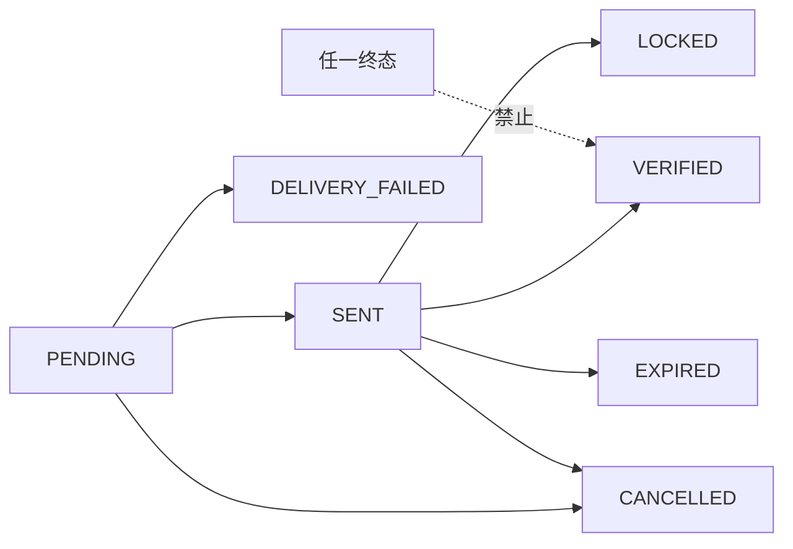

# Web 版测试、验收与安全运营

> 文档版本：`v0.4.0`
> 基线日期：`2026-08-23`
> 状态：验收基线已确认；执行证据待各工作包归档

## 1. 验收原则

首版验收以“登录/注册场景隔离、注册原子完成、密码安全、协议可追溯、user_id 隔离、验证码成本可控、账号状态反馈不可被批量滥用、会话可撤销、模型不能越权写库”为硬门槛。任何安全门失败均不得上线。

测试环境必须使用短信供应商沙箱或测试号码，禁止压测真实短信通道产生费用。所有安全测试数据使用专用测试账号并在测试后按保留策略清理。

## 2. 测试矩阵

| 编号 | 场景 | 操作与覆盖维度 | 预期结果 / 验收证据 |
|---|---|---|---|
| REG-01 | 新手机号注册 | 注册场景提交OTP、合法密码和协议版本 | 原子创建用户、密码凭据、协议记录和会话；挑战为 `VERIFIED`；进入工作台 |
| REG-02 | 已注册手机号验证码登录 | 登录场景请求并正确验证OTP | 不新建用户或改写密码；创建会话；正常进入工作台 |
| REG-03 | 验证码错误 | 连续输入错误码 | 前4次返回 `invalid_code`；第5次返回 `too_many_attempts` 并 `LOCKED`；不能再验证 |
| REG-04 | 验证码过期/重放 | 超过 5 分钟、成功后再次提交 | 分别进入/保持 `EXPIRED`、`VERIFIED`；均不能创建第二个会话副作用 |
| REG-05 | 新挑战替代旧挑战 | 同手机号再次签发 | 旧挑战 `CANCELLED`；只有新码有效 |
| REG-06 | 跨场景挑战 | 注册验证码用于登录，或登录验证码用于注册 | 返回稳定错误；不创建账号、凭据或会话 |
| REG-07 | 登录未注册手机号 | 登录页申请或验证 | 返回 `phone_not_registered`；提供注册跳转；绝不自动建号 |
| REG-08 | 注册已存在手机号 | 注册页申请或提交 | 返回 `phone_already_registered`；提供登录跳转；不接收或改写密码 |
| REG-09 | 协议未确认 | 绕过前端直接提交登录或注册 | 返回 `agreement_required`；无会话、账号或凭据副作用 |
| REG-10 | 密码边界 | 7/8/20/21位、仅字母、仅数字、空白、控制字符和超大输入 | 仅8—20位、同时含英文字母和数字且无空白/控制字符的密码通过；原文不落库、不入日志 |
| RL-01 | 手机号冷却 | 60 秒内重复请求 | 只发送一条；后续统一 202；`retry_after` 含抖动 |
| RL-02 | 手机号小时/日限流 | 单号码跨设备、跨 IP、跨登录/注册场景请求 | 达5/小时或10/滚动24小时后停止发送，不能通过换设备/IP/页面绕过 |
| RL-03 | IP 限流 | 同 IP/前缀请求多个号码 | 达阈值升级 CAPTCHA，硬上限后停止发送 |
| RL-04 | 设备限流 | 同设备切换 IP 与号码 | 设备计数持续有效；达到硬上限后停止发送 |
| RL-05 | 账号作用域限流 | 多 IP、多设备围绕同一账号空间并发 | 达内部账号上限后停止发送，不影响其他账号 |
| RL-06 | 并发竞争 | 50 个并发请求命中同手机号/窗口 | MySQL 原子计数准确；实际发送量不超过阈值；无重复有效挑战 |
| RL-07 | 窗口边界 | 请求跨小时/日边界 | 新窗口计数正确；旧窗口不被错误复用 |
| CAP-01 | CAPTCHA 升级 | 达软阈值、不带或伪造 token | 不发送；返回 `captcha_required=true`；伪造、过期、重放均失败 |
| CAP-02 | CAPTCHA 不是通行证 | CAPTCHA 通过但已达硬上限 | 仍不发送，审计为硬限流原因 |
| SMS-01 | 供应商受理/拒绝/超时 | 模拟三种结果 | 状态正确；超时不盲目跨供应商重发；错误不暴露供应商细节 |
| SMS-02 | 提交响应解析 | `00`、`03`、拒绝、乱码、缺流水号 | 仅 `00`/`03` 且含流水号标记 SENT；其余失败关闭；错误不泄露敏感字段 |
| COST-01 | 预算 80% | 推进账号与全局预算 | 产生告警并强制 CAPTCHA；审计包含范围和窗口 |
| COST-02 | 预算 100% | 继续请求 | 新短信熔断；已发送挑战仍可验证；其他未熔断范围按策略运行 |
| BL-01 | 黑名单 | 手机、IP 前缀、设备、账号分别命中 | 不调用供应商；外部统一 202；内部记录明确原因码 |
| ENUM-01 | 账号存在性批量查询 | 对登录/注册入口各运行1,000个号码 | 产品规定的存在性反馈可用，但限流、CAPTCHA、WAF和成本上限阻断批量高速探测；产生安全告警 |
| ENUM-02 | 额外信息泄露 | 比较限流、拉黑、供应商失败、存在与不存在 | 除允许的 `phone_not_registered`/`phone_already_registered` 外，不泄露账号状态、策略、供应商、锁定或注销信息 |
| SES-01 | Cookie 安全 | 登录后检查 Set-Cookie | `Secure; HttpOnly; SameSite=Lax; Path=/`，token 不出现在 URL/日志 |
| SES-02 | 会话轮换 | 登录、资料变更、权限提升 | token 轮换；旧 token 立即失效；无会话固定漏洞 |
| SES-03 | 撤销和过期 | 退出、锁定账号、闲置/绝对到期 | 会话被拒绝；`revoked_at`/到期判断正确；同账号其他会话按策略撤销 |
| SES-04 | CSRF | 缺失、错误、跨站 token 发起写请求 | 请求被拒绝且无数据变更 |
| USER-01 | 用户隔离 | 用 A 用户会话访问 B 用户资源 | API 返回通用无权/不存在响应；数据库查询必须带 user_id；审计告警 |
| DB-01 | 敏感数据 | 检查 DB、应用日志、追踪与异常 | 无明文OTP、密码、会话token、CAPTCHA token；手机号/IP仅加密或HMAC形式 |
| DB-02 | 事务故障 | 在计数、挑战、用户/凭据/协议/会话创建阶段注入失败 | 回滚保持一致；不产生无计数挑战、重复用户、孤立凭据或半登录状态 |
| DB-03 | 密码哈希 | 检查算法、盐、参数、pepper和轮换 | 方案经独立安全批准；每用户独立盐；参数可升级；秘密不在仓库或日志 |
| AI-01 | 模型写入边界 | 构造恶意模型输出 | 模型只读；不经质量门不能写题库或用户记录；操作有 request/task 审计 |
| AI-02 | 图片外发完整性与隐私 | 上传后替换隔离对象；构造含 EXIF 的 JPEG | 哈希不一致时不调用模型；模型只收到去元数据、限像素的重编码预览 |
| AI-03 | 模型调用并发 | 同资源/版本重复请求及多资源并发 | 同资源 single-flight；本地进程全局并发不超过 2；超限安全回退 |
| AI-04 | 判题入本门 | 直接提交 correct/unclear 候选 | 服务端拒绝；只有 partial/incorrect 可写正式错题 |
| PDF-01 | 用户数据授权 | A 用户请求 B 用户 PDF | 拒绝访问；OSS 签名 URL 短时有效且绑定授权 |

## 3. 状态机与数据库不变量测试

必须以集成测试覆盖所有允许状态边，并逐一证明非法边被拒绝：

数据库验收不变量：

1. 同一 `(purpose, phone_hmac)` 同时最多一个未过期、可验证挑战；并发签发后同场景旧挑战必须取消，跨场景不得互相消费。
2. 同一 `(tenant_id, phone_hmac)` 只对应一个有效手机身份；并发首次验证不得创建重复用户。
3. 限流唯一键不存在重复窗口；并发计数最终值等于已处理请求数。
4. 同一挑战只记录一个提交流水号；当前通道没有送达回调，不得构造送达状态。
5. 会话库只存 token 哈希；撤销或过期 token 永远不能恢复有效。
6. 所有个人业务表查询和唯一约束均包含明确的 user_id；跨用户请求不能只依赖前端过滤。

## 4. 防轰炸专项压测

压测分三类，均验证“供应商实际受理数”而非只看 API 成功率：

- 单主体攻击：同手机号 1,000 请求、同设备切换 IP、同 IP 请求 1,000 手机号。
- 分布式低速攻击：多 IP、多设备围绕同一账号作用域和成本预算持续请求。
- 窗口竞争：在冷却、小时和日窗口边界同时发起请求，验证无多发和计数丢失。

首版容量验收目标：Auth API 在 50 RPS OTP 请求压测下 P95 小于 200 ms（不含短信供应商网络耗时），错误率低于 0.1%，MySQL 限流行锁等待 P95 小于 20 ms，实际短信发送数不超过任何维度的硬上限。达不到时先检查索引、事务范围和供应商调用是否错误地位于事务内；达到架构文档门槛后才评估 Redis。

## 5. 账号存在性反馈安全验证

v0.4.0 产品明确要求登录未注册号码提示注册、注册已存在号码提示登录，因此账号存在性本身不再完全隐藏。安全验收改为证明该能力不能被低成本批量滥用：对登录和注册申请接口分别使用至少1,000个测试号码，验证手机号/IP/网段/设备/场景/平台限流、CAPTCHA升级、WAF、预算熔断和告警均生效，且达到阈值后不调用短信供应商。

响应只允许区分 `phone_not_registered` 和 `phone_already_registered`；不得进一步泄露账号锁定、注销、最近登录、是否有学习数据、供应商结果或安全策略。出现可稳定利用的额外字段、长度或时序差异必须修复。

日志、指标名称和客服话术也必须检查：普通运营角色不得通过搜索日志判断某手机号是否注册；只有经过授权的安全审计操作可基于 HMAC 主体关联事件。

## 6. 上线门槛

上线前必须同时满足：

- 全部自动化测试和本章安全矩阵通过，无高危/严重缺陷；
- MySQL 已启用 TLS、独立低权限账号、自动备份和时间点恢复，恢复演练成功；
- KMS 中已配置手机号加密密钥、OTP HMAC pepper和密码pepper，应用配置和镜像不含密钥；
- 密码哈希算法与参数、协议版本记录、旧账号无密码兼容和凭据迁移已经独立安全复核；
- 短信模板、签名、固定出口 IP 白名单和测试号码已配置，真实通道小流量验证成功；
- 短信账号密码已轮换并仅通过服务器密钥配置注入，应用日志、镜像和仓库均不含凭据；
- WAF/SLB 只把可信代理提供的真实客户端 IP 传给应用，应用拒绝客户端伪造转发头；
- 成本预算、CAPTCHA、黑名单和告警阈值已设置；至少两名管理员可执行熔断恢复；
- 审计事件可追踪到 `request_id`，但不包含明文手机号、验证码、密码或token；
- user_id 隔离测试通过，模型调用保持只读，所有题库写入仍经过项目质量门。

## 7. 监控与告警

| 指标 | 告警建议 | 处理目标 |
|---|---|---|
| OTP 请求量 / 实际发送量（按账号伪标识、IP、设备、手机号摘要） | 5 分钟高于近 7 日同时间 P99 或发送比异常 | 5 分钟确认 |
| 限流与 CAPTCHA 升级比例 | 环比突增 3 倍或误拦投诉上升 | 15 分钟定位维度 |
| 小时/日短信费用 | 80% 预警，100% 熔断 | 立即响应 |
| 供应商提交失败、超时、延迟 | 失败率 >5% 或 P95 >5 秒持续 5 分钟 | 10 分钟确认供应商状态 |
| OTP 验证失败率 / 锁定率 | 突增或集中在主体 HMAC | 15 分钟风险分析 |
| Auth API P95 / 5xx | P95 >200 ms 或 5xx >1% 持续 5 分钟 | 10 分钟响应 |
| MySQL 行锁等待 / 死锁 | P95 >20 ms 或出现持续死锁 | 10 分钟响应 |
| 会话撤销失败 / 跨用户拒绝 | 任一异常即告警 | 立即响应 |
| 审计写入失败 | 任一持续失败 | 立即停止敏感写操作，失败关闭 |

## 8. 安全事件运行手册

### 8.1 验证码流量或费用异常

1. 确认全局、账号作用域、供应商预算和实际受理数，开启或保持成本熔断。
2. 按 HMAC 主体查看 IP 前缀、设备、手机号和账号聚类，不导出明文号码。
3. 提升 CAPTCHA 或添加有时限的黑名单；不得删除审计或放宽其他账号限制。
4. 检查供应商是否重复受理、应用是否发生了禁止的自动重试。
5. 恢复前进行小流量测试；记录操作者、原因、时间窗口和费用影响。

### 8.2 账号存在性批量滥用或会话泄露

1. 暂停相关接口或收紧 WAF，保留日志与审计快照。
2. 修复差异响应；怀疑 token 泄露时按用户或全局撤销会话并轮换密钥。
3. 检查日志、追踪、错误平台和前端存储是否出现明文敏感数据。
4. 根据合规要求通知受影响用户和监管方，并形成复盘与回归测试。

### 8.3 短信供应商故障

1. 依据同步提交响应和供应商人工支持判断“明确未受理”或“结果未知”。
2. 结果未知时禁止自动换供应商重发；向用户保持统一响应并允许稍后重试。
3. 切换供应商必须由值班负责人批准、使用幂等请求键，并监控重复短信率。

## 9. 数据保留与日常运维

- OTP 哈希、挑战和细粒度限流窗口保留 30 天；安全审计默认保留 180 天，具体期限由隐私与合规要求确认。
- 供应商同步响应仅保留状态码、流水号和响应哈希，不保存包含账号、密码、手机号或验证码的请求体。
- 每日清理过期限流窗口和挑战，每周验证备份可读，每季度进行 MySQL 时间点恢复和会话密钥轮换演练。
- 每月复核黑名单永久项、账号预算、CAPTCHA误拦率和账号存在性批量滥用回归；每次短信供应商SDK或反向代理配置变更都重跑相关矩阵。

## 10. Redis 升级验收

只有监控已触发架构文档中的量化门槛，且 MySQL 索引与事务优化不足时才实施 Redis。升级验收必须证明：多维 Lua 限流原子性、Redis 故障时回退 MySQL 且不失败开放、审计最终写入 MySQL、计数偏差可监测、预算熔断不依赖可丢失缓存。未满足全部条件时保留 MySQL 方案。

## 11. 自动化测试落点与证据归档

`tests/test_web_auth_registration.py` 是注册安全内核的权威自动化回归入口，覆盖 `services/web_auth/registration.py`；数据库约束测试在隔离 MySQL 实例应用 `services/web_auth/migrations/0001_phone_registration.sql` 后运行。测试不得用 SQLite 的并发或约束行为代替 MySQL 验收。

每次候选发布保留以下证据：测试版本与提交号、迁移校验结果、测试矩阵逐项结果、压测参数及供应商实际受理数、账号存在性批量滥用测试、密码敏感数据扫描、MySQL锁等待分位数、预算熔断演练、备份恢复记录。证据不得包含明文手机号、验证码、密码、会话或CAPTCHA token。

## 12. 产品学习闭环验收

除认证安全矩阵外，公开MVP还必须覆盖PRD v0.4.0的注册自动登录和学习闭环。以下是最低验收矩阵：

| 需求 | 关键场景 | 必要证据 |
|---|---|---|
| `ACCOUNT-001` | 新手机号在注册页完成验证码、密码和协议后自动登录；无资料、身份、家庭或监护步骤 | 真实HTTP E2E、事务故障注入、首屏与上传入口验收 |
| `INTAKE-001` | 合法上传、伪造类型、损坏、超限、重复内容 | 文件安全报告、内容哈希与幂等测试 |
| `INTAKE-002` | 跨页切分、漏题、重复题、用户修订和版本失效 | 固定试卷样本逐题对账 |
| `GRADE-001` | 正确、部分正确、错误、不清晰、复杂证明和答案冲突 | 固定判题基准集、首错步骤复核记录 |
| `ERROR-001` | 正式入本、重复题、历次作答、移除与恢复 | 状态机和审计链测试 |
| `CONTENT-001` | 来源授权、题目版本、验证状态和桌面库迁移 | 双次迁移哈希对账、来源与版本审计 |
| `RECOMMEND-001` | 已验证题过滤、难度适配、重复过滤和推荐缺口 | Top-K、冲突率、重复率、缺口率报告 |
| `REVIEW-001` | 到期、逾期、阶段推进/回退、跨日和重复调度 | 时间边界与幂等回归 |
| `PDF-001` | 12 题以上、公式/图片、答案版、过期下载 | 逐页渲染检查、内容哈希和权限测试 |
| `JOB-001` | Worker 崩溃、重复投递、输入变化、取消与恢复 | 检查点恢复演练和副作用对账 |
| `WORKBENCH-001` | 新用户、空状态、待确认、受限、失败和学生切换 | 页面状态清单、键盘与移动端验收 |
| `PRIV-002` | 导出越权、链接过期和跨用户范围 | 导出内容对账、下载权限与过期证明 |
| `PRIV-003` | 注销残留和异步任务停止 | 数据分类对账、会话与对象链接失效证明 |
| `OPS-001` | 脱敏运营、临时访问、人工复核和双人批量操作 | 权限测试、访问审计与回滚记录 |

### 12.1 端到端金丝雀场景

使用虚构身份和有授权的固定样本，在生产等价本地环境完成：

1. 新手机号完成验证码并直接进入空工作台；
2. 不填写姓名、昵称、年级、年龄、身份、家庭或监护信息即可打开上传入口；
3. 上传含题目和错误作答的样本；
4. 修正一次识别候选并冻结新版本；
5. 生成判题候选，确认后写入正式错题；
6. 获得一项已验证推荐并完成一次复习作答；
7. 生成默认无答案的 A4 PDF；
8. 验证原图、候选、修订、正式记录和任务证据可追溯；
9. 使用另一账号证明数据、对象链接、任务和导出均不串号。

该场景中模型失败、推荐缺口或判题不确定都必须得到安全、可恢复的产品结果，不能通过跳过质量门使流程“变绿”。

### 12.2 产品体验验收

- 常规页面查询 P95 不高于 500 ms；不含外部供应商的同步写操作 P95 不高于 1 秒。
- 异步操作在 2 秒内返回已受理状态，并能在刷新后恢复。
- 360 px 宽度无主流程横向滚动；核心流程完成键盘、焦点、对比度和错误提示检查。
- 所有持续状态都有空、加载、失败、受限和无权限表现。
- 分析事件不含手机号、验证码、密码、挑战令牌、题目正文、学生姓名、原图地址、下载token或模型完整正文。
