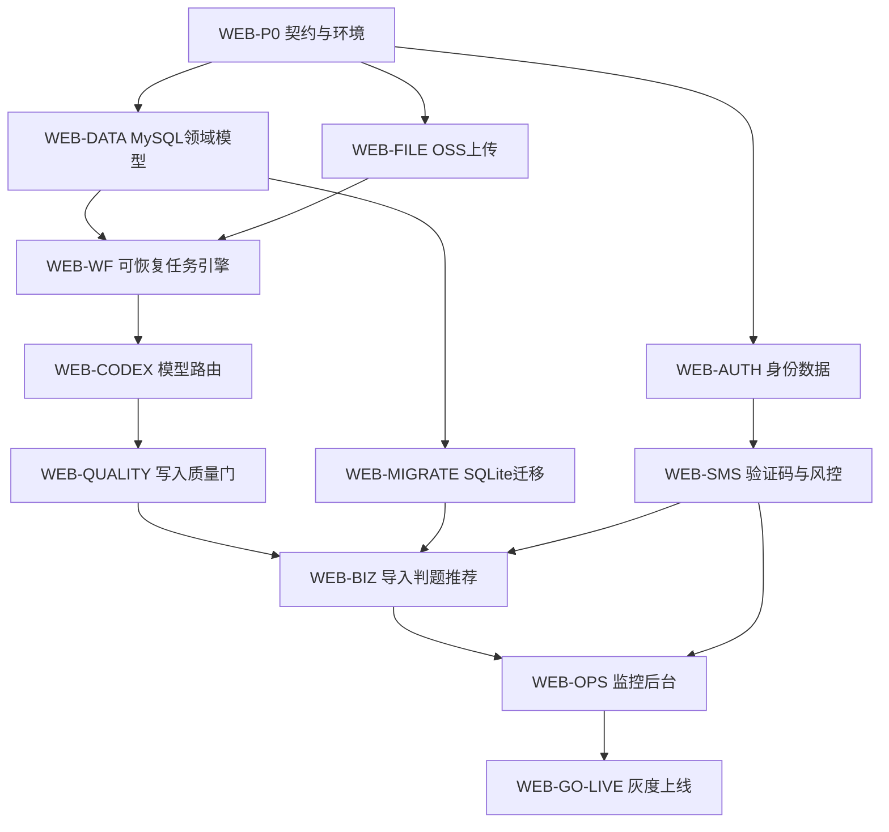

# 工作分解与 Codex Agent 工作流

> v0.3.2 产品边界：普通用户只有一种，手机号验证后直接使用个人错题本。本文中的家庭、学生档案和产品租户表述属于早期工作包命名；后续领取任务时必须按 `user_id` 隔离和无资料/身份/监护流程重新冻结验收标准。

> 剩余功能的具体任务 ID、依赖、里程碑和完成证据以 `11-REMAINING-FUNCTION-WBS.md` 为准；本文继续负责通用领取、复核、恢复和模型路由规则。

## 1. 文档目的

本文件定义 Web 版建设过程中任务如何拆分、领取、交付、复核和恢复，以及 Codex CLI 如何按难度选择模型。它约束人和 Agent 的协作方式，不替代产品、安全、架构或接口文档。

核心约束：**Agent/模型只能生成候选产物；只有测试、确定性校验和业务质量门可以把候选写入权威系统。**

## 2. 任务角色

| 角色 | 主要职责 | 不得单独完成的事项 |
|---|---|---|
| 交付经理（DM） | 维护范围、依赖、里程碑、风险和完成证据；分派冲突 | 不得以进度为由豁免安全或质量门 |
| 产品负责人（PO） | 用户流程、验收标准、复习规则和运营策略 | 不直接修改生产数据或安全阈值 |
| 架构负责人（ARCH） | 服务边界、数据流、ADR、容量和演进路线 | 不绕过安全评审引入外部服务 |
| 身份与安全负责人（SEC） | 注册、验证码风控、权限、隐私、威胁模型 | 不兼任同一安全变更的唯一复核人 |
| 后端负责人（BE） | API、身份服务、领域服务、幂等和质量门 | 不允许模型或脚本直写生产库 |
| 数据负责人（DATA） | MySQL 模型、迁移、对账、备份恢复 | 不执行无回滚计划的破坏性迁移 |
| AI/工作流负责人（AI） | 任务路由、提示词、Schema、评测、成本审计 | 不将候选状态伪装为业务完成状态 |
| 前端负责人（FE） | 注册、上传、判题、复习和异常态体验 | 不在客户端保存短信/云服务密钥 |
| QA 负责人（QA） | 测试策略、基准集、攻击测试、验收证据 | 不仅以 happy path 证明完成 |
| SRE/运维负责人（SRE） | 部署、队列、监控、告警、容灾和发布 | 不在无观测、无回滚情况下放量 |
| 领域审核人（MATH） | 数学题、答案、错因和推荐适配性终审 | 不批准证据不清或未验证题推荐 |

同一人可以承担多个角色，但高风险变更必须满足“双人原则”：实现者不能同时成为唯一批准人。高风险包括身份认证、权限、短信风控、数据迁移、生产写入质量门和删除/导出。

## 3. RACI

R=执行，A=最终负责，C=会签，I=知会。

| 工作项 | DM | PO | ARCH | SEC | BE | DATA | AI | FE | QA | SRE | MATH |
|---|---|---|---|---|---|---|---|---|---|---|---|
| 产品范围与验收 | C | A/R | C | C | I | I | I | C | C | I | C |
| 多租户和服务边界 | C | I | A/R | C | C | C | I | I | C | C | I |
| 手机验证码注册 | I | C | C | A | R | C | I | R | C | C | I |
| 防验证码轰炸 | I | I | C | A/R | R | I | I | C | C | C | I |
| MySQL 模型与迁移 | I | C | C | C | C | A/R | I | I | C | C | C |
| 导入/审核/判题工作流 | C | C | C | C | R | C | A/R | C | C | C | C |
| 推荐与复习规则 | I | A | C | I | C | C | R | C | C | I | R |
| Codex 模型路由与成本 | C | I | C | C | I | I | A/R | I | C | C | C |
| 安全/性能/恢复测试 | I | I | C | A | C | C | C | I | R | R | I |
| 灰度与正式发布 | A | C | C | C | C | C | C | I | C | R | I |

## 4. 工作项结构与领取规则

每个工作项必须具有稳定 ID，例如 `WEB-AUTH-003`，并包含以下字段：

```yaml
id: WEB-AUTH-003
title: 验证码原子消费与防重放
owner_role: BE
reviewer_roles: [SEC, QA]
dependencies: [WEB-AUTH-001, WEB-DATA-002]
risk: high
model_task: web-security-review
allowed_paths:
  - services/web_auth/**
  - tests/test_web_auth_registration.py
acceptance:
  - 并发请求只有一次消费成功
  - 过期、错误、重复验证码均失败且不泄漏账号状态
evidence:
  - test-report.json
  - threat-test-report.md
rollback: 关闭新注册入口并恢复上一版本
status: ready
```

状态流转固定为：

```text
draft → ready → claimed → in_progress → review_ready → verified → integrated → done
                         ↘ needs_rework ↗
claimed/in_progress → blocked
```

领取规则：

1. 只有依赖全部 `done` 或明确提供稳定 mock/契约的任务可进入 `ready`。
2. 领取者先写明 owner、分支/工作树、允许修改路径和预计交付证据，再改代码。
3. 一个文件同一时段只能有一个 owner；共享契约文件由 DM 安排串行合并。
4. 领取后发现范围不符，应拆出新任务，不得悄悄扩张修改路径。
5. 超过租约时间无进展，DM 可回收任务；已有候选产物保留并标为 stale，不直接合入。

## 5. 交付与复核规则

交付包至少包含：变更摘要、需求映射、风险、测试命令与结果、配置/迁移说明、回滚方式、未解决事项和证据路径。

复核按风险分层：

- **低风险**：实现者自测 + 一名代码复核人；
- **中风险**：功能复核 + QA 验收；
- **高风险**：代码复核 + SEC/DATA/领域对应会签 + QA 负向测试；
- **发布风险**：SRE 演练、DM 检查依赖和证据后批准灰度。

禁止以下交付方式：只报告“测试通过”但无命令/报告；以模型自评代替复核；将未确认候选直接写库；为了通过测试降低现有质量门；把跨租户测试、失败恢复或安全负向测试留到上线后。

## 6. 依赖图与实施工作包



### 工作包与完成证据

| 工作包 | 关键任务 | 难度路线 | 完成证据 |
|---|---|---|---|
| WEB-P0 | OpenAPI、环境、CI、密钥注入、ADR | Terra；架构争议升 Sol | 契约测试、部署记录、ADR |
| WEB-AUTH | 用户/家庭/学生/角色/会话 | Terra；权限模型升 Sol | API E2E、跨租户负向测试 |
| WEB-SMS | 验证码状态机、五层限流、挑战、熔断 | Sol | 并发消费、轰炸、枚举、重放报告 |
| WEB-DATA | MySQL Schema、约束、审计表 | Terra；迁移设计升 Sol | migration up/down、约束测试 |
| WEB-MIGRATE | 抽取、映射、导入、哈希对账 | Terra；冲突修复升 Sol | 双次迁移一致、对账报告 |
| WEB-FILE | OSS 签名上传、扫描、规范化 | Terra | 越权、恶意文件、大小限制测试 |
| WEB-WF | 队列、幂等、检查点、重试、死信 | Sol | 崩溃恢复、重复投递、超时演练 |
| WEB-CODEX | 任务 Schema、路由、只读执行、成本审计 | Terra；复杂路由升 Sol | 固定基准集、路由审计样本 |
| WEB-QUALITY | 判题/验证/推荐正式写入门 | Sol | 无候选绕过、低置信度停机测试 |
| WEB-BIZ | 导入、判题、推荐、复习 PDF | Luna/Terra；疑难题升 Sol | 领域回归、PDF 视觉检查 |
| WEB-OPS | 看板、告警、备份、导出/注销 | Terra | 告警演练、恢复/删除证明 |
| WEB-GO-LIVE | 压测、安全测试、灰度、回滚 | Sol 辅助评审，人工批准 | 上线检查表、灰度和回滚记录 |

## 7. 可恢复工作流

项目内置两套确定性清单：`registration` 用于单独注册模块，`project` 用于整个 Web 项目。全项目模板按依赖图开放可并行领取的 `ready_steps`，不是简单按文件顺序串行。

注册模块：

```powershell
python -X utf8 -B scripts\project_workflow.py start `
  --id WEB-AUTH-001 --label "手机验证码注册" --template registration --json
python -X utf8 -B scripts\project_workflow.py claim WEB-AUTH-001 `
  --step requirements --role PO --owner <负责人> --json
```

全项目：

```powershell
python -X utf8 -B scripts\project_workflow.py start `
  --id WEB-PROJECT-001 --label "李兆霖数学错题本 Web" --template project --json
python -X utf8 -B scripts\project_workflow.py status WEB-PROJECT-001 --json
```

`project` 模板覆盖产品基线、架构契约、身份短信、领域数据、文件管道、迁移、可恢复任务、Codex 路由、质量门、业务流程、运维验收、安全复核和云部署批准。`model_task` 只表示应由哪个 Codex 路由做离线只读辅助，不授权自动外发；调用仍须显式数据发送授权。

每个完成步骤必须附证据文件；高风险实现者不能成为系统安全复核的唯一复核人；最后一步必须记录人工批准者。中断后通过 `status` 返回的 `ready_steps` 继续领取。当前用户已将阿里云部署后置，因此 `cloud_deploy_approval` 必须保持未领取，直到本地全链路验收完成。

### 7.1 运行模型

每个长任务由 `workflow_run`、`workflow_step` 和 `artifact` 三类记录组成：

- `workflow_run`：业务类型、租户、输入快照哈希、状态、当前检查点、幂等键；
- `workflow_step`：步骤版本、尝试号、租约、开始/结束时间、输入/输出摘要、错误分类；
- `artifact`：OSS 对象键、内容哈希、Schema 版本、产生者和保留期。

状态至少包含 `queued/running/waiting_review/succeeded/failed/dead_letter/cancelled`。Worker 用短租约领取步骤并周期续租；进程失联后由其他 Worker 接管。队列允许至少一次投递，但 `(tenant_id, workflow_type, idempotency_key, step_version)` 必须唯一。

### 7.2 检查点

典型导入/验证流程：

```text
上传完成
→ 文件安全检查
→ 文档解析/图片规范化
→ 题目候选切分
→ 确定性结构预检
→ Codex 只读审核候选
→ 人工/领域复核（按风险）
→ verify/grade/recommend 质量门
→ 权威库事务提交
→ 索引与 PDF 派生任务
```

每一步只读取已冻结的上一步产物并写新版本，不覆盖原始证据。恢复时从最近的成功检查点继续；输入哈希变化则创建新 run，不复用旧候选。

### 7.3 重试和升级

- 网络、限流、供应商 5xx：指数退避并带抖动；达到上限进入死信；
- Schema 不合法、证据不足、数学冲突：不做相同模型的盲目重试，最多升级一次到 Sol；
- Sol 仍不能确定：状态为 `waiting_review`，禁止写入；
- 数据库提交失败：复用同一幂等键重试质量门，不再次调用模型；
- 短信发送状态不明：当前瑞成云不提供送达查询或回调，禁止自动重复发送；用户只能在冷却期后重新请求。

## 8. Codex CLI 插件与模型路由

项目统一通过 `scripts/codex_task_router.py` 调用 Codex CLI，不允许业务代码自行拼接 CLI 参数或绕过 Schema。

任务执行前先查看路由：

```powershell
python -X utf8 -B scripts\codex_task_router.py route `
  --task web-requirements --json
python -X utf8 -B scripts\codex_task_router.py route `
  --task web-implementation --risk authentication --json
```

再以冻结的、已脱敏的输入执行：

```powershell
python -X utf8 -B scripts\codex_task_router.py run `
  --task web-security-review `
  --input data\review-inputs\security-review.json `
  --out data\review-results\security-review.json `
  --authorize-external-send --json
```

统一参数必须包含：`--ephemeral --sandbox read-only --output-schema`。输入经本地压缩后通过 stdin 发送；手机号、验证码、令牌、对象存储签名和未必要的学生身份不得进入输入。

### 8.1 难度路由

| 等级 | 适用任务 | 默认模型 | 触发升级 |
|---|---|---|---|
| L0 纯本地 | 格式、Schema、限流、状态机、迁移和测试 | 不调用模型 | 失败交确定性错误处理 |
| L1 需求复核 | 普通需求完整性、文案和验收标准 | Luna low | 认证、隐私、迁移或多租户风险直接升 Sol |
| L2 实现复核 | 非安全关键代码和工程实现 | Terra medium | 认证、授权、密钥、短信滥用风险直接升 Sol |
| L3 安全复核 | 注册、验证码、会话、迁移和部署安全 | Sol high | 无法确定则人工复核 |

Web 注册和短信风控的实时决策必须是确定性本地规则（L0），不得把是否发送验证码交给模型。模型可离线辅助分析攻击模式或代码评审，但不得读取明文手机号，也不得直接改变风控阈值。

### 8.2 候选输出与写入门

Codex 输出只落入候选区，并至少包含 `schema_version/task_id/status/confidence/items/evidence_refs`。候选区服务账号无权更新业务表。正式提交必须经过对应命令或服务质量门：

- 判题：`grade-preview → 人工确认 → grade-commit`；
- 审核：`prepare-review-batch → verify-review-batch`；
- 推荐：`recommend-packet → assign-recommendations`；
- 标签：经 `annotate` 规则校验；
- 注册：验证码和风控状态机的数据库事务，不调用模型写入。

质量门负责重新校验租户归属、输入版本、Schema、置信度、来源、验证状态、重复项和幂等键。任何一项变化或缺失都拒绝提交并要求重新生成候选。

## 9. Token、耗时与成本审计

每次模型调用必须产生不可变审计记录，但不得保存完整模型正文或隐私数据：

```json
{
  "trace_id": "...",
  "task_id": "WEB-CODEX-...",
  "workflow_run_id": "...",
  "tenant_pseudonym": "...",
  "task_type": "verify-simplified",
  "model": "gpt-5.6-luna",
  "reasoning_effort": "medium",
  "input_tokens": 0,
  "cached_input_tokens": 0,
  "output_tokens": 0,
  "latency_ms": 0,
  "estimated_cost": 0,
  "attempt": 1,
  "escalated_from": null,
  "status": "candidate_ready",
  "confidence": 0.0,
  "database_modified": false,
  "input_hash": "...",
  "output_hash": "..."
}
```

控制规则：

1. 先运行本地预检和缓存命中，再调用模型；相同输入哈希、任务版本和模型版本复用候选。
2. 为任务类型设置单次 token、时延和日成本预算；超限进入人工队列，不自动循环。
3. 每个任务最多自动升级一次；升级记录原模型、原因和新增成本。
4. 看板按租户伪标识、任务、模型、版本和成功率汇总，不能显示手机号或学生姓名。
5. 每次提示词或模型版本变更必须在固定基准集上对比准确率、拒答率、耗时和成本。

## 10. 并行 Agent 协作流程

一次实施迭代遵循：

1. DM 从依赖图中选择 `ready` 工作项，冻结验收标准和允许路径。
2. Agent 领取任务并运行项目预检；只读取完成任务所需上下文。
3. Agent 先用本地工具完成可机械化工作，再按第 8 节调用模型。
4. Agent 在独立分支/工作树实现并自测，提交交付包，不直接合并。
5. Reviewer 根据风险等级执行代码、功能、安全、数据或领域复核。
6. QA 复现实验并归档证据；失败回到 `needs_rework`，不得口头放行。
7. DM 检查依赖、证据和迁移顺序后集成；SRE 负责环境晋级和回滚准备。

多 Agent 并行只适用于文件所有权不重叠、契约已冻结的任务。数据库迁移序号、OpenAPI 主文件、共享 Schema 和发布配置必须由指定 owner 串行整合。

## 11. 完成审计清单

每个工作包标记 `done` 前，必须逐项给出权威证据：

- 明确需求与代码/配置/迁移的映射；
- 所有验收条件均有覆盖它的测试或演练，而非仅有间接绿灯；
- 负向、越权、并发、重试和回滚路径得到验证；
- 模型候选没有绕过质量门，审计显示 `database_modified=false`；
- Token、成本、时延、模型和升级原因可查询；
- 文档、运行手册、告警和配置样例同步更新；
- 未完成项有独立任务 ID、责任人和风险，不藏在交付说明中；
- 高风险任务已由非实现者完成会签。

整个项目完成还需满足 `04-IMPLEMENTATION-PLAN.md` 中批次 0—5 的全部证据，并通过注册到复习 PDF 的生产等价端到端演练。
