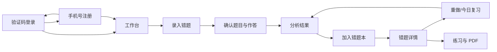

# Web 版 UE、UI 与交互设计

> 文档版本：v0.4.2
>
> 设计日期：2026-08-23
>
> 状态：登录/注册与本地手工闭环已实现；生产体验门禁未完成
>
> 上游：02-PRODUCT-REQUIREMENTS.md、09-PRODUCT-FUNCTION-DESIGN.md

## 1. 设计结论

产品采用“任务优先、内容优先”的个人错题本界面。已有账号通过验证码登录，新用户在独立注册页设置密码并确认协议，注册成功后直接进入工作台；任何页面都不要求姓名、昵称、年级、身份、家庭、监护或实名信息。

MVP 只强化四件事：

1. 快速录入一道错题；
2. 清楚确认系统识别了什么；
3. 看懂第一处错误与下一步；
4. 按时重做并看到掌握变化。

暂不设计公开主页、社交、排行榜、换肤、头像体系、复杂标签管理、个性化布局和多角色切换。

## 2. 体验原则

| 原则 | 界面规则 |
|---|---|
| 注册即用 | 注册表单成功后自动登录并打开工作台，不出现资料完善弹窗 |
| 一屏一主任务 | 每个页面只保留一个最高强调按钮 |
| 证据先于结论 | 判题先展示题目与作答版本，再展示结论、首错步骤和依据 |
| 异步不失联 | 离开处理页后，任务仍可从工作台和任务中心恢复 |
| 默认保护数据 | 不在 URL、页面或前端参数中暴露 user_id、对象键和下载 token |
| 少即是快 | 原生上传、按钮、表单和对话框优先，不引入复杂手势和隐藏操作 |

## 3. 信息架构

### 3.1 桌面端

左侧主导航保留六项，每项使用独立 URL 和独立 HTML 文档：

1. 工作台；
2. 错题本；
3. 今日复习；
4. 练习与 PDF；
5. 学习进度；
6. 设置与隐私。

“录入错题”是工作台的唯一主任务，采用类似通用 AI 助手的单聊天流：中间只显示欢迎语和本次录入步骤，底部只显示一个始终可输入文字并可添加附件的会话框。错题、复习、练习和进度数据不作为统计卡片混入工作台。

六个桌面侧栏入口使用同一套线性图标并保留文字标签；“设置与隐私”固定在侧栏左下角，其余五项保持顶部任务顺序。退出入口只出现在“设置与隐私”的账号会话区，不在各页面页头重复展示。

### 3.2 移动端

底部导航保留“工作台、错题本、复习、进度”四项；中央使用清晰标注的“录入”主操作。练习与 PDF、设置与隐私进入“更多”页或对应内容页的自然入口。

### 3.3 页面关系



### 3.4 页面路由与文档边界

| 左侧导航 | URL | HTML 文档 | 页面独占内容 |
|---|---|---|---|
| 工作台 | `/` | `web/index.html` | 聊天式上传、状态、手工确认和入本结果 |
| 错题本 | `/errors` | `web/errors.html` | 全部错题和错题详情 |
| 今日复习 | `/reviews` | `web/reviews.html` | 当日复习任务与结果提交 |
| 练习 PDF | `/practice` | `web/practice.html` | 选题与 PDF 生成 |
| 学习进度 | `/progress` | `web/progress.html` | 学习统计 |
| 设置与隐私 | `/settings` | `web/settings.html` | 会话、导出和注销 |

禁止使用一个 HTML 同时承载以上六个业务页面，也禁止使用 `#hash` 隐藏/显示业务面板模拟路由。侧边栏和移动端导航必须使用普通页面链接；共享范围仅限品牌样式、导航外观和按当前页面初始化的脚本。

## 4. 页面框架与响应式

| 视口 | 页面框架 | 内容规则 |
|---|---|---|
| ≥ 1200 px | 224 px 左侧栏 + 主内容区 | 主内容最大宽度 1120 px，阅读型内容最大 760 px |
| 768—1199 px | 72 px 图标侧栏 + 主内容区 | 标签在聚焦或悬停时可见，不使用抽屉遮挡任务 |
| 360—767 px | 顶栏 + 底部导航 | 单列；主按钮触控高度至少 44 px；页面无横向滚动 |

通用页面从上到下只有四层：页面标题、必要状态提示、主内容、页面操作。不要为同一信息同时使用卡片、弹窗和 Toast。

## 5. 视觉系统

### 5.1 视觉方向

整体沿用李兆霖错题本既有品牌：深蓝书本代表积累，红色纠错箭头代表从错误走向掌握。界面采用安静、可信的“纸张与批注”风格；数学题、作答图片和第一处错误是视觉主角，装饰元素保持克制。

### 5.2 正式品牌资产

`assets/branding/` 是 Web 项目的品牌资产来源，不再使用临时 `π`、通用书本图标或重新绘制的替代 Logo。

| 场景 | 正式资产 |
|---|---|
| 登录页、网站页眉 | `lizhaolin-math-notebook-logo-concept-v1.png` |
| 桌面侧栏、移动顶栏 | `logo-app-icon-64-v1.png` + “李兆霖错题本”文字 |
| PWA / 安装图标 | `logo-app-icon-192-v1.png`、`logo-app-icon-512-v1.png` |
| favicon | `favicon-v1.ico`、`favicon-64-v1.png` |
| 深色实底 | `logo-symbol-white-v1.png` |
| 黑白印刷 | `logo-symbol-monochrome-v1.png` |
| 练习 PDF 水印 | `logo-watermark-v1.png` |

使用时保持书本、红色箭头和文字比例，不拉伸、不旋转、不改色。产品名称统一写作“李兆霖错题本”；需要完整学科名称时写作“李兆霖数学错题本”。

### 5.3 设计令牌

| 类型 | 令牌 | 值 | 用途 |
|---|---|---|---|
| 页面 | background | `#F6F5F1` | 全局背景 |
| 内容面 | surface | `#FFFFFF` | 卡片、对话框、题目画布 |
| 正文 | text | `#182230` | 标题、正文、公式 |
| 次级文字 | text-muted | `#586474` | 辅助说明、时间 |
| 品牌深蓝 | primary | `#002060` | 唯一主操作、当前导航、焦点 |
| 品牌红 | annotation | `#E00010` | 第一处错误、纠错箭头和关键批注 |
| 成功 | success | `#087A55` | 已确认、已掌握 |
| 错误 | danger | `#B42318` | 失败、破坏性操作 |
| 边界 | border | `#D9DEE7` | 输入框、分隔线 |

主色不能同时铺满多个按钮。状态不能只靠颜色，必须配合文字或图标。MVP 先实现浅色主题；只有出现明确使用需求后再增加深色主题。

品牌 PNG 母版含轻微渐变，上述色值用于界面控件的稳定纯色，不替代或重着色品牌图片。品牌红只用于纠错重点，不与普通主按钮竞争。

### 5.4 字体与图标

- 界面字体：系统中文无衬线字体栈；正文默认 16 px；辅助文字不小于 14 px。
- 数学公式：沿用统一数学渲染器，禁止把公式当普通字符串挤压显示。
- 图标：使用同一套线性图标；图标只辅助文字，不用无标签图标承担关键操作。
- 圆角：输入框和按钮 8 px，内容卡片 12 px；不使用胶囊式按钮堆叠状态。

## 6. 核心页面线框

登录和注册页是独立认证表面，不套用业务工作台框架。未登录时侧栏、底部导航和工作台必须从布局、可见性与键盘焦点序列中同时移除；认证卡片相对整个视口居中。参考产品只用于校验常见操作习惯，不复制第三方品牌、二维码或社交登录。

### 6.1 P-LOGIN 验证码登录

```text
┌────────────────────────────────┐
│ [Logo] 李兆霖数学错题本        │
│ 验证码登录                     │
│                                │
│ 手机号  [____________________] │
│ 验证码  [________] [获取验证码]│
│                                │
│ □ 已阅读并同意用户协议/隐私政策│
│ [            登录           ]  │
│ 没有账号？立即注册             │
└────────────────────────────────┘
```

- 手机号合法后才启用获取验证码；请求中和60秒倒计时均不可重复点击。
- 验证码、协议和登录按钮首屏始终可见；验证码在成功获取前禁用，请求成功后自动获得焦点。
- 验证码填满只激活登录按钮，不自动提交；协议未勾选时按钮保持禁用。
- CAPTCHA只在服务端要求时插入手机号与验证码之间。
- 未注册手机号显示“该手机号尚未注册，请前往注册”，注册链接携带页面内手机号回填状态。
- 登录验证成功后直接替换为工作台，不增加欢迎页或资料步骤。

### 6.2 P-REGISTER 手机号注册

```text
┌────────────────────────────────┐
│ [Logo] 李兆霖数学错题本        │
│ 注册账号                       │
│                                │
│ 手机号  [____________________] │
│ 验证码  [________] [获取验证码]│
│ 密码    [______________] [显示]│
│                                │
│ □ 已阅读并同意用户协议/隐私政策│
│ [            注册           ]  │
│ 已有账号？去登录               │
└────────────────────────────────┘
```

- 密码为8—20位，必须同时包含英文字母和数字，默认隐藏；显示按钮有明确无障碍名称。
- 注册模式首屏同时展示手机号、验证码、密码、协议和注册按钮；验证码在成功获取前禁用。
- 已注册手机号提示切换登录页；确认切换时回填手机号。
- 返回登录页按产品规则清空注册验证码和密码。
- 注册成功提示“注册成功”，自动登录并打开工作台。
- 详细字段错误、按钮状态、异常文案和风控见 `13-LOGIN-REGISTER-PRD.md`。

### 6.3 P-WORKBENCH 单聊天流

```text
┌──────────┬─────────────────────────────────────┐
│ 工作台   │ 错题助手                        退出 │
│ 错题本   │                                     │
│ 今日复习 │       今天要整理哪道错题？           │
│ 练习 PDF │ 添加未判或已判题目，我会陪您整理错题。│
│ 学习进度 │                                     │
│ 设置     │ ┌─────────────────────────────────┐ │
│          │ │ [＋] 添加图片、PDF 或 DOCX  [↑] │ │
│          │ └─────────────────────────────────┘ │
└──────────┴─────────────────────────────────────┘
```

待发送附件的缩略图、移除操作和失败重试显示在底部输入框内部。用户点击发送后，附件立即离开输入框并作为一条用户消息进入上方对话流；发送失败的文件返回输入框供重试。

底部会话框采用“文字区 + 工具栏”的两层结构：文字输入始终打开；工具栏左侧是添加附件和当前操作选择器，右侧是唯一发送按钮。操作选择器只显示学生能理解的业务动作，不暴露模型、权限或运行环境：无活动题目时为“询问”，题干确认阶段为“询问或修正 / 确认并判题 / 下一题”，判题阶段为“询问或修正 / 确认入本（仅错误或部分正确时出现）/ 下一题”。选择确认类动作后可以直接发送，无需输入暗号；若用户开始输入文字，选择器自动回到“询问或修正”，避免误把草稿当成确认。Enter 发送、Shift+Enter 换行，中文输入法选字时 Enter 不得误发。

助手在同一条消息中按真实执行状态更新“正在上传附件（文件序号、名称与可得百分比）→ 正在建立错题会话 → 正在识别题目与作答 → 文件已准备好”。底部文字/附件输入框从页面打开起始终可编辑；尚无题目时发送文字，助手在消息流中提示先添加附件；模型处理期间允许先输入下一句话，但发送动作要等待当前轮完成。文件建立 intake 后，用户可以像连续智能会话一样继续追问、修正题干/OCR、核对判题和要求重算。模型不可用时必须安全停止，不显示虚假的 OCR、AI 分析或预计剩余时间。题干候选、判题候选和入本结果作为只读助手消息依次留在对话流中；不得跳出大卡片、在文字流中插入表单或弹出多余对话框。

PNG/JPEG 缩略图本身是“查看原图”入口，点击后使用浏览器原生模态预览并支持 Esc/关闭按钮返回；预览不承担确认业务。单张图片含多道题时，识别必须遍历整图，按阅读顺序逐题拆分，并把邻近的手写步骤、勾选、圈选或最终答案关联到对应题目。每道题依次进入同一个底部输入框驱动的确认流程，界面明确显示识别题数，不能把“一张文件”误报为“一道题”。同一未确认图片再次上传时允许刷新旧识别候选，使模型协议升级或识别修正能够对已去重文件生效；已确认或已进入判题的题目不得被刷新覆盖。

题干、作答、判题解析、错题详情、复习内容和练习列表中的 LaTeX 统一由随项目提供的本地 KaTeX 以 MathML 渲染；保留原始换行和选项分行，长公式允许在公式区域内横向滚动，不得把 `\\frac`、`\\sqrt`、`\\overrightarrow` 等控制符直接展示给用户。公式无效或渲染资源不可用时保留可读原文，不阻断页面其余内容。

### 6.4 P-INTAKE 录入

默认展示四种入口，但只把“拍照/上传单题”设为主操作：

```text
录入错题                         1 上传  2 确认  3 结果

┌──────────────────────────────────────────────┐
│ 拖入或选择单题图片                           │
│ JPG、PNG、PDF；上传后先检查，再开始识别       │
│ [ 选择文件 ]                                 │
└──────────────────────────────────────────────┘

整份试卷上传  ·  手工录入  ·  支持与隐私说明
```

- 浏览器原生文件选择器为基础能力；移动端允许直接调用相机。
- 文件选择后立即显示预览、名称、大小和移除操作。
- 网络失败保留本地选择；重复内容打开原任务。
- 用户离开时仅在存在未上传文件或未保存手工内容时提示。

### 6.5 P-INTAKE-CONFIRM 会话确认

题干与作答候选作为只读助手消息，所有修正只从底部聊天框输入：

```text
助手：题干与作答候选
      题干：……
      作答：……

┌──────────────────────────────────────┐
│ [＋] 输入修正；无误请发送“确认并判题” [↑] │
└──────────────────────────────────────┘
```

- 页面不出现独立题干/作答文本框或确认按钮；候选始终是只读消息。
- 自然语言修正经智能助手返回完整结构化候选并创建新输入版本；旧分析立即失效。
- 只有精确发送“确认并判题”才进入版本确认门，普通对话不得触发判题。
- 多题试卷使用“第 2/8 题”与上一题/下一题，不使用横向缩略图长列表；当前题判定正确时自动进入下一题，错误或部分正确时等待确认入本，证据不足时留在当前题补充。
- 保存草稿自动完成，不再增加“保存”和“下一步”两个同级主按钮。

### 6.6 P-GRADE-RESULT 分析结果

```text
分析结果：这道题有一处关键错误

第一处错误
第 3 步把 sin²x + cos²x 写成了 0。
[查看原作答中的位置]

为什么
恒等式结果应为 1，因此后续等式从这里开始失效。

下一步
先订正这一步，再完整重做一次。

[加入错题本]   修正识别   补充步骤   申请复核
```

- 结论用自然语言，不用大面积红色评分。
- “正确”时不强行创建错题，主操作改为“完成”。
- “无法判断”时不出现“加入错题本”，主操作改为“补充作答”或“重新拍摄”。
- 展开证据是次级操作；置信度只在会改变用户决策时展示。

### 6.7 P-ERROR-LIST 与 P-ERROR-DETAIL

错题本默认按“最需要处理”排序。首屏只提供搜索、状态和知识点三个常用条件；来源、日期、错误阶段放进“更多筛选”。筛选条件显示为可移除文字标签，并提供一个“清除全部”。

列表项只展示题目摘要、首错步骤、掌握状态、最近作答和下次复习时间。进入详情后再展示完整证据、版本、推荐和历史。

### 6.8 P-REVIEW-TODAY

- 开始前只显示题数、预计耗时和“开始复习”。
- 作答时一次只显示一道题；答案和解析默认收起。
- 点击“提交作答”后走同一判题确认流程，不建立第二套结果页。
- 离开后从当前题恢复；打开答案不算完成。

### 6.9 P-PRACTICE、P-PROGRESS 与 P-SETTINGS

- 练习与 PDF：选择来源、题量、答案版三个必要参数；纸张固定 A4，不提供无用的版式主题。
- 学习进度：默认最近 30 天，只展示新增/掌握趋势、知识点和错误阶段；样本不足时直接说明。
- 设置与隐私：只包含会话、数据导出和账号注销，不出现个人资料页。

## 7. 关键交互契约

| 场景 | 触发 | 界面状态 | 用户可做什么 |
|---|---|---|---|
| 登录验证码已提交 | 点击登录 | 按钮显示“登录中”且禁止重复提交 | 等待；失败后按原字段修正 |
| 注册表单已提交 | 点击注册 | 按钮显示“注册中”且禁止重复提交 | 等待；失败后保留可安全复用字段 |
| 账号场景不匹配 | 登录未注册/注册已存在 | 字段下提示并提供明确跳转 | 回填手机号切换页面 |
| 文件检查中 | 选择文件 | 预览上显示 checking | 移除或离开，不可开始识别 |
| 上传中断 | 网络失败 | 显示已上传比例和“文件未丢失” | 重试或移除 |
| 识别待确认 | 任务进入 waiting_confirmation | 工作台顶部和任务中心同时出现一条入口 | 继续确认 |
| 分析运行中 | 确认题目与作答 | 显示真实步骤，不显示虚假剩余时间 | 离开页面或取消 |
| 分析失败可重试 | failed_retryable | 说明已保存到哪个检查点 | 从检查点重试 |
| 正式入本成功 | 服务端幂等提交成功 | Toast“已加入错题本”，页面进入详情 | 立即重做或继续录入 |
| 数据已变化 | 当前输入版本与任务不一致 | 阻止旧结果提交并解释原因 | 回到确认页重新分析 |
| 高影响操作 | 注销、取消任务、移除错题 | 模态框说明具体影响 | 确认或返回 |

所有加载操作超过 300 ms 才显示进度；少于 300 ms 不闪烁骨架屏。没有准确百分比时使用步骤文本，不伪造进度条。

## 8. 状态与反馈规范

每个业务页面必须定义六种状态：初始、加载、空、成功、可恢复失败、最终失败。无权限不使用“找不到”掩盖在前端逻辑中，服务端统一拒绝后页面显示通用不可访问提示。

错误文案使用三段式：发生了什么、数据是否保存、下一步。例如：

> 图片识别暂时失败。原图和修改已保存，你可以稍后重试或改用手工录入。

Toast 只用于无需追踪的短结果；异步任务、失败和待确认状态必须留在页面或任务中心。

## 9. 动效与手势

- 页面切换不做转场动画；状态变化只使用 150—200 ms 淡入或位置变化。
- 尊重 `prefers-reduced-motion`。
- 不把滑动、长按、双击作为唯一操作方式。
- 图片支持按钮缩放和触控缩放；公式区域可独立横向查看，但页面本身不横向滚动。

## 10. 无障碍基线

1. 核心流程达到 WCAG 2.2 AA 目标；正文与背景对比度至少 4.5:1。
2. 所有操作可通过键盘完成，焦点顺序与视觉顺序一致。
3. 主内容顶部提供“跳到主要内容”；对话框打开后聚焦标题或首个字段，关闭后返回触发点。
4. 字段错误与输入控件建立程序化关联；提交失败后聚焦第一个错误。
5. 动态任务变化使用礼貌播报；普通悬停和进度动画不反复播报。
6. 正确、错误、处理中和已掌握均同时使用文字、图标与颜色。

## 11. 文案基线

| 场景 | 使用 | 避免 |
|---|---|---|
| 空工作台 | 开始建立你的错题本 | 你的档案还未完善 |
| 分析等待 | 正在核对你的作答 | AI 正在思考 |
| 无法判断 | 现有图片不足以确认 | 识别失败，请重试 |
| 推荐不足 | 暂时没有符合条件的已验证练习 | 为你智能生成 10 道题 |
| 提交成功 | 已加入错题本 | 数据写入成功 |
| 越权/失效 | 这个内容不可访问或已经失效 | user_id 不匹配 |

界面统一称“错题”“作答”“第一处错误”“今日复习”，不混用“学生档案”“成员”“租户”和内部任务术语。

## 12. 设计验收清单

- [ ] 新账号从注册成功到“录入第一道错题”不超过一次页面跳转。
- [ ] 登录页和注册页分开，手机号回填、注册表单清空和协议跳转符合标准。
- [ ] 密码默认隐藏且不持久化；验证码填满不自动提交。
- [ ] 全流程没有资料、身份、家庭、学生、监护、实名或年级必填入口。
- [ ] 每个页面最多一个最高强调主操作。
- [ ] 页眉、侧栏、PWA、favicon 和 PDF 使用 `assets/branding/` 中对应的正式品牌资产，不出现临时 `π`。
- [ ] 360 px 宽度下核心流程无页面级横向滚动。
- [ ] 上传、识别、分析和 PDF 任务刷新后均可恢复。
- [ ] unclear、输入版本变化和失败状态不会创建正式错题。
- [ ] 用户 A 的 URL、任务 ID、文件键和导出链接不能显示用户 B 数据。
- [ ] 键盘、焦点、错误提示、对比度和减少动态效果通过检查。
- [ ] 题目原图、公式和首错步骤在桌面与移动端均可读。

## 13. 前端实现顺序

只先实现一条可验证纵切：

1. P-LOGIN 验证码登录；
2. P-REGISTER 手机号注册；
3. P-WORKBENCH 空状态；
4. P-INTAKE 单题上传；
5. P-INTAKE-CONFIRM；
6. P-GRADE-RESULT；
7. P-ERROR-DETAIL。

这条链路通过真实 MySQL、真实 HTTP、本地文件检查和跨用户隔离验收后，再增加整卷切分、今日复习、推荐、PDF、进度和设置。

## 14. 与架构契约的关系

本设计冻结页面名称、路由职责、可见任务状态和关键交互，不冻结具体前端框架。后续 API 与数据契约至少要支持：

- 登录成功或注册自动登录后直接返回工作台可用状态；
- login/register挑战用途隔离、账号存在性稳定错误码、协议版本和注册密码凭据；
- 以当前会话 user_id 查询工作台、文件、任务和错题；
- 上传检查、识别、确认、分析和正式入本的幂等状态转换；
- waiting_confirmation、failed_retryable、failed_final 和版本失效的稳定错误码；
- 刷新后恢复草稿、上传与异步任务；
- 不接受客户端提供其他用户作用域。

本文件完成的是 UE/UI 和页面状态契约；OpenAPI、MySQL Schema 和领域迁移仍属于 `architecture_and_contract` 的后续工作，不因本文件完成而标记整个步骤已完成。
