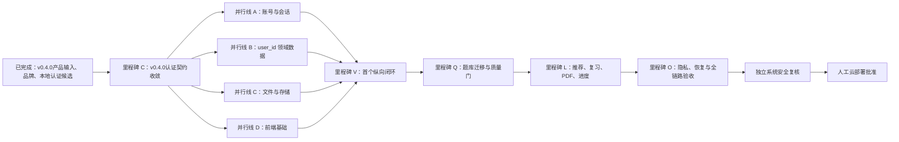

# Web 版剩余功能任务分解

> 产品基线：v0.4.0
>
> 分解日期：2026-08-23
>
> 状态：2026-09-01 当前快照；独立验证的本地候选已达到，剩余任务聚焦生产化门禁与延期能力
>
> 上游：02-PRODUCT-REQUIREMENTS.md、04-IMPLEMENTATION-PLAN.md、05-TEST-ACCEPTANCE-OPERATIONS.md、10-UX-UI-INTERACTION-DESIGN.md

## 1. 目的与边界

本文把李兆霖数学错题本 Web 版的剩余功能拆成可领取、可验证、可恢复的工程任务。它只规划当前MVP：验证码登录与新用户注册分开，注册使用手机号、验证码、密码和协议确认并自动登录；仍不建设资料、身份、家庭、学生档案、监护或实名流程。

任务状态必须以可复现证据判定。代码存在、单元测试通过或页面能打开，都不能单独代表业务功能完成。

## 2. 当前实施快照

### 2.1 已形成的基线

| 能力 | 当前证据 | 判断 |
|---|---|---|
| 产品范围 | PRD、功能设计、测试验收文档 v0.4.0 | 已确认，认证与本地闭环已实现 |
| UE/UI/交互 | 核心流程、响应式规范、正式品牌资产 | 已确认 |
| 认证基础 | v0.4.0 状态机、MySQL Store、ASGI、模拟短信和 CAPTCHA 适配器 | 四接口、密码、协议和场景隔离已本地验收；真实供应商与安全门禁未完成 |
| 本地 MySQL 模拟 | localhost MySQL、模拟短信/CAPTCHA、HTTP smoke | 已运行 |
| 工程工作流 | 任务领取、租约、证据、模型路由 | 已实现 |
| 自动化测试与契约 | 289 项通过；OpenAPI 45 paths、零条 `/v1/admin*` | 2026-09-01 当前本地候选证据；生产变更后仍需重跑 |
| 本地集成与浏览器 | 真实 MySQL smoke；桌面 1440×900、移动 390×844 零溢出；HTTP 验证旧 admin 路径 404 | 独立验证的本地候选已达到 |
| 本地安全 | 独立复核 PASS，无未解决 Critical/High；冻结附件重放 High 已修复 | 仅限本地候选，不是生产安全签署 |
| 运营后台 | 2026-08-31 删除页面、专用 API、查询服务和授权命令；`0012` 仅作历史迁移证据 | 不属于当前功能 |

### 2.2 当前剩余/延期

| 剩余内容 | 当前边界 | 完成要求 |
|---|---|---|
| 生产执行面 | 本地同步路径已验收 | 生产工厂、异步 OCR/AI Worker、外置会话存储及 PDF/DOCX 自动 intake |
| 生产基础设施 | 仅 localhost + MySQL | OSS/RDS/KMS、真实短信/Turnstile、固定出口和生产网络 |
| 质量与运维 | 本地独立复核已通过 | 固定数学基准/人工复核包、生产等价 E2E、观测、压测、备份恢复与灾备 |
| 发布治理 | 分支/工作树候选，待集成授权 | 独立生产安全签署、人工云部署批准、集成/推送/发布授权 |

## 3. 状态与完成规则

| 状态 | 含义 |
|---|---|
| 待领取 | 依赖未满足或尚无负责人 |
| 可领取 | 所有依赖已完成，可开始 |
| 进行中 | 已领取且租约有效 |
| 待复核 | 实现与自测完成，等待独立复核 |
| 已完成 | 需求、测试、演练和文档证据齐全 |
| 已阻塞 | 具体外部条件阻止继续，已记录恢复条件 |

每项任务至少需要：稳定任务 ID、需求映射、允许修改路径、输入、输出、负向测试、完成证据和独立复核要求。认证、授权、迁移、隐私和部署任务的实现者不能成为唯一批准人。

## 4. 总体依赖

关键路径：`ARCH → DATA/FILE → JOB → GRADE 质量门 → 首题闭环 → 题库迁移 → 推荐复习 PDF → 运维验收 → 安全复核 → 人工部署批准`。

## 5. 里程碑 C：v0.4.0 架构与认证契约收敛

以下第 5—14 节保留任务 ID 和依赖作为规划/追溯目录，不逐行表示 2026-09-01 当前状态；当前判断以第 2 节快照和第 15 节两条完成定义为准。

此里程碑完成前，不继续扩展旧 tenant/student/guardian 设计；任何迁移必须以个人 `user_id` 模型、审查记录和可回滚证据为准。

| ID | 任务 | 角色 | 依赖 | 交付物 | 完成证据 |
|---|---|---|---|---|---|
| ARCH-001 | 冻结账号与授权边界 | ARCH + SEC | 产品与UX基线 | login/register场景、当前会话user_id、账号状态、会话撤销和跨用户拒绝规则 | 权限矩阵；无客户端user_id；账号存在性风险复核记录 |
| ARCH-002 | 冻结 user_id 领域 Schema | ARCH + DATA | ARCH-001 | 题目、文件、错题、作答、任务、推荐、复习和 PDF 的归属/公共内容边界 | ER 图、约束清单、删除旧模型说明和回滚方案 |
| ARCH-003 | 冻结候选、正式记录与版本模型 | ARCH + MATH | ARCH-002 | 原始证据、识别候选、判题候选、用户修订、正式记录和输入版本规则 | 状态转换表；旧结果失效、幂等和审计不变量 |
| ARCH-004 | 冻结v0.4.0 OpenAPI与稳定错误码 | ARCH + BE + FE | ARCH-001、ARCH-003 | 四个目标认证API及业务API | OpenAPI校验；登录/注册页面状态逐项映射；旧端点迁移期定义 |
| ARCH-005 | 冻结迁移顺序与回滚 | DATA + ARCH + SEC | ARCH-002 | 已应用迁移只读；新增密码凭据、协议记录和挑战场景约束 | 空库、现有库、重复执行、失败恢复和旧账号兼容演练计划 |
| ARCH-006 | 对齐工作流与文档 | DM + ARCH | ARCH-001—005 | v0.4.0作为新基线；v0.3.3证据仅作迁移起点 | 工作流artifact、依赖和任务ID与本WBS一致 |

完成门：ARCH-001—006 全部完成，且 0002 尚未以旧模型应用到任何共享环境。

## 6. 里程碑 F：四条基础并行线

### 6.1 并行线 A：账号与会话

| ID | 任务 | 角色 | 依赖 | 允许落点 | 完成证据 |
|---|---|---|---|---|---|
| AUTH-101 | 拆分登录/注册状态机 | BE | ARCH-001、ARCH-004 | `services/web_auth/registration.py` | purpose隔离；登录不建号、注册不覆盖；跨场景/重放/并发测试 |
| AUTH-102 | 新增密码与协议持久化 | BE + DATA + SEC | ARCH-005、AUTH-101 | auth Store与新前向迁移 | 密码自适应哈希、独立盐、协议版本；注册原子事务；旧账号兼容 |
| AUTH-103 | 对齐v0.4.0 HTTP契约 | BE | AUTH-101—102、ARCH-004 | `services/web_auth/asgi.py`、bootstrap、OpenAPI | 四个目标端点；稳定错误；Cookie安全；旧端点迁移策略 |
| AUTH-104 | 更新风控与账号状态反馈 | BE + SEC | AUTH-101、AUTH-103 | auth service/Store | 5/小时、10/日；跨场景共享预算；存在性反馈最小化与告警 |
| AUTH-105 | 会话查询与撤销 | BE + SEC | AUTH-102 | auth API/Store | 当前会话、退出当前设备、全端失效；旧Cookie访问失败 |
| AUTH-106 | 实现登录与注册页面 | FE | AUTH-103、UX | `web/` | 两页、回填/清空、协议、密码显示、倒计时、CAPTCHA、无障碍状态通过 |
| AUTH-107 | v0.4.0认证安全回归 | QA + SEC | AUTH-101—106 | tests与演练证据 | 场景串用、重放、批量枚举、密码泄漏、并发事务、限流和供应商未知结果通过 |

### 6.2 并行线 B：user_id 领域数据

| ID | 任务 | 角色 | 依赖 | 允许落点 | 完成证据 |
|---|---|---|---|---|---|
| DATA-101 | 对齐个人领域迁移 | DATA | ARCH-002、ARCH-005 | `services/web_domain/migrations/0002_web_domain.sql` 及后续迁移 | 个人表全部 user_id；旧 tenant/家庭/成员/学生设计不成为产品或授权依赖；公共题库边界明确；SQL 审查 |
| DATA-102 | 重构领域 Store | DATA + BE | DATA-101 | `services/web_domain/mysql_store.py` | 移除 create_family/create_student；所有个人查询从会话 user_id 注入 |
| DATA-103 | 建立领域约束与幂等键 | DATA | DATA-101 | Schema/Store | 重复上传、重复作答、重复正式入本和重复复习任务不产生重复记录 |
| DATA-104 | 建立跨用户隔离矩阵 | QA + SEC | DATA-102 | tests | 用户 A 通过 ID、URL、对象键、任务和导出均不能访问用户 B 数据 |
| DATA-105 | 真实 MySQL 迁移与回滚演练 | DATA + SRE | DATA-101—104、ENV-101 | 本地 MySQL | 空库/现有库/重复执行结果一致；失败可恢复；哈希与约束检查通过 |

### 6.3 并行线 C：文件与存储

| ID | 任务 | 角色 | 依赖 | 允许落点 | 完成证据 |
|---|---|---|---|---|---|
| FILE-101 | 固化基础文件检查 | BE + SEC | ARCH-004 | `services/web_files/intake.py` | 保留现有魔数、大小、名称、DOCX zip 限制和哈希；补完整负向测试 |
| FILE-102 | 绑定文件元数据与 user_id | BE + DATA | DATA-101、FILE-101 | file service/Store | 隔离区对象键不可猜测；重复内容幂等；跨用户内容不复用 |
| FILE-103 | 建立存储适配边界 | BE + SRE | FILE-102 | local adapter + OSS contract | 本地只写受控目录；生产只存 OSS 对象键；短时访问授权 |
| FILE-104 | 上传 API 与恢复 | BE | ARCH-004、FILE-102 | API/file service | 文件检查状态、断点/重试、取消和错误码稳定；请求体限制有效 |
| FILE-105 | 恶意文件与生命周期测试 | QA + SEC | FILE-101—104 | tests/演练 | 伪扩展名、zip bomb、超限、损坏、路径穿越、重复和清理策略通过 |

### 6.4 并行线 D：前端基础

| ID | 任务 | 角色 | 依赖 | 允许落点 | 完成证据 |
|---|---|---|---|---|---|
| FE-101 | 建立响应式应用壳 | FE | UX、品牌资产、ARCH-004 | 新前端目录 | 正式 Logo/名称；桌面侧栏、移动底栏；360 px 无横向滚动 |
| FE-102 | 建立认证页面基础组件 | FE | FE-101、ARCH-004 | auth forms | 登录/注册共用手机号、验证码、倒计时、CAPTCHA、协议和字段错误组件；键盘可用 |
| FE-103 | 建立 API/会话/错误客户端 | FE + BE | ARCH-004 | frontend client | Cookie 会话；统一错误码；401、版本失效和网络失败行为可测 |
| FE-104 | 建立任务恢复外壳 | FE | FE-103、JOB-201 | task center | 刷新可恢复；不显示虚假剩余时间；失败说明数据是否保存 |

### 6.5 环境与迁移账本

| ID | 任务 | 角色 | 依赖 | 允许落点 | 完成证据 |
|---|---|---|---|---|---|
| ENV-101 | 完成多迁移账本 | DATA + SRE | ARCH-005 | `scripts/local_env.py`、对应测试 | 已存在 0001 可登记；新迁移一次执行；失败不错误记账；再次运行幂等 |
| ENV-102 | 扩展本地环境验收 | SRE + QA | AUTH-107、DATA-105、FILE-104 | local_env smoke | 独立登录/注册、密码/协议事务、建会话、上传和user_id查询使用真实MySQL/HTTP跑通 |

基础完成门：四条并行线的目标任务通过复核，且本地环境能以个人 Schema 启动；旧 tenant/student/guardian 不再是产品或授权前置条件。

## 7. 里程碑 V：首个可验证纵向闭环

目标流程：`完成注册并自动登录 → 空工作台 → 上传一道题 → 确认题干与作答 → 得到判题候选 → 确认入本 → 错题详情/列表`；另需已有账号验证码登录直达工作台的独立E2E。

| ID | 任务 | 角色 | 依赖 | 交付物 | 完成证据 |
|---|---|---|---|---|---|
| JOB-201 | 建立可恢复任务状态机 | BE + DATA | DATA-103、FILE-104 | queued/running/waiting_confirmation/ready/failed/cancelled/expired | 状态转换测试；输入快照和检查点持久化 |
| JOB-202 | 建立 Worker 租约与重试 | BE + SRE | JOB-201 | 至少一次投递、短租约、重试上限和死信 | 崩溃、重复投递和数据库短暂故障演练无重复副作用 |
| INTAKE-201 | 单题上传到确认候选 | BE | FILE-104、JOB-201 | 原图、题干/公式/作答候选与来源声明 | 原始文件不被覆盖；失败可手工录入；版本可追溯 |
| INTAKE-202 | 确认与输入版本冻结 | BE + FE | INTAKE-201、FE-103 | 修改、自动保存、确认和旧结果失效 | 修改题干/作答创建新版本；旧任务不能提交 |
| AI-201 | 生成脱敏判题任务包 | AI + BE | INTAKE-202、JOB-202 | 冻结输入、路由、Schema、预算和审计摘要 | 不含手机号/密钥；模型只读；同输入可缓存 |
| GRADE-201 | 判题候选与首错步骤 | MATH + AI | AI-201 | correct/partial/incorrect/unclear、证据和下一步 | 固定样本集；unclear 不入本；低置信度停止或升级一次 |
| GRADE-202 | 正式入本质量门 | BE + MATH | GRADE-201、DATA-103 | 用户确认后幂等创建正式错题 | 重校 user_id、输入版本、来源和幂等键；模型不能直写 |
| ERROR-201 | 错题列表与详情 API | BE | GRADE-202 | 列表、详情、时间线和移除/恢复基础 | user_id 隔离；只有正式记录可见；历史作答不丢失 |
| WORKBENCH-201 | 工作台聚合查询 | BE | JOB-201、ERROR-201 | 待确认、到期、任务和近期错题 | 空、加载、失败和新账号状态确定；P95 查询目标验证 |
| FE-201 | 工作台、上传和确认页 | FE | FE-101—104、INTAKE-202 | P-WORKBENCH、P-INTAKE、P-CONFIRM | 与 UX 文档一致；键盘、焦点、360 px 和失败恢复通过 |
| FE-202 | 分析结果、列表和详情页 | FE | GRADE-202、ERROR-201 | P-GRADE-RESULT、P-ERROR-LIST/DETAIL | unclear 不显示入本；首错证据可查看；一页一个主操作 |
| E2E-201 | 首题闭环验收 | QA + SEC + MATH | 上述全部 | 生产等价本地演练包 | 新账号直达；真实 MySQL/HTTP；跨用户拒绝；刷新恢复；无重复记录 |

里程碑完成门：E2E-201 通过后，才扩大到整卷导入、推荐、复习和 PDF。

## 8. 里程碑 Q：题库迁移、整卷导入与质量门

| ID | 任务 | 角色 | 依赖 | 交付物 | 完成证据 |
|---|---|---|---|---|---|
| MIG-301 | 只读抽取桌面 SQLite | DATA + MATH | DATA-105 | 字段映射、内容哈希、来源和验证状态快照 | 不修改桌面库；抽取两次结果一致 |
| MIG-302 | 幂等导入 MySQL | DATA | MIG-301 | dry-run、commit、对账和回滚命令 | 总数、哈希、版本、关联与抽样内容一致 |
| CONTENT-301 | 公共题库来源与验证门 | MATH + DATA | MIG-302、ARCH-003 | source/license/verification/version 状态 | 未验证或授权不允许的题不能推荐 |
| INTAKE-301 | 整份试卷解析与图片规范化 | BE | E2E-201、FILE-105 | PDF/图片/DOCX 解析检查点 | 模糊、缺页、答案页、跨页题和损坏文件可恢复处理 |
| INTAKE-302 | 题目切分与逐题确认 | BE + FE | INTAKE-301 | 合并、拆分、排除、草稿和题数确认 | 固定试卷样本无漏题/重复；未确认候选不进入判题 |
| REVIEW-301 | 人工复核包与提交门 | AI + MATH + OPS | GRADE-202、CONTENT-301 | 冻结审核包、理由、时限和审计 | 版本变化拒绝提交；复核员不能绕过 user_id 和来源 |
| BENCH-301 | 建立固定数学质量基准集 | MATH + QA | GRADE-201、CONTENT-301 | 四类判题、首错、推荐冲突和拒答样本 | 版本化报告可比较模型、提示词、耗时和成本 |

## 9. 里程碑 L：学习闭环

| ID | 任务 | 角色 | 依赖 | 交付物 | 完成证据 |
|---|---|---|---|---|---|
| RECO-401 | 结构化召回与过滤 | MATH + BE | CONTENT-301、BENCH-301 | 知识点、题型操作、难度、错误阶段和重复过滤 | 只返回 verified 且授权允许题；缺口真实记录 |
| RECO-402 | 推荐质量门与解释 | MATH + AI | RECO-401 | 来源错题、匹配理由、难度变化和候选审计 | Top-K、冲突、重复、缺口率报告；模型不直写分配 |
| REVIEW-401 | 复习阶段与调度 | MATH + BE | GRADE-202、RECO-402 | 到期、逾期、阶段前进/保持/回退 | 跨日、重复调度和恢复结果确定；不静默删除任务 |
| REVIEW-402 | 今日复习作答闭环 | BE + FE | REVIEW-401、GRADE-202 | 一题一页、提交、判题确认和恢复 | 打开答案不算完成；作答可追溯；刷新回到当前题 |
| PDF-401 | A4 练习生成 | BE + MATH | RECO-402、REVIEW-401 | 题目版、可选答案版、顺序和留白 | 12 题混合包逐页无裁切/重叠；默认不打印 |
| PDF-402 | PDF 任务与下载授权 | BE + SEC | PDF-401、JOB-202 | processing/ready/failed/expired 与短时下载 | 同快照同哈希；过期和跨用户下载拒绝 |
| PROGRESS-401 | 学习进度聚合 | BE + DATA | REVIEW-402 | 7/30 天趋势、知识点和错误阶段 | 只显示本人；样本不足明确说明；查询性能通过 |
| FE-401 | 复习、练习、PDF 和进度页面 | FE | REVIEW-402、PDF-402、PROGRESS-401 | UX 文档对应页面 | 桌面/移动、键盘、状态反馈和品牌一致性通过 |
| E2E-401 | 完整学习闭环验收 | QA + MATH + SEC | 上述全部 | 注册到复习 PDF 的演练包 | 正式判题、推荐来源、阶段变化和 PDF 全部可追溯 |

## 10. 里程碑 O：隐私、恢复与生产等价验收

| ID | 任务 | 角色 | 依赖 | 交付物 | 完成证据 |
|---|---|---|---|---|---|
| PRIV-501 | 数据导出 | BE + SEC | DATA-105、JOB-202 | 敏感 OTP 二次验证、异步导出、短时下载 | 不含其他用户/内部字段；过期、重试和审计有效 |
| PRIV-502 | 账号注销与数据处置 | BE + DATA + SEC | PRIV-501 | 敏感 OTP 二次验证、会话撤销、任务取消、删除/匿名化/保留分类 | 注销后登录、恢复和下载失败；分类处置可证明 |
| OPS-501 | 最小运营与复核后台 | OPS + FE + SEC | — | 2026-08-31 已退出范围；历史迁移保留 | 不再建设或验收当前后台运行时 |
| OPS-502 | 日志、指标、追踪与成本 | SRE + AI | JOB-202、RECO-402 | trace_id、SLO、模型 token/耗时/成本和告警 | 日志无敏感正文；关键告警可演练；候选审计不可变 |
| OPS-503 | 备份、恢复与降级 | SRE + DATA | E2E-401、PRIV-502 | MySQL/对象恢复、供应商失败、只读和回滚手册 | RPO/RTO 演练；恢复后哈希、权限和任务状态一致 |
| PERF-501 | 容量与性能验收 | SRE + QA | OPS-502 | 注册、查询、上传、Worker 和 PDF 压测 | 达到 PRD P95/SLO；容量余量和瓶颈记录 |
| SEC-501 | 系统威胁与隐私回归 | 独立 SEC | OPS-502—503、PERF-501 | 攻击面、越权、滥用、恶意文件、密钥和依赖审查 | 高危清零；实现者不是唯一审核人 |
| E2E-501 | 生产等价全链路演练 | DM + QA + SRE | SEC-501 | 注册、上传、判题、推荐、复习、PDF、导出、注销 | 所有 P0 验收和恢复证据归档；不连接生产用户数据 |

## 11. 里程碑 P：生产准备与人工批准

以下任务继续后置，不能因本地功能完成而自动执行。

| ID | 任务 | 角色 | 依赖 | 完成证据 |
|---|---|---|---|---|
| PROD-601 | 真实 Turnstile 测试配置 | SEC + SRE | E2E-501 | hostname/action、失败关闭和密钥轮换演练 |
| PROD-602 | 瑞成云小流量验收 | SEC + SRE | E2E-501 | 已重置密钥、固定出口 IP、白名单、预算和专用号码证据；超时不重发 |
| PROD-603 | RDS/OSS/网络生产配置 | SRE + DATA + SEC | E2E-501 | TLS、最小权限、签名访问、备份、出站安全组和无请求体日志 |
| PROD-604 | 灰度与回滚准备 | SRE + DM | PROD-601—603 | 灰度指标、开关、回滚命令和值守表 |
| PROD-605 | 系统安全最终复核 | 独立 SEC | PROD-604 | 复核签署；高危为零；证据可复现 |
| PROD-606 | 云部署人工批准 | 人工 DM | PROD-605 | 明确批准人和时间；未批准不得部署 |

## 12. 需求追溯

| 活跃需求 | 主任务 |
|---|---|
| ACCOUNT-001 | ARCH-001、AUTH-101—107、WORKBENCH-201 |
| AUTH-001、AUTH-002 | AUTH-101—107、PROD-601—602 |
| INTAKE-001、INTAKE-002 | FILE-101—105、INTAKE-201—202、INTAKE-301—302 |
| GRADE-001 | AI-201、GRADE-201—202、BENCH-301 |
| ERROR-001 | DATA-101—104、ERROR-201 |
| CONTENT-001 | MIG-301—302、CONTENT-301 |
| RECOMMEND-001 | RECO-401—402 |
| REVIEW-001 | REVIEW-401—402 |
| PDF-001 | PDF-401—402 |
| JOB-001 | JOB-201—202、FE-104 |
| WORKBENCH-001 | WORKBENCH-201、FE-201 |
| PRIV-001 | ARCH-001、DATA-104、FILE-105、AUTH-105、SEC-501 |
| PRIV-002、PRIV-003 | PRIV-501—502 |
| OPS-001 | 已退出当前范围；历史需求不再驱动后台运行时，生产观测/恢复仍由 OPS-502—503、PERF-501 跟踪 |

## 13. 并行与文件所有权

契约收敛后可并行：

- AUTH-101—107：只改认证状态机、Store、API、认证页面和对应测试；
- DATA-101—105：独占领域迁移编号、领域 Store 和跨用户测试；
- FILE-101—105：独占文件检查、存储适配和上传边界；
- FE-101—103：基于冻结 OpenAPI mock 开发，不在前端复制权限规则；
- MIG-301—302：只读桌面库，不与在线用户写路径混用。

必须串行整合：

- `services/web_auth/registration.py` 只能由 AUTH 线维护；
- MySQL 迁移序号、OpenAPI 主文件、共享错误码和任务状态 Schema 只能有一个 owner；
- `scripts/local_env.py` 的迁移顺序由 ENV/DATA 线整合；
- 同一高风险改动的实现者不能成为唯一 SEC reviewer。

## 14. 推荐执行顺序

1. 先完成 ARCH-001—006，不应用旧 0002。
2. 并行推进AUTH-101、DATA-101、FILE-101、FE-101和ENV-101；AUTH-102涉及密码安全，必须由SEC独立复核。
3. 以 E2E-201 为第一个工程里程碑，不先建设推荐、报表或运营大屏。
4. E2E-201 通过后迁移题库并完成质量门，再开发推荐、复习和 PDF。
5. 本地 E2E-501、安全复核和恢复演练全部通过后，才进入 PROD-601；PROD-606 永远需要人工批准。

## 15. 两条完成定义

### 15.1 独立验证的本地候选（已达到）

范围限定为 localhost + MySQL 个人学习闭环。2026-09-01 证据包括 289 项确定性测试、真实 MySQL smoke、45 条 OpenAPI 路径、桌面/移动布局、本地独立安全复核，以及冻结附件重放修复的定向覆盖。它不授权集成、推送、部署或生产开放。

### 15.2 生产/云完成（未达到）

项目只有在下列条件同时满足时才可标记为生产完成：

1. 本文 ARCH、AUTH、DATA、FILE、ENV、JOB、INTAKE、AI、GRADE、ERROR、WORKBENCH、MIG、CONTENT、RECO、REVIEW、PDF、PROGRESS、PRIV、OPS-502—503、PERF、SEC 和 E2E 任务证据齐全；已退出的 OPS-501 不作为完成条件；
2. 所有活跃 P0 需求可追溯到实现、测试和演练；
3. 新用户完成注册并自动登录后直接使用，不出现资料、身份、家庭、学生、监护、实名、昵称或年级流程；
4. user_id 隔离覆盖 API、数据库、对象键、任务和导出；
5. 至少一次生产等价流程从注册运行到复习 PDF、导出和注销；
6. 备份恢复、验证码攻击、恶意文件、Worker 中断、重复投递和跨用户访问演练通过；
7. 独立生产安全复核签署通过；
8. 如需云部署，另有 PROD-606 的人工批准证据。
