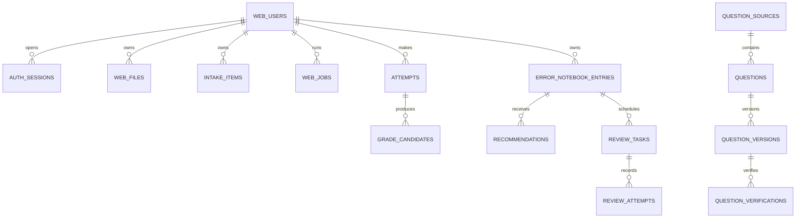

# v0.4.0 目标架构、数据与 API 契约

> 当前实现说明：`openapi/web-v1.json` 已为 v0.4.0 本地候选契约，共 35 paths；认证四接口、个人 user_id 领域闭环、Codex CLI 数学候选与连续会话、导出和注销已通过本地测试。真实供应商、生产 Worker、压测/灾备、观测与正式部署仍是生产门禁。

## 1. 权限矩阵（ARCH-001）

| 操作 | 未登录 | 当前用户 | 其他用户资源 |
|---|---:|---:|---:|
| 请求/验证登录 OTP | 允许，仅已有账号场景 | 允许 | 不适用 |
| 请求注册 OTP / 完成注册 | 允许，仅新账号场景 | 已登录时拒绝或要求先退出 | 不适用 |
| 查看工作台、文件、任务、错题 | 401 | 允许 | 404 |
| 修改候选、确认入本、重试任务 | 401 | 允许 | 404 |
| 获取推荐、完成复习、查看进度 | 401 | 允许 | 404 |
| 创建或下载练习 PDF | 401 | 允许 | 404 |
| 退出当前设备 | 401 | 允许 | 不适用 |
| 全端退出 | 401 | 允许 | 不适用 |
| 读取已验证公共题库 | 按接口策略 | 允许 | 不适用 |

规则：业务请求不得包含归属型 `user_id`；对象 ID 只是定位键，不是授权。账号状态只有 `active`、`locked`、`pending_delete`、`deleted`，只有 `active` 可进入工作台。

## 2. 数据契约（ARCH-002）

约束：

- 个人表必须有 `user_id NOT NULL` 和面向 `user_id` 的查询索引；外键直接引用 `web_users(id)`。
- Store 的个人资源方法第一个命名参数必须是服务端会话给出的 `user_id`。
- `web_files(user_id,purpose,content_sha256)`、`attempts(user_id,idempotency_key)`、`error_notebook_entries(user_id,attempt_id)`、`review_tasks(user_id,error_id,stage)`、`review_attempts(user_id,idempotency_key)` 唯一。
- 公共题库不带个人 `user_id`；只有 `questions.status=verified`、来源授权允许、且存在 verified verification 的版本可推荐。
- 删除旧 `web_tenants`、`tenant_memberships`、`web_students`、`tenant_invitations` 产品表；不做兼容视图。

## 3. 候选/正式与版本（ARCH-003）

| 记录 | 可修改 | 成为正式记录的门 |
|---|---|---|
| 上传文件 | 否；删除为状态变化 | 安全检查为 ready |
| `intake_items` 识别候选 | 自动解析或用户手工补录后可修订；每次 `input_version+1` | 用户确认当前版本 |
| `grade_candidates` 判题候选 | 模型不可覆盖输入；本地手工候选明确记录为用户输入 | `input_version` 相等且 verdict 为 partial 或 incorrect |
| `error_notebook_entries` 正式错题 | 只追加审计更新 | 用户显式确认；按 attempt 唯一 |
| 题库候选版本 | 只追加版本 | 来源允许 + 独立/人工验证 |

正式提交事务必须锁定 intake、attempt 和候选，重新比较 `input_version`，再写正式错题和审计事件。重复提交返回同一正式记录。任务状态只允许 `queued → running → waiting_confirmation/completed/failed_retryable/failed_final/cancelled`；失败保留最后检查点。

## 4. API 与错误（ARCH-004）

当前机器契约：`openapi/web-v1.json`。当前 34 条路径覆盖登录/注册四接口、会话、工作台、文件与任务、Codex CLI 识别/判题候选、人工回退、正式入本、错题、已验证推荐、今日复习、进度、练习 PDF、敏感导出和注销。所有领域写接口均声明 `400`（请求/状态不合法）与 `403`（无操作权限）响应，不能只在认证接口声明错误。

v0.4.0认证目标端点为：

| 方法与路径 | 目标行为 |
|---|---|
| `POST /v1/auth/login/otp/request` | 仅已注册账号申请 `purpose=login` 挑战 |
| `POST /v1/auth/login/otp/verify` | 验证登录挑战、协议确认并创建会话，不创建账号 |
| `POST /v1/auth/register/otp/request` | 仅未注册手机号申请 `purpose=register` 挑战 |
| `POST /v1/auth/register/complete` | 验证注册挑战并原子创建账号、密码凭据、协议记录和会话 |

旧认证端点仅保留为迁移起点；当前前端和 OpenAPI 使用 v0.4.0 四接口，不得让旧端点绕过同一手机号和平台预算。生产切换前仍需完成兼容期、回滚和旧 Cookie 失效演练。

| 错误码 | HTTP | 页面行为 |
|---|---:|---|
| `invalid_request` | 400 | 定位字段，保留用户输入 |
| `invalid_code` | 400 | 清空验证码，保留当前页其他可安全复用字段 |
| `code_expired` | 400 | 清空验证码和挑战，要求重新获取 |
| `too_many_attempts` | 400 | 当前挑战作废，要求重新获取 |
| `phone_not_registered` | 409 | 登录页提示并提供注册跳转，回填手机号 |
| `phone_already_registered` | 409 | 注册页提示并提供登录跳转，不提交密码 |
| `agreement_required` | 400 | 聚焦协议复选框 |
| `weak_password` | 400 | 聚焦密码字段，说明8—20位且同时包含英文字母和数字的规则 |
| `request_too_large` | 413 | 保留本地文件选择并提示大小限制 |
| `authentication_required` | 401 | 回到手机号入口；成功后返回原页 |
| `forbidden` | 403 | 不重试，提示无操作权限 |
| `not_found` | 404 | 显示不存在；跨用户同样返回此码 |
| `conflict` | 409 | 刷新资源后重试 |
| `input_version_changed` | 409 | 丢弃旧候选并重新分析 |
| `waiting_confirmation` | 409 | 打开确认页 |
| `rate_limited` | 429 | 按 `Retry-After` 等待 |
| `captcha_required` | 428 | 原地显示 CAPTCHA |
| `temporarily_unavailable` | 503 | 显示可恢复状态，不自动重发短信 |
| `model_network_error` | 503 | CLI 已执行有限重试；保留 intake 检查点并允许用户重试识别 |
| `model_rate_limited` | 503 | 保留 intake 检查点，稍后重试 |
| `model_authentication_error` | 503 | 不自动重试；重新建立桌面用户的 Codex 登录状态并重启本地服务 |
| `failed_retryable` | 503 | 从检查点重试 |
| `failed_final` | 422 | 保留数据并给出修正入口 |

认证协议版本由服务端常量与 OpenAPI `const` 固定为当前生效版本 `2026-08-23`；客户端只能提交该版本，不能自行选择或降级。

## 5. 迁移与回滚（ARCH-005）

- 0001 已发布：只读；旧字段由 0003 前向移除。
- 0002、0003已在本地MySQL应用；0004纯增量增加幂等复习结果历史，不修改既有记录。
- v0.4.0 已通过 0005—0009 前向迁移建立密码凭据、协议确认、挑战场景、注销恢复字段和文件上传幂等键映射；禁止改写0001—0004。
- 旧账号没有密码时仍可验证码登录；不得生成默认密码，也不得因迁移阻断登录。
- 迁移表记录 `name`、`sha256`、`applied_at`；DDL 完成后才写账本。
- 空库、已有 0001、本地重复运行、同名异哈希、DDL 中途失败五种演练必须有自动化证据。
- 生产回滚不是执行破坏性 down SQL，而是恢复部署前 MySQL/OSS 一致性备份；数据修复用新编号前向迁移。

## 6. 文档与工作流（ARCH-006）

`WEB-PRD-004`、v0.4.0 PRD和`docs/13-LOGIN-REGISTER-PRD.md`是当前产品基线。现有`WEB-PRD-003`和 v0.3.3 OpenAPI 仅保留为历史迁移起点；当前契约、WBS、35 paths OpenAPI 和 0005—0009 迁移已对齐，剩余工作属于生产门禁和独立复核。
