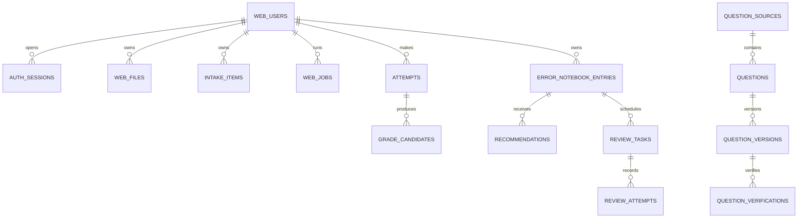

# v0.3.2 架构、数据与 API 契约

## 1. 权限矩阵（ARCH-001）

| 操作 | 未登录 | 当前用户 | 其他用户资源 |
|---|---:|---:|---:|
| 请求/验证 OTP | 允许 | 允许 | 不适用 |
| 查看工作台、文件、任务、错题 | 401 | 允许 | 404 |
| 修改候选、确认入本、重试任务 | 401 | 允许 | 404 |
| 获取推荐、完成复习、查看进度 | 401 | 允许 | 404 |
| 创建或下载练习 PDF | 401 | 允许 | 404 |
| 退出当前设备 | 401 | 允许 | 不适用 |
| 全端退出 | 401 | 允许 | 不适用 |
| 读取已验证公共题库 | 按接口策略 | 允许 | 不适用 |

规则：业务请求不得包含归属型 `user_id`；对象 ID 只是定位键，不是授权。账号状态只有 `active`、`locked`、`pending_delete`、`deleted`，只有 `active` 可进入工作台。

## 2. 数据契约（ARCH-002）

约束：

- 个人表必须有 `user_id NOT NULL` 和面向 `user_id` 的查询索引；外键直接引用 `web_users(id)`。
- Store 的个人资源方法第一个命名参数必须是服务端会话给出的 `user_id`。
- `web_files(user_id,purpose,content_sha256)`、`attempts(user_id,idempotency_key)`、`error_notebook_entries(user_id,attempt_id)`、`review_tasks(user_id,error_id,stage)`、`review_attempts(user_id,idempotency_key)` 唯一。
- 公共题库不带个人 `user_id`；只有 `questions.status=verified`、来源授权允许、且存在 verified verification 的版本可推荐。
- 删除旧 `web_tenants`、`tenant_memberships`、`web_students`、`tenant_invitations` 产品表；不做兼容视图。

## 3. 候选/正式与版本（ARCH-003）

| 记录 | 可修改 | 成为正式记录的门 |
|---|---|---|
| 上传文件 | 否；删除为状态变化 | 安全检查为 ready |
| `intake_items` 识别候选 | 用户可修订；每次 `input_version+1` | 用户确认当前版本 |
| `grade_candidates` 判题候选 | 模型不可覆盖输入 | `input_version` 相等且 verdict 非 unclear |
| `error_notebook_entries` 正式错题 | 只追加审计更新 | 用户显式确认；按 attempt 唯一 |
| 题库候选版本 | 只追加版本 | 来源允许 + 独立/人工验证 |

正式提交事务必须锁定 intake、attempt 和候选，重新比较 `input_version`，再写正式错题和审计事件。重复提交返回同一正式记录。任务状态只允许 `queued → running → waiting_confirmation/completed/failed_retryable/failed_final/cancelled`；失败保留最后检查点。

## 4. API 与错误（ARCH-004）

权威机器契约：`openapi/web-v1.json`。当前 21 条路径覆盖 OTP、会话、工作台、文件与任务、识别/判题/正式入本、错题、已验证推荐、今日复习、进度以及练习 PDF 创建/授权下载。

| 错误码 | HTTP | 页面行为 |
|---|---:|---|
| `invalid_request` | 400 | 定位字段，保留用户输入 |
| `invalid_or_expired_code` | 400 | 验证码页统一提示，不暴露账号状态 |
| `request_too_large` | 413 | 保留本地文件选择并提示大小限制 |
| `authentication_required` | 401 | 回到手机号入口；成功后返回原页 |
| `forbidden` | 403 | 不重试，提示无操作权限 |
| `not_found` | 404 | 显示不存在；跨用户同样返回此码 |
| `conflict` | 409 | 刷新资源后重试 |
| `input_version_changed` | 409 | 丢弃旧候选并重新分析 |
| `waiting_confirmation` | 409 | 打开确认页 |
| `rate_limited` | 429 | 按 `Retry-After` 等待 |
| `captcha_required` | 428 | 原地显示 CAPTCHA |
| `temporarily_unavailable` | 503 | 显示可恢复状态，不自动重发短信 |
| `failed_retryable` | 503 | 从检查点重试 |
| `failed_final` | 422 | 保留数据并给出修正入口 |

## 5. 迁移与回滚（ARCH-005）

- 0001 已发布：只读；旧字段由 0003 前向移除。
- 0002、0003 已在本地 MySQL 应用；0004 纯增量增加幂等复习结果历史，不修改既有记录。
- 迁移表记录 `name`、`sha256`、`applied_at`；DDL 完成后才写账本。
- 空库、已有 0001、本地重复运行、同名异哈希、DDL 中途失败五种演练必须有自动化证据。
- 生产回滚不是执行破坏性 down SQL，而是恢复部署前 MySQL/OSS 一致性备份；数据修复用新编号前向迁移。

## 6. 文档与工作流（ARCH-006）

`WEB-PRD-003` 是 v0.3.2 唯一活跃产品基线。本契约、`docs/11-REMAINING-FUNCTION-WBS.md`、OpenAPI 和迁移文件中的任务 ID 必须一致；早期工作流仅保留历史证据，不再作为实现依赖。
