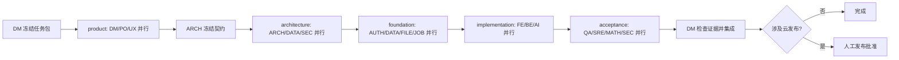

# Codex CLI 多角色开发团队

> 版本：v1.0｜日期：2026-08-23｜状态：已建立；批量 CLI 外发仅限公开/合成资料

## 1. 团队目标与运行边界

本项目采用“一个岗位配置对应一个专业子智能体”的按需团队。岗位长期存在，Agent 只在有明确任务时实例化；每一批最多并行 4 个，避免成本失控和共享文件冲突。

Codex CLI 子智能体可以独立分析问题、审查脱敏材料、使用提供的公开资料并生成结构化候选方案。它们不能发送短信、修改数据库、批准部署或直接合并代码。主智能体负责整合候选；确定性测试、专业复核和人工发布门决定结果能否落地。

配置与执行入口：

- `config/team-roles.json`：岗位、能力、任务、模型、交付物和并行波次；
- `config/model-routing.json`：Luna/Terra/Sol 路由及风险升级；
- `scripts/codex_task_router.py`：以独立、临时、只读 Codex CLI 进程运行每个子智能体；
- `scripts/project_workflow.py`：任务领取、依赖、租约、证据和独立复核；
- `data/workflows/WEB-TEAM-001.json`：本次团队建设清单。

OpenAI 官方资料说明，子智能体适合彼此独立、可并行的工作流，且可以使用不同模型和专门指令；并行会增加 token 消耗，不适合有共享写入冲突的任务。模型选择遵循 Luna 面向高吞吐需求任务、Terra 面向通用工程、Sol 面向最困难或高风险判断的定位。参见 [Codex Subagents](https://learn.chatgpt.com/docs/agent-configuration/subagents) 和 [Model guidance](https://developers.openai.com/api/docs/guides/latest-model)。

## 2. 岗位、能力与交付物

| ID | 岗位 | 专业职能与能力要求 | 标准交付物 | 默认模型 |
|---|---|---|---|---|
| DM | 交付经理 | 范围、依赖、租约、风险、证据和集成决策 | 迭代清单、依赖图、交付审计 | Luna low |
| PO | 产品负责人 | PRD、用户流程、状态、异常、指标和验收标准 | 需求基线、状态标准、验收映射 | Luna medium |
| UX | UE/UI 与交互设计师 | 信息架构、交互、响应式、可访问性和品牌一致性 | 页面流、组件状态、视觉验收 | Terra medium |
| ARCH | 解决方案架构师 | 服务边界、API、数据流、容量、演进和 ADR | 架构决策、接口/数据契约、风险权衡 | Terra high |
| AUTH | 认证工程师 | 注册状态机、验证码、会话、并发和认证测试 | 认证候选、状态机测试、攻击面说明 | Sol high |
| FE | 前端工程师 | 页面、组件、交互状态、可访问性和浏览器测试 | 前端候选、交互测试、视觉证据 | Terra medium |
| BE | 后端工程师 | Python API、领域规则、事务、幂等和权限注入 | 后端候选、契约测试、恢复说明 | Terra high |
| DATA | 数据与迁移工程师 | MySQL 8、Schema、前向迁移、对账和回滚 | 迁移候选、对账方案、回滚证据 | Sol high |
| FILE | 文件管道工程师 | 上传检查、格式规范化、存储契约和恶意文件测试 | 文件管道候选、存储契约、负向测试 | Terra medium |
| JOB | 可恢复任务工程师 | 队列、租约、检查点、幂等、重试和死信 | 任务状态机、恢复候选、故障演练 | Terra high |
| AI | AI 与工作流工程师 | Codex CLI、模型路由、Schema、评测和成本审计 | 路由配置、评测报告、模型审计 | Terra high |
| QA | 质量工程师 | 正负向、并发、跨用户、恢复、契约和端到端测试 | 测试矩阵、缺陷报告、验收证据 | Terra high |
| SEC | 安全与隐私负责人 | 威胁建模、认证、授权、隐私、秘密和发布安全 | 威胁模型、安全发现、门禁意见 | Sol high |
| SRE | SRE 与运维工程师 | 运行环境、观测、容量、备份、灰度和回滚 | 运行手册、告警演练、回滚方案 | Terra high；发布风险升 Sol |
| MATH | 数学领域审核人 | 高中数学、首错诊断、答案复核和题目适配 | 领域复核、疑难项、质量证据 | Sol high |

岗位是职责边界，不是永久占用的 15 个进程。一个具体任务只能有一个 `owner_role`；需要会签时另列 `reviewer_roles`。高风险实现者不能成为唯一复核人。

## 3. 文件所有权与批准矩阵

| 资产或决策 | 唯一主责 | 必须复核 | 说明 |
|---|---|---|---|
| 产品范围与验收 | PO | DM、UX、QA | 不得恢复家庭、身份、昵称、年级或学生档案流程 |
| `services/web_auth/registration.py` | AUTH | SEC、QA | 注册状态机唯一实现位置 |
| OpenAPI、错误码、共享 Schema | ARCH | BE、FE、QA | 共享契约串行合并 |
| MySQL 迁移序号与对账 | DATA | ARCH、SEC、QA | 破坏性迁移须回滚演练 |
| 文件上传与规范化 | FILE | SEC、QA | 用户文件和题库不进仓库/模型输入 |
| 可恢复任务状态机 | JOB | ARCH、QA、SRE | 重试不得绕过幂等与质量门 |
| 模型路由与候选区 | AI | SEC、QA、MATH | 模型不得决定登录、短信或正式写入 |
| 数学结论与推荐适配 | MATH | QA | 证据不清必须拒绝定论 |
| 发布配置与回滚 | SRE | SEC、DM | 云部署须真实人工批准 |

DM 可以协调和集成，但不能以进度为由替代 SEC、DATA、MATH 或 QA 的专业结论。

## 4. 并行协作工作流



每个任务包至少包含：目标、输入快照、依赖、唯一 owner、reviewer、允许路径、禁止路径、风险、验收、证据、回滚、公开资料范围和数据分类。并行只适用于输入已冻结且文件所有权不重叠的任务；OpenAPI、迁移序号、共享 Schema 和发布配置由指定 owner 串行整合。

交接格式固定为：变更摘要、需求映射、候选产物、测试命令与结果、引用来源、风险、回滚、未决事项、下一岗位。口头“已完成”不作为证据。

## 5. 模型路由

| 路由 | 默认岗位/任务 | 选择理由 | 自动升级 |
|---|---|---|---|
| Luna low/medium | DM、PO、需求完整性和文案 | 快速、低成本处理高吞吐产品任务 | 认证、授权、隐私、迁移、秘密、短信滥用升 Sol |
| Terra medium/high | UX、ARCH、AUTH、FE、BE、DATA、FILE、JOB、AI、QA、SRE | 工程实现、代码理解、测试和方案权衡 | 低置信度或高风险升 Sol，最多一次 |
| Sol high | SEC、MATH、高风险架构/迁移/发布复核 | 最困难推理、独立安全和领域裁决 | 仍不确定则转人工，不循环调用 |

实时认证、限流、验证码、权限和写入判断属于本地确定性代码，不走任何模型。模型路由只决定“由谁产生候选意见”，不决定业务结果。

## 6. 资料查阅规则

子智能体可以为专业结论查阅公开资料，但必须遵守：

1. 优先官方文档、标准、原始论文和可核验的一手仓库；记录标题、URL、发布日期/版本、访问日期和结论。
2. 只检索公开、无需项目账号的数据；第三方代码须核对许可证，下载物记录来源和哈希。
3. 手机号、验证码、密码、令牌、密钥、会话、用户上传、数据库内容和受限题库不得外发。
4. 当前加固后的 CLI 路由使用空临时目录、只读沙箱、临时会话、忽略用户配置和环境变量白名单，不向进程提供项目文件或用户插件配置。由于不能证明所有宿主内置工具均被关闭，批量命令只接受公开/合成资料。需要在线资料时，由具备浏览能力的受控主机先形成公开来源包；宿主支持受控 Web 工具时，也必须遵守相同来源台账和授权规则。
5. 外部注册、提交、发信、部署、购买或联系供应商必须另行取得人工授权。

## 7. Codex CLI 使用

查看团队和模型分配，不会调用模型：

```powershell
python -X utf8 -B scripts\codex_task_router.py roles --json
python -X utf8 -B scripts\codex_task_router.py team-route --wave product --json
python -X utf8 -B scripts\codex_task_router.py team-route --wave foundation --risk authentication --json
```

运行一个并行波次时，每个岗位启动一个独立的 `codex exec --ephemeral --ignore-user-config --sandbox read-only` 子进程，并写入各自的结构化候选结果。输入文件必须位于 `data/review-inputs/`，按岗位拆包且标记为 `public-synthetic`；输出必须是 `data/review-results/` 下一个尚不存在的目录。真实项目材料、源码、用户数据或内部配置不得使用 `team-run`。

公开资料包示例：

```json
{
  "classification": "public-synthetic",
  "wave": "product",
  "packets": {
    "DM": {"question": "梳理公开方案的交付风险", "sources": []},
    "PO": {"question": "梳理公开方案的验收状态", "sources": []},
    "UX": {"question": "梳理公开方案的交互状态", "sources": []}
  }
}
```

下列命令包含真实外发动作，因此必须由操作者显式确认：

```powershell
python -X utf8 -B scripts\codex_task_router.py team-run `
  --wave product `
  --input data\review-inputs\product.json `
  --out-dir data\review-results\product-001 `
  --authorize-external-send --json
```

一次波次最多调用每个岗位一次，不做批量自动升级；不确定结果进入人工/单项复核。当前 `owner` 和证据仍是本地工作流字段，不是不可伪造的人员身份或签名，因此该清单不能单独充当生产发布批准账本。

团队建设和后续长任务使用可恢复清单：

```powershell
python -X utf8 -B scripts\project_workflow.py start `
  --id WEB-TEAM-001 --label "Codex CLI 多角色开发团队" --template team --json
python -X utf8 -B scripts\project_workflow.py status WEB-TEAM-001 --json
```

## 8. 完成标准

- 岗位、模型、职责和交付物可以通过 `roles` 命令机器读取；
- 每个波次可通过 `team-route` 预览，不外发数据；
- `team-run` 缺少显式外发授权时必须拒绝；
- 每个角色运行在独立临时只读进程，批量输入只接受逐岗位公开/合成资料包，结果限定进入候选根目录；
- 高风险标签自动路由到 Sol；
- 工作流支持依赖、并行、租约、证据和实现/复核分离；
- 全量单元测试通过，团队建设工作流完成并有 Git 提交证据；
- 真实项目数据批量外发、不可伪造的审批身份和生产发布账本继续保持阻断，直到另行完成安全设计与验收。

## 9. 本次 v0.4.0 本地测试版协作记录

本次协作按产品/UX、实现、安全与文档岗位复核，结论统一为：产品是个人错题本，不收集昵称、年级、身份、家庭、成员、学生档案、监护或实名信息；认证目标为登录验证码申请/验证、注册验证码申请、注册完成四接口；本地学习链路采用人工上传、手工识别候选、确认、手工判题候选、确认入本、已验证推荐、复习和 PDF。导出与注销必须敏感 OTP 二次验证并验证会话、任务和下载失效。

产品/UX 审查确认 v0.4.0 候选已具备独立认证状态、个人页面、任务恢复和异常分类；后端/接口/浏览器 E2E、真实 MySQL smoke、133 项测试和独立安全复核已完成。本地手工闭环不等于生产完成；自动 OCR/AI 判题 Worker、权威题库迁移、PWA、运营后台、生产恢复和云部署明确延期。

本地交付前由根代理执行并保存实际结果（不预填通过）：

```powershell
python -X utf8 -B -m unittest discover -s tests -p "test_*.py"
node --check web/app.js
python -X utf8 -B scripts/local_env.py smoke
python -X utf8 -B scripts/project_workflow.py doctor --json
```

最终结果：全量测试 133/133、前端脚本语法检查、localhost MySQL smoke、浏览器注册/移动视口与 doctor 均通过；smoke 使用模拟短信/CAPTCHA，验证个人注册/登录、上传幂等、手工学习链路、跨用户拒绝、导出/注销和 PDF。生产真实供应商、Worker、题库导入、压测/灾备/观测和部署仍需另行验收。
