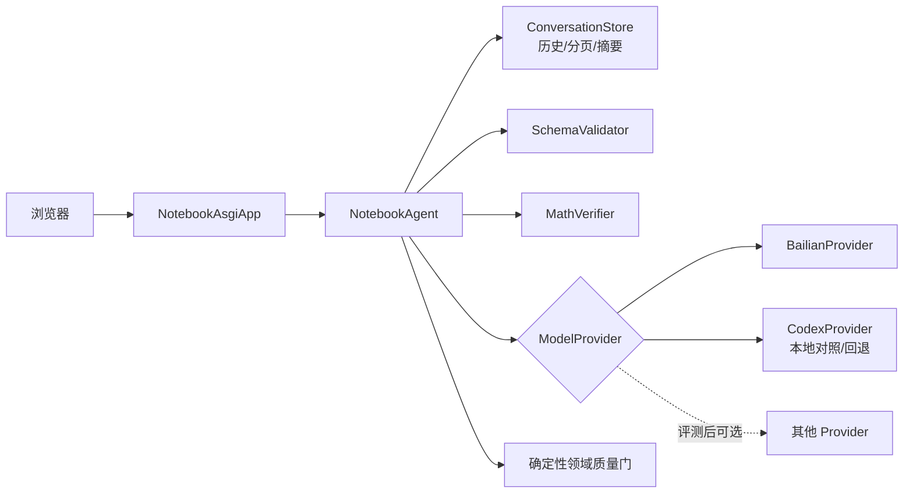

# 阿里云模型供应商迁移方案

> 版本：v0.2
>
> 日期：2026-08-26
>
> 状态：本地可配置 Harness 适配层已实施；Qwen 生产切换仍待离线评测
>
> 适用范围：阿里云环境无法稳定使用 Codex/OpenAI 服务时的数学模型替代

## 1. 决策摘要

项目允许更换大模型供应商，但不能把替换理解为只修改模型名称。当前工作台同时依赖两类能力：

1. 数学模型能力：图片理解、题目拆分、作答 OCR、独立解题、判题、错因和知识点分析；
2. Codex Harness 能力：持久会话、历史分页、上下文压缩、流式事件、停止、重试和连续任务循环。

阿里云生产候选优先采用百炼中的通义千问多模态模型。模型推理通过供应商适配器替换；会话历史、上下文压缩、任务状态和写库质量门由错题本自己的服务管理。当前 Codex app-server 实现继续保留为本地开发和对照评测适配器，在新链路通过验收前不得删除。

首个生产候选采用单一供应商，避免图片识别、解题和判题分散到多个供应商。只有离线评测证明有明确收益后，才评估“千问视觉识别 + 其他模型解题/复核”的混合路由。

## 2. 保持不变的边界

- 浏览器页面、上传交互和现有产品 NDJSON 事件语义保持稳定；
- `NotebookAsgiApp` 继续只调用 `extract`、`grade`、`chat_turn`、`history` 和 `compact` 等业务能力；
- 现有 intake、题目版本、作答、判题和错题本领域对象继续作为权威数据；
- 继续使用现有 intake、解题、判题和会话 JSON Schema，并在服务端二次校验；
- 用户隔离、资源归属、版本冻结、幂等和正式写库必须由确定性代码执行；
- 模型不能发送短信、决定认证或权限、越过质量门、批准部署；
- API Key、用户凭据和其他秘密只能进入环境变量或密钥管理服务，不能进入代码、测试、文档、日志和 Git。

## 3. 目标架构



职责固定为：

| 组件 | 职责 |
|---|---|
| `NotebookAgent` | 编排识别、独立解题、判题复核、追问和自动入本流程 |
| `ModelProvider` | 统一文本、图片、结构化输出和流式生成接口 |
| `BailianProvider` | 百炼鉴权、请求转换、流式响应和供应商错误映射 |
| `CodexProvider` | 包装现有 app-server 能力，供本地开发、对照评测和迁移回退 |
| `ConversationStore` | 保存产品消息、摘要、分页游标、任务状态和可选的供应商会话 ID |
| `SchemaValidator` | 校验结构化输出；失败时安全停止或执行一次受控格式修复 |
| `MathVerifier` | 受限数学验算，不提供 Shell、文件、网络或任意函数调用 |
| 领域质量门 | 校验用户归属、冻结版本、资源哈希、幂等和正式写库条件 |

## 4. 代码改造范围

### 4.1 模型边界

当前 `services/web_app/codex_model.py` 同时承担模型调用和 Codex 会话编排。迁移时应把供应商调用抽象为 `ModelProvider`，把错题流程保留在供应商无关的 `NotebookAgent` 中。

Provider 最少需要提供：

- 多图片和文本输入；
- 同步结构化生成；
- 增量流式生成；
- 超时、限流、认证、网络和内容安全错误分类；
- 请求 ID、模型版本、token 和耗时等不含正文的审计元数据；
- 取消当前生成；
- 能力声明，例如 `vision`、`json_schema`、`stream` 和 `tools`。

不得让 API 层根据供应商类型编写分支，也不得为百炼复制一套平行的 intake、判题或写库流程。

### 4.2 会话与 Harness 替代

产品会话 ID 必须由错题本生成和拥有。供应商会话 ID 只能作为可空映射，不能成为产品历史的唯一来源。数据库映射应逐步泛化为：

- `conversation_id`；
- `provider`；
- `provider_conversation_id`，允许为空；
- `summary` 和摘要版本；
- `last_message_id`；
- `model_name`、`prompt_version` 和 `schema_version`；
- 当前 turn、取消和恢复状态。

上下文接近模型限制时，由服务端生成并保存摘要，同时保留题目、学生作答、已确认事实、判题结论、待办和资源引用。页面刷新、加载更早消息和供应商故障时均从产品数据库恢复，而不是依赖供应商线程。

### 4.3 图片与文件输入

- 本地测试可以把去 EXIF、重编码且有尺寸上限的图片转换为 Base64；
- 阿里云生产优先使用私有 OSS 和短期签名 URL，或在供应商限制内使用 Base64；
- 一次上传的多张图片必须保持文件 ID、顺序、哈希和用户归属；
- 同图拆出的全部题目共享原图引用，独立解题和判题复核按需要重新附带原图；
- 不支持图片能力的模型不得承担题目拆分或作答 OCR。

### 4.4 结构化输出

继续复用：

- `schemas/intake-candidate.schema.json`；
- `schemas/math-solution-result.schema.json`；
- `schemas/math-grade-result.schema.json`；
- `schemas/math-loop-turn.schema.json`。

模型声明支持 JSON Schema 也不能取消服务端验证。输出不符合 Schema、资源 ID 不匹配、题目数量冲突或版本过期时不得写入正式错题本。具体候选模型是否支持严格 JSON Schema，必须按百炼当期模型能力表逐一验证。

### 4.5 流式事件和错误恢复

Provider 的原始事件统一转换为当前产品事件，前端不感知供应商协议差异。至少覆盖：连接、读取附件、识别、独立解题、判题复核、组织回复、压缩、完成、停止和失败。

重试规则：

- 短暂连接失败、限流和可恢复超时只在调用层做有上限的指数退避；
- 认证、证书、参数、Schema 和内容安全错误不盲目重试；
- 每次调用带幂等键，避免一次题目重复入本；
- 上传和模型调用分开记录状态，模型失败不能把已保存附件标记为丢失；
- 审计日志只记录调用 ID、供应商、模型、阶段、耗时、尝试次数和错误分类，不记录图片、题目正文、提示词或密钥。

### 4.6 启动和模型路由

`scripts/local_env.py serve --enable-harness-model` 已通过统一 Harness 适配层装配 Provider。实际冻结的环境配置为：

```text
HARNESS_PROVIDER=<内部路由名，默认 notebook-provider>
HARNESS_PROVIDER_NAME=<显示名>
HARNESS_API_PROTOCOL=<默认 openai-completions>
HARNESS_BASE_URL=<OpenAI 兼容网关根地址>
HARNESS_API_KEY_ENV=<密钥所在环境变量的名称>
HARNESS_MODEL=<模型 ID>
HARNESS_INPUT_MODALITIES=text,image
HARNESS_REASONING=<可选；只有模型明确支持时才设置>
```

当前实现只在 `config/deepseek-harness/cordis.yml` 和 `HarnessRuntimeConfig` 提供安全默认值，运行时以上述环境变量覆盖。API、intake、判题、自动入本和历史恢复代码不按供应商分支。

## 5. 推荐模型路由原则

| 任务 | 必需能力 | 初始策略 |
|---|---|---|
| 图片识别、题目拆分、作答 OCR | 多图片视觉、中文和数学公式、结构化输出 | 百炼千问多模态候选，离线评测后定型 |
| 独立解题 | 数学推理、结构化输出 | 常规模型；困难或几何题按规则升级 |
| 判题复核 | 原图理解、参考解、证据比较 | 与识图兼容的多模态模型，执行二阶段复核 |
| 普通追问和修订 | 多轮中文对话、流式输出 | 成本较低的通用模型 |
| 上下文压缩 | 长文本、事实保持、结构化摘要 | 通用模型；结果写入应用自己的会话存储 |

首版不引入自动跨供应商回退。跨供应商回退会改变答案分布、数据处理主体和故障语义，必须经过隐私、成本和质量评审。

## 6. 实施阶段

### 阶段 A：离线评测

建立 50—200 个经人工标注的代表性样本，覆盖多题同图、手写作答、未作答、已判题、几何图、旋转/模糊图片、数学公式和冲突证据。比较题目数量、题干、作答、最终答案、判题结论、错因、延迟和成本。

退出条件：候选模型达到冻结的准确率门槛，且不存在系统性漏题、重复拆题或把参考解析误认为学生答案的问题。

### 阶段 B：Provider 最小接入

实现 `ModelProvider` 和 `BailianProvider`，先接通无状态的 `extract`、独立解题和 `grade`，保持 API、Schema、页面和写库门不变。

退出条件：契约测试、失败恢复测试、跨用户隔离测试和标注集回归通过。

### 阶段 C：应用自有 Harness

完成产品会话存储、历史分页、上下文压缩、流式事件、停止、恢复和有界重试；现有 Codex 线程映射只作为迁移兼容字段。

退出条件：服务重启后历史和任务可以恢复；供应商线程丢失不导致产品历史丢失；长会话压缩前后关键事实一致。

### 阶段 D：影子评测和灰度

新旧 Provider 对同一冻结样本并行生成候选，影子结果不得写正式库。通过质量、安全和成本评审后，按小比例逐步切换，并保留明确回滚开关。

建议灰度顺序为 5% → 20% → 100%，每一阶段均检查漏题率、重复拆题率、判题一致率、失败率、P95 延迟和单题成本。

## 7. 测试与完成门

必须新增或扩展：

1. Provider 契约测试，确保 Codex 和百炼适配器返回相同业务结构；
2. 多题图片拆分、作答归属、数学公式和原图复核黄金样本；
3. 正确、部分正确、错误、未作答、无法识别和证据冲突判题样本；
4. 流式顺序、取消、断线、限流、超时、重试耗尽和幂等测试；
5. 历史分页、摘要恢复、服务重启和长会话压缩测试；
6. 跨用户文件、会话和 Provider 映射隔离测试；
7. API Key、图片正文和提示词不进入日志的安全检查；
8. 双 Provider 影子评测报告、成本报告和一键回滚演练。

完成上述门禁前，“支持百炼”只能标记为拟议或开发中，不能标记为生产完成。

## 8. 工作量预估

- 仅完成识图、独立解题和判题 Provider 替换：约 3—5 个开发日；
- 补齐应用自有历史、流式、压缩、取消、恢复和重试：约 1—3 周；
- 实际周期取决于标注样本准备、候选模型表现、数据合规评审和灰度结果。

预估不是交付承诺。实施前应通过项目工作流拆分任务、确定负责人、风险审批人与验收证据。

## 9. 官方能力参考

- 阿里云百炼 OpenAI 兼容 Chat 接口：<https://help.aliyun.com/zh/model-studio/qwen-api-via-openai-chat-completions>
- 阿里云百炼结构化输出：<https://help.aliyun.com/zh/model-studio/qwen-structured-output>
- 阿里云百炼视觉模型：<https://help.aliyun.com/zh/model-studio/vision-model/>
- 阿里云百炼 OpenAI Responses 兼容接口：<https://help.aliyun.com/zh/model-studio/qwen-api-via-openai-responses>

供应商能力、模型名称和限制可能变化。开始实施时必须重新核对官方文档，不以本文中的候选描述替代当期能力表和实际评测。
