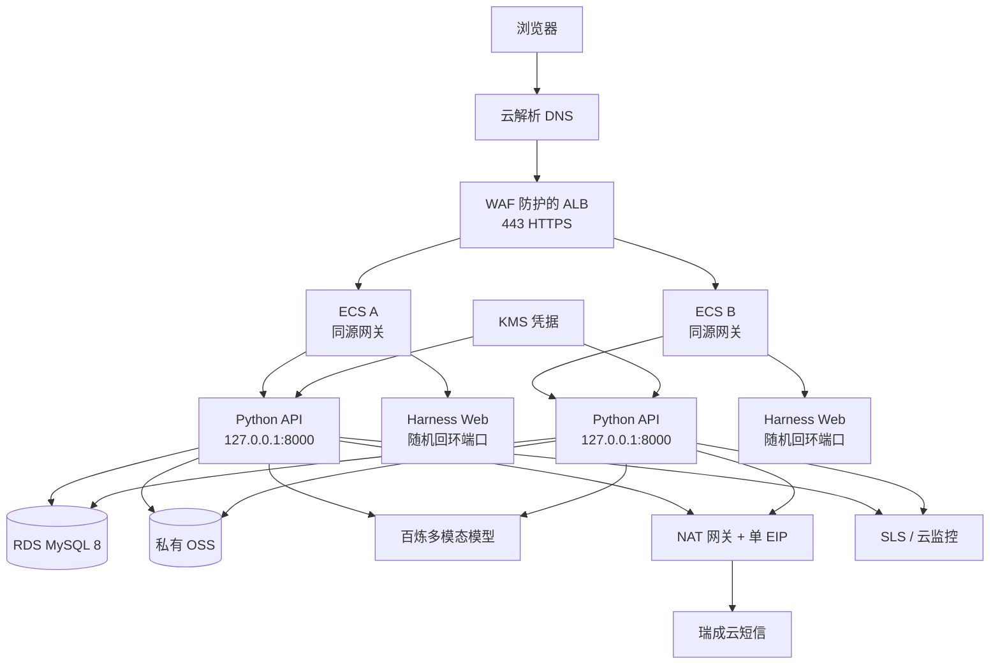

# 李兆霖数学错题本：阿里云部署与上线手册

> 手册版本：v0.1
>
> 对应代码基线：`v0.5.0-rc.1`
>
> 默认地域：华北 2（北京）
>
> 当前结论：可据此采购、生产化改造和验收；当前代码尚不可直接对公网部署

## 1. 先读结论

当前 `v0.5.0-rc.1` 是本地候选版，不是生产发布版。不得把项目目录复制到 ECS 后直接运行 `scripts/local_env.py serve`，原因是：

- `scripts/local_env.py` 会启动本地 MySQL、模拟短信和模拟 CAPTCHA，并强制只监听 localhost；
- 完整 `NotebookAsgiApp` 尚无生产依赖装配入口；现有 `services.web_auth.bootstrap:create_app` 只装配认证子应用；
- 上传原图、PDF、导出文件、Harness 附件和会话仍有本地文件路径；
- 本地同源网关已能统一代理 Harness，但完整生产装配入口、可信转发头和生产安全响应头尚未落地；
- Harness JSONL 会话仍在单机目录，不能安全运行两个无状态应用副本；
- 生产异步 Worker、OSS 适配、就绪检查、生产迁移器和完整依赖锁仍未完成；
- 真实短信、Turnstile、百炼模型、备份恢复、压测、观测和独立安全复核尚未取得上线证据。

因此执行分两段：

1. **生产化改造与云上预发布**：资源可以先创建，但只能接测试域名、测试号码和合成数据；
2. **正式上线**：所有门禁通过、人工批准后，再开放真实用户流量。

本项目不在 ECS 上运行本地大模型，不需要 GPU。模型推理由百炼等外部服务承担。

## 2. 目标拓扑



在应用自有会话存储、OSS 和 Worker 完成前，云上预发布只能使用 **1 台 ECS**。两台 ECS 的正式高可用拓扑必须在所有运行状态均已外置后启用，不能依赖 ALB 会话保持掩盖本地状态问题。

## 3. 资源采购清单

### 3.1 小规模正式环境

| 资源 | 建议起步规格 | 数量 | 用途 |
|---|---:|---:|---|
| 域名与云解析 DNS | 已实名域名 | 1 | 正式访问地址 |
| ICP 备案 | 中国内地网站备案 | 1 | 中国内地公网服务前置条件 |
| SSL 证书 | 覆盖正式域名 | 1 | ALB 443 监听 |
| VPC | `/16` 私网 | 1 | 隔离全部生产资源 |
| 交换机 | 两个可用区，每区应用/接入子网 | 至少 2 | ALB 与 ECS 跨可用区 |
| ALB | 标准版或支持 WAF 的规格 | 1 | HTTPS、WebSocket、健康检查和流量切换 |
| WAF 3.0 | 云产品接入 ALB | 1 | Web 攻击、恶意请求和验证码滥用防护 |
| ECS | 4 vCPU、8 GiB、100 GiB ESSD，Alibaba Cloud Linux 3 | 2 | Python API、同源网关和 Harness Web；不运行 GPU 模型 |
| RDS MySQL | MySQL 8、高可用系列，2 vCPU、4 GiB 起 | 1 | 账号、题库、错题、会话、任务和审计 |
| OSS | 标准存储、私有 Bucket | 1 | 原图、附件、PDF 和导出文件 |
| 公网 NAT 网关 | 按量付费 | 1 | 统一出站 |
| EIP | 单固定 IPv4 | 1 | 短信白名单和百炼 API Key IP 白名单 |
| KMS | 凭据管理 | 1 | 数据库口令、pepper、短信和模型密钥 |
| SLS | Project + LogStore | 1 套 | 脱敏应用日志、审计和告警 |
| 云监控 | ECS、ALB、RDS、NAT、EIP | 1 套 | 基础资源告警 |
| 百炼业务空间 | 独立生产空间 | 1 | 模型、费用和权限隔离 |

### 3.2 暂不购买

- **GPU ECS**：模型不在本机推理。
- **Redis**：当前 MySQL 限流和任务量足够；只有压测证明行锁或跨实例协调成为瓶颈时再加。
- **ACK/Kubernetes**：两个进程和一个 Worker 不需要容器编排平台。
- **消息队列**：先使用 MySQL 任务租约；吞吐量或隔离要求超过其能力时再引入。
- **CDN**：页面主要是登录后的私有应用，首版收益有限；静态流量明显增长后再评估。

## 4. 地域、域名和备案

1. 默认选择 **华北 2（北京）**，ECS、RDS、OSS、KMS、SLS、ALB、NAT 和百炼业务空间尽量同地域。
2. 如果主要用户和百炼工作空间在其他地域，以模型可用性、用户时延和合规要求重新选区，不能跨地域随意传输学生图片。
3. 中国内地服务器对公网提供网站服务前必须完成 ICP 备案；网站开通后按当期要求办理公安联网备案。
4. 建议域名：`math.example.cn`。测试环境使用不同域名，例如 `staging-math.example.cn`。
5. DNS 最终只解析到 ALB，不解析到 ECS 或 Harness 端口。

官方依据：[阿里云 ICP 备案流程](https://help.aliyun.com/zh/icp-filing/basic-icp-service/user-guide/icp-filing-application-overview)、[个人网站备案快速入门](https://help.aliyun.com/zh/icp-filing/basic-icp-service/getting-started/quick-start-for-icp-filing-for-personal-websites)。

## 5. 网络与安全组

### 5.1 建议网段

```text
VPC                 10.20.0.0/16
接入交换机 A        10.20.0.0/24
接入交换机 B        10.20.1.0/24
应用交换机 A        10.20.10.0/24
应用交换机 B        10.20.11.0/24
数据库交换机 A      10.20.20.0/24
数据库交换机 B      10.20.21.0/24
```

### 5.2 入站规则

| 目标 | 允许来源 | 端口 | 说明 |
|---|---|---:|---|
| ALB | 公网 | 443 | 唯一正式入口 |
| ALB | 公网 | 80 | 只做 301/308 跳转到 HTTPS |
| ECS 同源网关 | ALB 安全组或接入子网 | 8080 | 不允许公网直接访问 |
| Python API | 本机回环 | 8000 | 不加入 ECS 安全组 |
| Harness Web | 本机随机回环端口 | 运行时分配 | 永远不暴露公网，也不作为浏览器入口 |
| RDS | ECS 应用安全组/应用子网 | 3306 | 仅内网 TLS |
| SSH | 不开放公网 | 22 | 使用云助手或堡垒机 |

### 5.3 出站规则

- RDS、OSS 和 KMS 使用同地域内网地址；
- 百炼、Turnstile 和短信供应商仅开放所需目标与端口；
- 瑞成云只支持明文 HTTP 时，必须经 NAT 的单一 EIP 出站，并在供应商侧设置 IP 白名单；
- ECS 不绑定自己的 EIP，否则其公网出口优先级可能高于 NAT SNAT，导致短信白名单失效；
- 短信请求超时后不得自动重发，请求体不得进入 Nginx、应用、NAT 或 SLS 日志。

官方依据：[公网 NAT 网关与 SNAT](https://help.aliyun.com/zh/nat-gateway/user-guide/use-internet-nat-gateway-for-public-network-access)、[NAT 会话日志](https://help.aliyun.com/en/nat-gateway/user-guide/session-log-overview/)。

## 6. ALB、WAF 和同源网关

### 6.1 ALB

1. 创建 HTTPS 443 监听并绑定正式证书；HTTP 80 仅重定向到 HTTPS。
2. 后端服务器组指向 ECS 私网 `8080`。
3. 开启 WebSocket 和后端长连接。
4. 健康检查最终使用 `GET /readyz`，只把 `2xx` 视为健康；`/healthz` 仅用于进程存活。
5. 配置优雅摘流，发布时先把实例权重置零，待在途请求结束后再停止进程。
6. WAF 通过云产品方式接入 ALB，至少启用 Web 基础防护、频率控制和 OTP 路径的独立限速规则。

官方依据：[创建 ALB HTTPS 监听](https://help.aliyun.com/zh/slb/application-load-balancer/create-and-manage-listeners)、[ALB 健康检查](https://help.aliyun.com/zh/slb/application-load-balancer/alb-health-check)、[WAF 接入概述](https://help.aliyun.com/zh/waf/web-application-firewall-3-0/user-guide/overview-8/)。

### 6.2 同源网关必须完成的路由

生产浏览器只能看到 `https://math.example.cn`。网关内部再区分：

- 产品 API、登录、注册、隐私页、错题本、PDF 和学习进度 → Python `127.0.0.1:8000`；
- Harness 静态资源、会话接口和 WebSocket → 当前实例启动的随机回环上游；
- 所有转发统一保留正式 Host，并只接受 ALB 提供的可信转发头；
- 禁止把任何 Harness 内部端口暴露为另一个公网端口或让浏览器直接访问回环地址；
- CSP 的 `frame-src`、`connect-src` 和 WebSocket 地址只允许正式同源地址；
- 增加 HSTS、`X-Content-Type-Options: nosniff`、合适的 `Referrer-Policy` 和 `Permissions-Policy`。

当前 Harness Web 不提供 base-path 参数，且根路径会与产品页面冲突。生产化改造必须先冻结实际资源/API 路径，再实现并测试网关映射；不能直接复制一份未经验证的 Nginx 示例。

## 7. RDS MySQL

1. 创建 MySQL 8 高可用实例，不开放公网地址。
2. 数据库字符集固定 `utf8mb4`，排序规则在预发布中与当前迁移兼容性测试通过后冻结。
3. 创建两个账号：
   - `lzlm_migrator`：只在发布窗口使用，拥有执行前向迁移所需 DDL 权限；
   - `lzlm_app`：运行时只拥有目标数据库的 `SELECT/INSERT/UPDATE/DELETE`。
4. 开启内网 SSL，并下载 CA PEM；应用必须校验证书和主机名。
5. 开启自动全量备份和日志备份，保留时间由业务确认；正式起步建议至少 7 天可按时间点恢复。
6. 每次发布前创建可追溯的手动备份；恢复演练必须恢复到新实例，校验后再决定是否切换。

当前生产迁移器尚未完成。实现后必须按下列顺序应用，并把文件 SHA-256 写入 `web_schema_migrations`；已应用文件哈希变化时立即失败：

```text
0001_phone_registration.sql
0002_web_domain.sql
0003_account_simplification.sql
0004_learning_loop.sql
0005_auth_v040.sql
0006_privacy.sql
0007_auth_security.sql
0008_privacy_recovery.sql
0009_file_upload_idempotency.sql
0010_codex_harness.sql
0011_daily_learning_usage.sql
0012_operations_admin.sql
0013_model_usage_sessions.sql
```

`0012_operations_admin.sql` 是已经执行并必须保留哈希的历史前向迁移，不表示当前提供运营后台；当前 `/admin` 与 `/v1/admin/*` 均为 404。`0013_model_usage_sessions.sql` 是当前 Harness 会话用量迁移。两者都必须进入生产迁移账本，不能跳号、重写或倒序执行。

不得在生产运行 `scripts/local_env.py migrate`，不得执行破坏性 down SQL。回滚使用部署前备份恢复或新的前向修复迁移。

官方依据：[RDS MySQL SSL](https://help.aliyun.com/zh/rds/apsaradb-rds-for-mysql/configure-a-cloud-certificate-to-enable-ssl-encryption)、[RDS 日志备份与按时间点恢复](https://help.aliyun.com/zh/rds/apsaradb-rds-for-mysql/use-the-log-backup-feature)、[RDS 备份指引](https://help.aliyun.com/zh/rds/apsaradb-rds-for-mysql/backup-guide)。

## 8. OSS 文件存储

1. 创建与 ECS 同地域的私有 Bucket，禁止公共读和公共写。
2. ECS 通过实例 RAM 角色访问 OSS，不在服务器保存长期 AccessKey。
3. 只授予项目 Bucket 下指定前缀的最小权限，例如：

```text
users/<opaque-user-namespace>/uploads/
users/<opaque-user-namespace>/pdf/
users/<opaque-user-namespace>/exports/
harness/attachments/
```

对象键不得包含手机号、姓名或原始文件路径。数据库只保存对象键、哈希、媒体类型、大小和状态。

4. ECS 到 OSS 使用内网 Endpoint。
5. 下载只返回短时签名 URL；导出链接继续执行次数、过期和审计限制。
6. 开启服务端加密、版本控制和生命周期策略；注销时删除活动对象，并按合规策略处理版本和备份。
7. Web 进程不能再依赖仓库内 `data/runtime/`、`.runtime/`、`output/` 或 `tmp/` 保存权威数据。

官方依据：[OSS 访问控制](https://help.aliyun.com/en/oss/how-to-control-access-permissions-on-oss)、[OSS 预签名上传](https://help.aliyun.com/en/oss/user-guide/upload-files-using-presigned-urls)、[ECS 实例 RAM 角色与 STS](https://help.aliyun.com/en/ram/support/faq-about-ram-roles-and-sts-tokens)。

## 9. KMS 与环境变量

应用通过 ECS 实例身份或 RAM 角色从 KMS 获取凭据。推荐使用 KMS 凭据客户端或 ECS 云原生接入，不把长期 AccessKey 写入 ECS。

必须托管的秘密：

- MySQL 应用账号口令；
- `LZLM_AUTH_PEPPER_B64`；
- 瑞成云短信账号和口令；
- Turnstile Secret；
- 百炼 API Key；
- 未来的手机号字段加密密钥；
- 发布系统使用的签名或部署凭据。

非秘密配置可以由系统服务注入；以下仅为变量名模板，禁止把真实值写入仓库、镜像、日志或命令历史：

```text
LZLM_ALLOWED_HOSTS=math.example.cn
LZLM_MYSQL_HOST=<RDS内网地址>
LZLM_MYSQL_PORT=3306
LZLM_MYSQL_USER=lzlm_app
LZLM_MYSQL_PASSWORD=<来自KMS>
LZLM_MYSQL_DATABASE=<生产库名>
LZLM_MYSQL_SSL_CA=/etc/lzlm/rds-ca.pem
LZLM_AUTH_PEPPER_B64=<来自KMS>

RUICHENG_SMS_USERNAME=<来自KMS>
RUICHENG_SMS_PASSWORD=<来自KMS>
RUICHENG_SMS_SIGNATURE=<已报备签名>

TURNSTILE_SECRET_KEY=<来自KMS>
TURNSTILE_EXPECTED_ACTION=otp_request

HARNESS_PROVIDER=notebook-provider
HARNESS_PROVIDER_NAME=<部署端显示名>
HARNESS_API_PROTOCOL=openai-completions
HARNESS_BASE_URL=<百炼当前业务空间的兼容接口根地址>
HARNESS_API_KEY_ENV=BAILIAN_API_KEY
BAILIAN_API_KEY=<来自KMS>
HARNESS_MODEL=<通过离线评测冻结的多模态模型ID>
HARNESS_INPUT_MODALITIES=text,image
HARNESS_MAX_TOKENS=<评测后冻结值>

LZLM_PRODUCT_ORIGIN=https://math.example.cn
```

Harness 内部令牌必须在每次服务启动时随机生成，只进入 Python 与 Harness Web 两个本机进程，不进入 KMS、浏览器、仓库或日志。

百炼 API Key 使用独立生产业务空间并限制可访问模型和固定出口 EIP；不要保留默认 `0.0.0.0/0` 白名单。模型 ID、Base URL 和视觉/结构化输出能力必须在部署当天按官方文档复核，不能照抄历史候选值。

官方依据：[KMS 凭据客户端](https://help.aliyun.com/zh/kms/key-management-service/developer-reference/secrets-manager-sdk/)、[KMS ECS 快速接入](https://help.aliyun.com/zh/kms/key-management-service/user-guide/ecs)、[百炼 API Key](https://help.aliyun.com/zh/model-studio/get-api-key)、[百炼 OpenAI 兼容 Chat](https://help.aliyun.com/zh/model-studio/qwen-api-via-openai-chat-completions)。

## 10. 构建发布包

发布包在 CI 或受控构建机生成，不在生产 ECS 上执行 Git 拉取或 npm 在线安装。

1. 检出已签名、已批准的 Git 标签。
2. 使用 Linux、Python 3.12 和 Node.js 24 构建。
3. Python 依赖从冻结的哈希锁安装；Node 使用 `npm ci` 和提交的 `package-lock.json`。
4. 安装 DejaVu Sans 与 DejaVu Math TeX Gyre 字体，逐页渲染检查 PDF 数学公式。
5. 运行：

```bash
python -X utf8 -B -m unittest discover -s tests -p 'test_*.py'
npm ci
```

6. 当前 `requirements.txt` 尚不是完整生产锁；正式发布前必须补齐并冻结 PDF 数学渲染等运行依赖。
7. 发布包只能包含代码、静态资源、迁移、Schema 和锁文件，不包含：

```text
.git/
.idea/
.runtime/
data/runtime/
output/
tmp/
任何题库、错题照片、PDF、日志、密钥或本地数据库
```

8. 为发布包生成 SHA-256、依赖清单和测试报告；上传到私有制品库或私有 OSS 发布前缀。
9. ECS 只下载指定版本，校验哈希后解压到 `/opt/lzlm/releases/<commit>`；切换 `/opt/lzlm/current` 软链接。

## 11. 生产进程

生产化完成后，单台 ECS 至少运行：

| 进程 | 监听 | 说明 |
|---|---|---|
| `lzlm-api` | `127.0.0.1:8000` | 完整 `NotebookAsgiApp` 生产工厂 |
| `lzlm-harness-web` | 启动期随机回环端口 | 固定版官方 Harness Web 与产品补丁；只接受同实例网关转发 |
| `lzlm-worker` | 无公网监听 | 领取解析、PDF、导出和删除任务 |
| `nginx` 或等价网关 | ECS 私网 `:8080` | 同源路由、WebSocket 和安全头 |

目标 API 启动形式为：

```text
uvicorn services.web_app.bootstrap:create_app --factory \
  --host 127.0.0.1 --port 8000 \
  --proxy-headers --forwarded-allow-ips=<ALB可信私网地址>
```

`services.web_app.bootstrap:create_app` 当前尚不存在，这条命令是生产化验收目标，不是当前可执行命令。服务管理器必须设置：

- 非 root 专用账号；
- `Restart=on-failure` 和有界重启；
- `UMask=0077`；
- 只读程序目录；
- 独立临时目录；
- 停止超时大于当前请求清理时间；
- 日志只输出结构化元数据，不输出请求体、图片、题干、手机号、验证码、Cookie、提示词或模型正文。

## 12. 数据迁移

### 12.1 数据范围

- 正式题库：从桌面权威库只读抽取，经哈希对账和受控迁移写入 RDS；不把 SQLite 文件放进仓库或 ECS。
- 当前本地账号、错题和 PDF：只有用户明确批准迁移范围后才导入；不得直接复制 `.runtime/local-mysql` 或本地文件目录。
- 图片和 PDF：先写私有 OSS，再把对象键和哈希写入 RDS。

### 12.2 顺序

1. 在预发布 RDS 空库执行全部迁移并校验账本。
2. 运行题库 dry-run，记录总数、验证状态、来源授权和哈希。
3. 执行正式题库导入，再运行第二次确认幂等。
4. 如需迁移本地账号数据，先建立账号映射清单和用户授权证据。
5. 上传对象到 OSS 后校验内容哈希，再提交 RDS 元数据。
6. 抽样验证题目、解析、错因、知识点、复习阶段和历史 PDF。
7. 保存不含用户正文的对账报告。

## 13. 上线步骤

### 13.1 T-7 天到 T-1 天

- [ ] ICP、域名、证书和隐私文本已完成；
- [ ] RDS、OSS、KMS、NAT/EIP、ALB/WAF、SLS 已创建；
- [ ] 短信签名/模板、测试号码和出口 IP 白名单已生效；
- [ ] 百炼模型通过冻结样本评测，生产业务空间、预算和 IP 白名单已生效；
- [ ] 生产工厂、OSS、Worker、会话外置和同源网关已经实现；
- [ ] 全量自动化测试、RDS 集成、浏览器 E2E、压测和安全复核通过；
- [ ] RDS PITR、OSS 恢复和整套回滚演练通过；
- [ ] 独立安全审核签署，高危问题为零。

### 13.2 发布窗口

1. 冻结发布标签、发布包哈希和迁移清单。
2. 创建 RDS 手动备份，记录可恢复时间点。
3. 运行生产迁移器；只允许前向迁移，失败立即停止。
4. 在一台无流量 ECS 安装发布包并启动进程。
5. 检查 `/healthz`、`/readyz`、RDS TLS、OSS 内网访问、KMS、模型和短信测试号码。
6. 加入 ALB，先分配 5% 流量；观察至少一个约定窗口。
7. 依次提高到 20%、50%、100%，每阶段检查错误率、延迟、漏题率、重复入本、短信发送数和模型成本。
8. 第二台 ECS 只有在会话和文件完全外置后才加入。
9. 归档发布证据和人工批准记录。

### 13.3 上线后金丝雀

用虚构身份和授权样本完成：注册 → 登录 → 上传多题图片 → 判题 → 自动入本 → 错因/知识点 → 推荐 → 复习计划 → PDF → 历史会话恢复 → 导出 → 注销。再用第二账号验证任何文件、题目、会话、PDF 和下载链接都不能串号。

## 14. 回滚

满足任一条件立即停止扩量并回滚：

- 出现跨用户访问、密钥或正文进入日志；
- 数据迁移哈希不一致；
- 重复入本、漏题或题目归属错误超过冻结阈值；
- OTP 实际发送数越过任何硬上限；
- 5xx、延迟、RDS 锁等待或模型失败率达到发布门槛；
- Harness 历史、附件或回执在重启后丢失。

应用回滚：ALB 权重归零 → 恢复上一发布软链接 → 启动上一版本 → 通过就绪检查 → 小流量恢复。

数据回滚：禁止直接执行旧版 down SQL。对错误写入使用新的前向修复迁移；灾难性错误恢复到新 RDS 实例和独立 OSS 恢复前缀，完成哈希与权限校验后再切换。

## 15. 监控与告警

SLS 只采集脱敏结构化日志。建议至少建立：

| 指标 | 告警 |
|---|---|
| ALB 健康后端数 | 任一实例持续不健康 |
| API 5xx | 5 分钟超过 1% |
| 普通查询 P95 | 持续高于 500 ms |
| OTP 请求/实际发送 | 异常突增或发送比例异常 |
| 短信预算 | 80% 告警，100% 熔断 |
| RDS CPU/连接/存储 | 70% 预警，85% 紧急 |
| RDS 死锁/锁等待 | 持续出现或 P95 超过验收线 |
| OSS 4xx/5xx | 持续异常 |
| 模型失败/P95/费用 | 超过冻结阈值 |
| 任务租约过期/积压 | 持续增长 |
| 跨用户拒绝/审计失败 | 任一异常立即告警 |
| NAT 端口分配/EIP 带宽 | 丢失或接近带宽上限 |

日志保留期按隐私与合规确认。任何日志和错误平台都不得记录请求体、图片、题干、学生作答、手机号、验证码、密码、Cookie、API Key、签名 URL 或完整提示词。

官方依据：[SLS 日志管理](https://help.aliyun.com/zh/sls/log-management)、[Logtail 采集 ECS 日志](https://help.aliyun.com/zh/sls/use-logtail-to-collect-data)、[ALB 监控指标](https://help.aliyun.com/zh/slb/application-load-balancer/alb-monitoring-metrics)。

## 16. 备份与恢复演练

- RDS：自动备份 + 日志备份；每季度至少一次按时间点恢复到新实例；
- OSS：版本控制、生命周期和必要的跨地域复制由数据等级决定；
- 发布包：私有制品库保存当前版和上一稳定版；
- KMS：轮换流程必须验证新旧凭据的过渡窗口；
- 会话与任务：恢复后核对消息顺序、附件哈希、冻结版本、任务状态和入本回执；
- 恢复演练必须使用测试账号，不读取真实学生正文进入报告。

RPO、RTO 在压测和恢复实测后冻结，未演练前不得承诺具体数值。

## 17. 当前上线阻断清单

| 阻断项 | 完成标准 |
|---|---|
| 完整生产工厂 | `NotebookAsgiApp` 从 RDS、OSS、KMS、模型和 Worker 装配，失败关闭 |
| OSS 存储适配 | 上传、下载、PDF、导出、注销和重试均不依赖本地权威文件 |
| 应用自有会话存储 | 历史、分页、压缩、任务和恢复不依赖单机 JSONL |
| Harness 同源入口 | 正式 HTTPS 域名下页面、API、WebSocket、附件和 Cookie 全流程通过 |
| 异步 Worker | 任务租约、重试、停止、恢复、幂等和积压监控通过 |
| 生产迁移器 | 顺序、SHA-256 账本、锁、dry-run、失败恢复和审计完成 |
| 就绪检查 | `/readyz` 验证 RDS、OSS、KMS 和必要运行时，不把外部模型瞬时故障误判为进程死亡 |
| 完整依赖锁 | Python/Node/字体/PDF 依赖可在干净 Linux 构建机复现 |
| 真实供应商验收 | Turnstile、瑞成云和百炼使用测试资源通过，不把密钥或正文写入日志 |
| 性能与恢复 | 生产等价压测、备份恢复和降级演练完成 |
| 独立安全复核 | 高危为零，审核人不是唯一实现者 |
| 人工部署批准 | 记录批准人、时间、版本、证据和回滚负责人 |

全部阻断项关闭前，只能部署到隔离的预发布环境，不能对真实学生开放。

## 18. 最终交付物

正式上线时应形成以下证据包：

```text
release-tag.txt
artifact-sha256.txt
dependency-lock-report.txt
migration-ledger.json
test-report.txt
browser-e2e-report.txt
load-test-report.txt
security-review-signoff.txt
rds-restore-report.txt
oss-restore-report.txt
provider-canary-report.txt
go-live-approval.txt
rollback-drill-report.txt
```

证据包不得包含用户正文、原图、手机号、验证码、密码、会话令牌、API Key、数据库口令或签名 URL。
