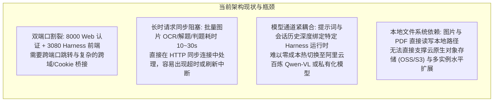
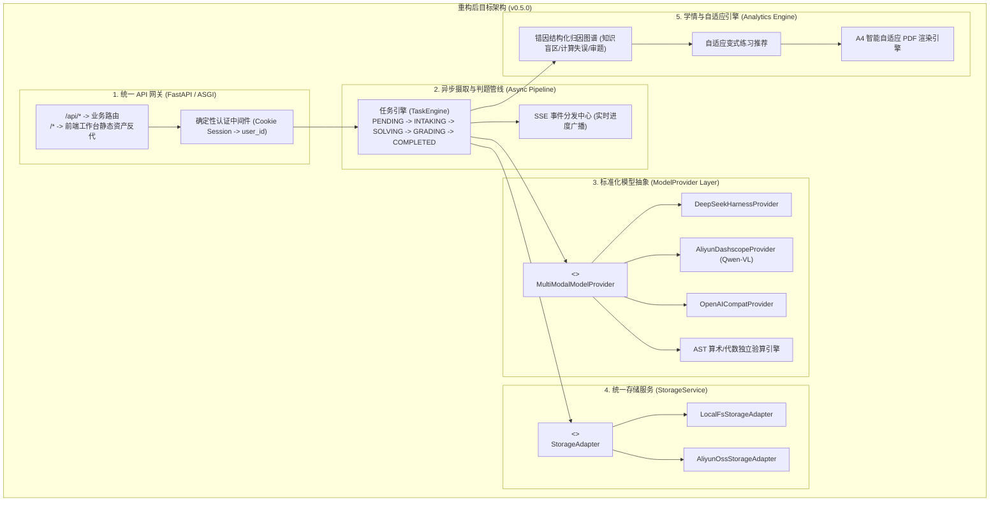
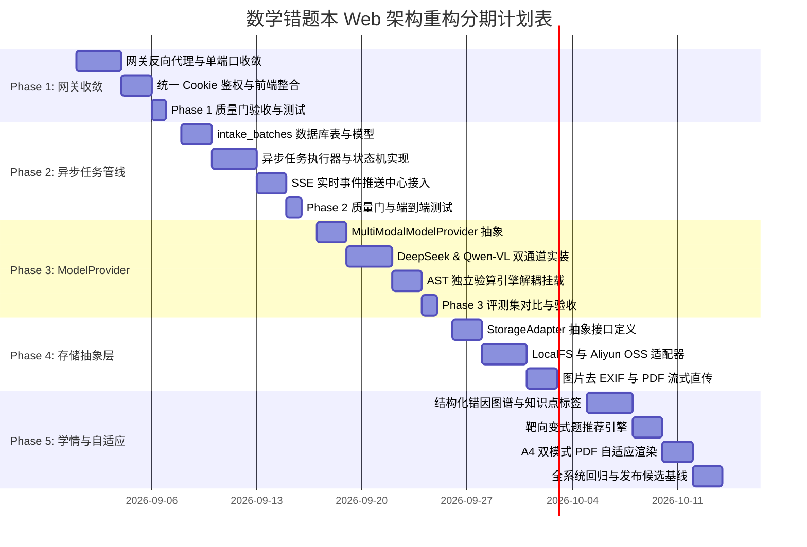

# 李兆霖数学错题本 Web：产品架构重构方案与详细开发计划

> 文档基线：v0.4.0 -> v0.5.0 重构演进  
> 基线日期：2026-08-30  
> 当前状态：重构方案已定义，分期开发计划可执行

---

## 1. 架构现状与核心矛盾诊断

当前李兆霖数学错题本 Web 已经完成了 v0.4.0 本地候选的全部核心功能，包括确定性认证状态机（`services/web_auth/registration.py`）、`user_id` 数据隔离、多模态视觉大模型（DeepSeek Harness / Codex App-Server）判题闭环、权威题库同步以及完整的单元测试质量门。

但在向**生产高可用**和**规模化稳定运行**演进的过程中，当前架构存在以下核心矛盾：



---

## 2. 重构总体目标与设计原则

1. **统一入口与零割裂体验**：收敛为单一域名与端口，业务 API、静态工作台与 AI 流式交互统一由网关反向代理调度；
2. **全链路异步化与可恢复性**：长耗时 AI 处理全量解耦为异步任务状态机，前端通过 SSE（Server-Sent Events）实时订阅，刷新页面可自动恢复进度；
3. **模型供应商插件化（Hot-Swappable）**：提炼标准 `MultiModalModelProvider`，同时支持 DeepSeek、阿里云通义千问（Qwen-VL）、OpenAI 兼容通道与本地 vLLM；
4. **存储介质无缝迁移**：通过 `StorageService` 适配器，本地开发使用 LocalFS，生产部署一键切换至阿里云 OSS；
5. **确定性安全红线不动摇**：无论模型如何演进，认证、权限、写库门与 AST 算术独立验算必须始终由确定性 Python 代码控制。

---

## 3. 五大重构模块技术设计



---

### 模块一：统一前后端接入网关（API Gateway & Static Serve）

- **目标**：彻底消除 `8000` 与 `3080` 双端口，对外只暴露单一业务端口。
- **设计要点**：
  1. 在 `services/web_app/asgi.py` 中挂载反向代理与静态路由；
  2. 前端请求 `/` 或静态页面时，网关校验 Cookie；未登录返回极简登录/注册外壳，已登录用户直接内联渲染 Harness 前端静态资源；
  3. 前端与后端的 API 交互全部走同源 `/v1/*` 路径，根治跨域与 Cookie 丢失风险。

---

### 模块二：异步事件流摄取与判题管线（Async Pipeline & SSE）

- **目标**：化解批量大图识别与复杂数学题求解时的 HTTP 同步阻塞。
- **设计要点**：
  1. **任务状态机设计**：
     ```sql
     -- 增加/完善 intake_batches 异步任务表
     CREATE TABLE IF NOT EXISTS intake_batches (
         batch_id VARCHAR(64) PRIMARY KEY,
         user_id VARCHAR(64) NOT NULL,
         status ENUM('pending', 'slicing', 'solving', 'grading', 'completed', 'failed') NOT NULL,
         total_items INT NOT NULL DEFAULT 0,
         completed_items INT NOT NULL DEFAULT 0,
         error_summary TEXT NULL,
         created_at DATETIME NOT NULL,
         updated_at DATETIME NOT NULL,
         INDEX idx_user_status (user_id, status)
     );
     ```
  2. **SSE 事件流契约 (`GET /v1/intake/batches/{batch_id}/events`)**：
     - `event: progress`（当前处理进度：`{ current: 2, total: 5, stage: "solving" }`）
     - `event: item_completed`（单题判题结果：包含题目快照、正误判定、是否自动入本）
     - `event: batch_completed`（批次完成总览）
  3. **可恢复机制**：断网重连后，客户端带 `Last-Event-ID` 重新建立 SSE 连接，服务端从数据库状态快照补发最新增量事件。

---

### 模块三：标准化 `ModelProvider` 抽象层与解耦

- **目标**：一套代码同时支持 DeepSeek、阿里云通义千问（Qwen-VL）及私有化模型。
- **接口契约设计**：
  ```python
  from abc import ABC, abstractmethod
  from dataclasses import dataclass
  
  @dataclass(frozen=True)
  class ExtractedQuestion:
      item_no: int
      stem_markdown: str
      student_answer_markdown: str
      image_crop_bytes: bytes | None
  
  @dataclass(frozen=True)
  class SolveResult:
      standard_answer: str
      analysis: str
      key_steps: list[str]
      ast_verified: bool
  
  @dataclass(frozen=True)
  class GradeReport:
      verdict: str  # correct, incorrect, partial
      error_type: str  # concept, calculation, comprehension, formula
      feedback: str
      need_entry: bool
  
  class MultiModalModelProvider(ABC):
      @abstractmethod
      def extract_questions(self, image_bytes: bytes) -> list[ExtractedQuestion]: ...
      
      @abstractmethod
      def solve_independently(self, stem_markdown: str) -> SolveResult: ...
      
      @abstractmethod
      def grade_and_diagnose(self, stem: str, student_answer: str, standard_answer: str) -> GradeReport: ...
  ```
- **配置驱动**：通过 `.env` 或配置中心动态切换实现类（如 `HARNESS_PROVIDER=dashscope` 或 `HARNESS_PROVIDER=deepseek`）。

---

### 模块四：存储适配层抽象（Storage Abstraction Layer）

- **目标**：解耦本地文件路径，支持本地开发与云端 OSS/S3 零修改切换。
- **设计要点**：
  1. `StorageAdapter` 抽象基类：`save_bytes(path, data, content_type)`、`read_bytes(path)`、`get_download_url(path, expires_in=300)`、`delete_path(path)`；
  2. `LocalFsStorageAdapter`：面向本地测试环境，写入 `.runtime/storage/`；
  3. `AliyunOssStorageAdapter`：面向阿里云环境，支持 Bucket 访问策略、图片上传前去除 EXIF 信息、生成限时签名的安全访问直链。

---

### 模块五：学情图谱与自适应闭环（Adaptive Learning）

- **目标**：从“静态存题”升级为“动态辅导与个性化攻坚”。
- **设计要点**：
  1. **错因结构化归因**：判题时产出 `error_category`（概念模糊、公式记忆、审题偏差、计算失误），并与数学知识点标签（如：*二次函数顶点式、三角函数诱导公式*）关联；
  2. **靶向变式题生成与练习**：根据用户的高频错因，从已验证题库中智能筛选 1~2 道“同考点变式题”；
  3. **PDF 自适应排版**：支持“错题复习卷（含解析）”与“巩固自测卷（仅题目+留白答题区）”两种模式。

---

## 4. 详细分期开发计划（WBS 与里程碑）

整个重构计划分为 5 个阶段（Sprints），预计总周期为 5 周，各阶段均严格遵循“测试先行、代码实现、单元测试验证、Git 提交”的质量门禁。



---

### 阶段分解与工作任务明细（WBS）

#### 【Phase 1】网关与前后端接入一体化（第 1 周，已于 2026-08-30 完成）
- **目标**：单端口对外暴露，消除 `8000` / `3080` 割裂，统一会话与静态资产。
- **任务清单**：
  1. `T1.1` 在 `services/web_app/asgi.py` 中实现前端静态资源挂载与认证路由分发；
  2. `T1.2` 改造 `scripts/local_env.py`，去除 3080 独立端口绑定，统一由 8000 网关反向代理 Harness 核心；
  3. `T1.3` 更新 `scripts/start.*` 与 `scripts/stop.*`，清理 3080 监听依赖；
  4. `T1.4` 编写网关统一路由与静态资源加载的单元测试与端到端检查。
- **完成结果**：浏览器只访问 `http://127.0.0.1:8000`；登录后在同一窗口进入 Harness 工作台，页面、插件、HTTP API 与 WebSocket 均经认证网关转发，内部 Host 使用随机回环端口且不出现在浏览器、日志或允许返回的响应头中。启停脚本统一委托 Python 生命周期裁决，后台 PID 具备独占领取、进程身份校验与失败恢复记录。
- **质量门验收**：真实浏览器已完成注册、登录和工作台加载，网络面仅有 8000 同源请求，WebSocket 返回 `101`，无跨域、控制台或失败响应；fresh-context 安全审查 P0/P1/P2 清零；阶段末唯一一次全量测试运行 267 项，全部通过，另有 2 项按环境条件跳过。

---

#### 【Phase 2】异步摄取与判题任务管线（第 2 周）
- **目标**：长耗时图像识别与多题判题全异步化，支持 SSE 进度推送与中断恢复。
- **任务清单**：
  1. `T2.1` 编写 `intake_batches` 数据库迁移脚本与 ORM/Store 访问层；
  2. `T2.2` 实现 `TaskEngine` 异步批处理调度器，负责切题、求解、判题的顺序流转与异常捕获；
  3. `T2.3` 实现 SSE 端点 `/v1/intake/batches/{batch_id}/events`，支持事件回放与断线续传；
  4. `T2.4` 前端工作台接入 SSE 进度组件，显示每道题的实时识别与入本状态卡片；
  5. `T2.5` 编写多图片并发上传、状态机流转与断网重连测试用例。
- **完成结果**：已落地持久批次、MySQL 双槽位 fencing、`slicing -> solving -> grading` 可恢复流水线、SSE 顺序重放、官方工作台进度卡和 Harness 异步桥。批次新建、账号注销、过期领取、题库版本复核和候选恢复均由确定性服务端边界裁决；模型解题回执有界，判题候选绑定批次操作身份。每账号最多 3 个活动批次、滚动 24 小时最多 60 个新批次，SSE 同时限制进程、账号和单批次连接数。
- **质量门验收**：上传含 5 道题目的试卷大图，HTTP 立即返回 `202 Accepted`，前端 3 秒内收到首题解析流，刷新页面后进度不丢失。
- **当前验收记录**：Python/JavaScript 语法、OpenAPI 和差异格式检查通过；15 个聚焦批次/恢复用例通过。阶段唯一一次全量运行共执行 286 项，其中 2 项按环境跳过、1 项暴露正确候选拒绝分支的模拟行兼容问题；该判断顺序已修正且失败用例与批次聚焦集通过，按用户要求未重复全量运行。生产 Worker 生命周期、真实 MySQL 并发压测和部署仍属于后续门禁。

---

#### 【Phase 3】标准化 `ModelProvider` 抽象层（第 3 周）
- **目标**：解耦模型供应商，实现 DeepSeek 与阿里百炼通义千问（Qwen-VL）无缝热切换。
- **任务清单**：
  1. `T3.1` 建立 `services/web_domain/model_provider/` 目录与 `MultiModalModelProvider` 抽象接口；
  2. `T3.2` 封装 `DeepSeekHarnessProvider` 与 `AliyunDashscopeProvider` 实现；
  3. `T3.3` 将 AST 算术独立验算逻辑挂载为通用的求解验证过滤器；
  4. `T3.4` 在 `.env.example` 和配置文件中加入供应商声明，支持一键切换通道。
- **质量门验收**：切换 `MODEL_PROVIDER=dashscope` 与 `MODEL_PROVIDER=deepseek` 后，以冻结标注集的漏题率、判题一致率、安全失败率、P95 延迟和单题成本阈值验收；AST 确定性校验语义必须一致。
- **实现结果（2026-08-30）**：已新增供应商无关 `ModelProvider` 契约、`NotebookAgent` 兼容解耦、DeepSeek/阿里百炼双配置档、安全端点校验、稳定错误归一化与可注入 AST 验算过滤器；API、异步摄取、Schema 和写库门未出现供应商分支。供应商选择改为语义明确的 `MODEL_PROVIDER=deepseek|dashscope`，`HARNESS_PROVIDER` 仅保留为内部路由 ID。
- **当前门禁**：代码与聚焦契约检查已完成；真实百炼联网、标注集对比和生产灰度仍是外部验收门禁。

---

#### 【Phase 4】存储适配器与云端 OSS 抽象（第 4 周）
- **目标**：解耦本地文件依赖，支持本地 LocalFS 与生产阿里云 OSS 自由切换。
- **任务清单**：
  1. `T4.1` 抽象 `StorageService` 接口与实现 `LocalFsStorageAdapter`；
  2. `T4.2` 实现 `AliyunOssStorageAdapter`，支持防盗链、预签名上传/下载直链与敏感元数据（EXIF）自动剥离；
  3. `T4.3` 重构 `practice_pdf.py` 与题目图片存储逻辑，全面调用 `StorageService`。
- **质量门验收**：在未配置 OSS 时无缝写入本地磁盘；配置 OSS 凭据时自动将图片和练习 PDF 流式上传至存储桶，单元测试全部通过。
- **实现结果（2026-08-30）**：已扩展统一 `StorageAdapter`，落地 LocalFS 与阿里云 OSS SDK V2 适配器、安全配置工厂、私有不可覆盖对象、SHA-256 元数据与有界读取；图片在摄取边界应用方向并重新编码去除 EXIF/XMP/ICC/文本信息；图片、PDF、导出与注销删除继续只依赖对象键和存储接口。OSS 的练习 PDF 下载在服务端先完成用户归属校验，再返回最长 15 分钟的 HTTPS 预签名地址；LocalFS 保持原有流式响应。
- **阶段进度**：`T4.1`—`T4.3` 开发任务完成，开发进度 100%；生产资源验收单独计入上线门禁，不用“开发百分比”掩盖外部资源尚未验证。
- **当前门禁**：开发与 fake-client 契约验证完成，`STORAGE_PROVIDER=local|oss` 已接入运行装配；真实 Bucket、RAM Role、内网 Endpoint、服务端加密/生命周期策略与联网 smoke 仍需部署资源，未通过前不得标记为生产完成。

---

#### 【Phase 5】学情图谱与自适应闭环演进（第 5 周）
- **目标**：引入结构化错因分析、知识点标签与双模式 A4 练习 PDF 导出。
- **任务清单**：
  1. `T5.1` 扩展判题输出 Schema，提取标准化错因分类与知识点标签；
  2. `T5.2` 在 MySQL 中建立错因聚合统计与知识点雷达分析查询视图；
  3. `T5.3` 升级推荐算法：优先推荐错因相同但难度递进的题库题目；
  4. `T5.4` 升级 PDF 渲染模块：支持“复习卷”与“自测卷”双模板排版。
- **质量门验收**：错题列表可按“错因分类”筛选，点击“生成变式卷”可自动输出排版优良的 A4 自测练习 PDF。
- **实现结果（2026-08-30）**：既有 12 类标准错因和知识点诊断继续以作答关联的批改候选为事实源，不把学生错因错误写成题目标签；新增 MySQL 8 调用者权限学习事实视图、用户级错因分布与知识点雷达、错题列表错因筛选，以及先按题干共同上下文、再按原题难度向上递进的确定性推荐排序。练习任务和 PDF 已统一为 `review`（含错因、解析与答案）和 `self_test`（仅题目与作答留白）双模式，并兼容旧布尔请求字段。
- **阶段进度**：`T5.1` 复用并核验既有完整诊断 Schema，`T5.2`—`T5.4` 开发任务完成，开发进度 100%。
- **当前门禁**：聚焦领域、MySQL 查询、API、OpenAPI、PDF 与前端契约检查完成；未按用户要求运行全量测试。画像是当前错题样本的相对分布，不等同于考试成绩；正式题库没有可证明的知识标签时不生成虚假标签。

---

## 5. 风险控制与回滚预案

1. **数据库迁移兼容性**：所有数据库 DDL 脚本必须保持向后兼容（只增字段/索引，不重命名现有字段），并提供对应的 `rollback.sql`；
2. **模型降级机制**：若多模态视觉模型发生服务中断或接口超时，系统自动降级为“待人工复核”状态，绝不在错误识别时直接写入正式错题本；
3. **确定性防线**：所有关于学生隐私、密码、会话凭据、短信验证码的业务逻辑始终严禁进入大模型上下文。
